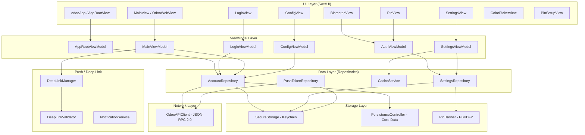
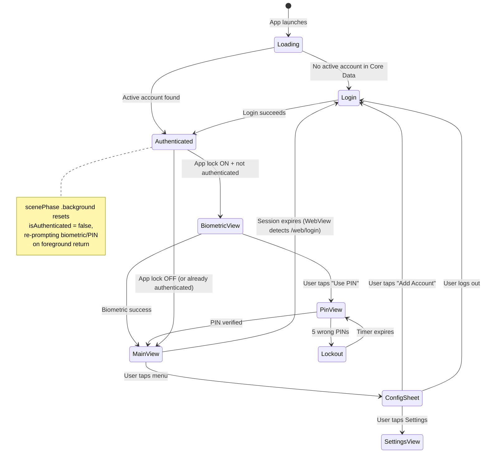
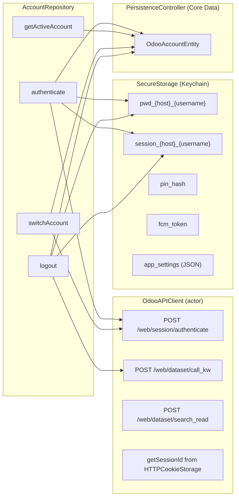
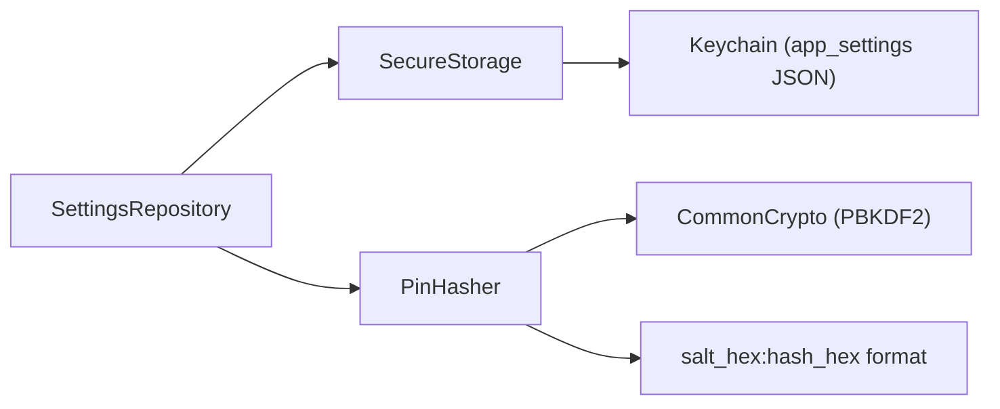
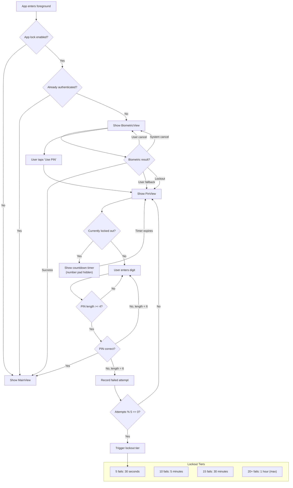
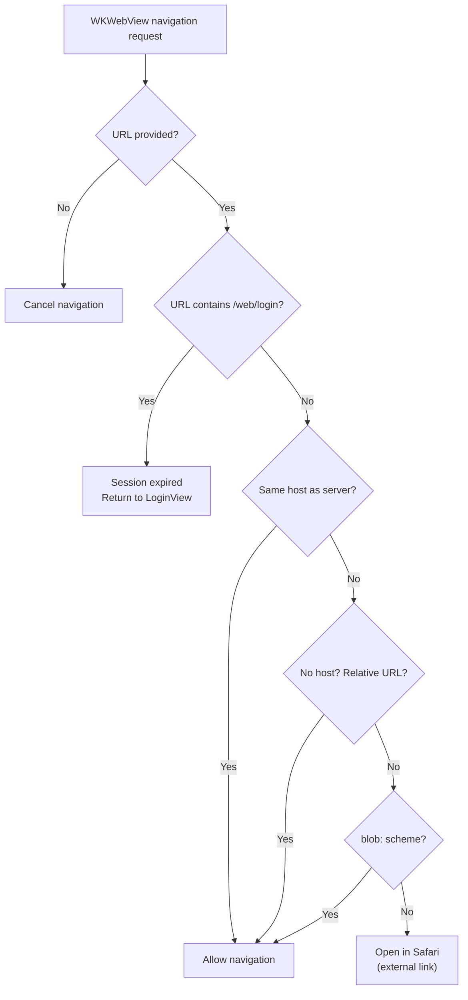
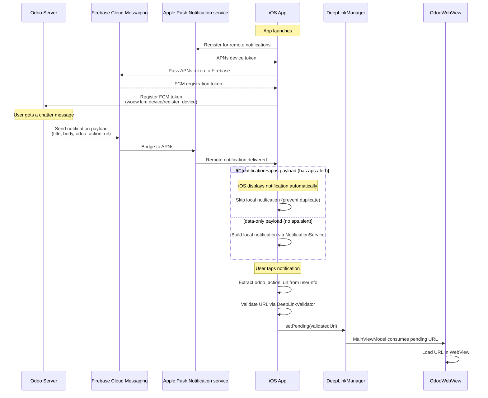
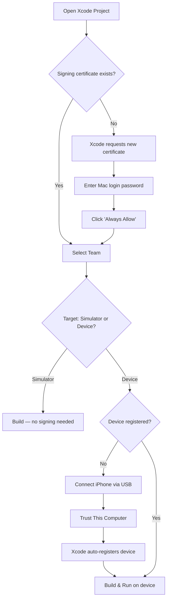
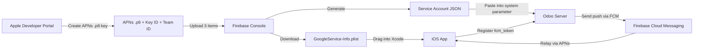
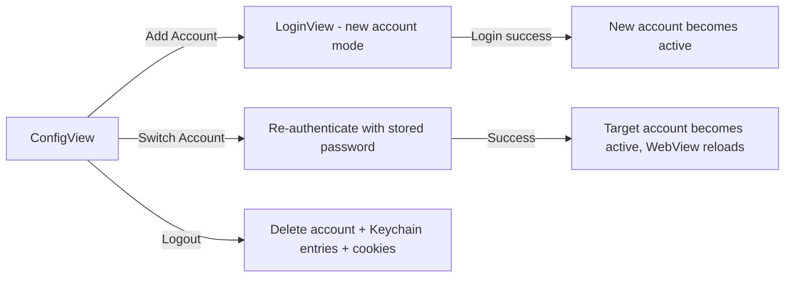

# WoowTech Odoo iOS

An iOS companion app for [Odoo ERP](https://www.odoo.com/) built by WoowTech. The app wraps Odoo's web interface in a native WKWebView, adding biometric/PIN security, multi-account management, push notifications via Firebase Cloud Messaging (FCM), deep linking, theme customization, and localization in English, Simplified Chinese, and Traditional Chinese.

This is the iOS port of the existing WoowTech Odoo Android app. Every user-facing behavior is documented in a [Functional Equivalence Matrix](docs/functional-equivalence-matrix.md) (82 UX items, all implemented) to ensure the two platforms behave identically.

---

## Table of Contents

1. [Architecture Overview](#1-architecture-overview)
2. [Navigation Flow](#2-navigation-flow)
3. [Data Flow](#3-data-flow)
4. [Auth Gate Flow](#4-auth-gate-flow)
5. [WebView Navigation Policy](#5-webview-navigation-policy)
6. [Push Notification Flow](#6-push-notification-flow)
7. [Project Structure](#7-project-structure)
8. [Prerequisites](#8-prerequisites)
9. [Setup Steps](#9-setup-steps)
10. [Configuration](#10-configuration)
11. [Key Features](#11-key-features)
12. [Security Model](#12-security-model)
13. [Testing](#13-testing)
14. [Debug Hooks](#14-debug-hooks)
15. [Troubleshooting](#15-troubleshooting)
16. [Contributing](#16-contributing)

---

## 1. Architecture Overview

The app follows the **MVVM (Model-View-ViewModel)** architecture with a Repository pattern for data access. Dependencies are injected via Swift protocols (no DI framework).



### Key Design Decisions

| Decision | Rationale |
|----------|-----------|
| SwiftUI (not UIKit) | iOS 16+ target; modern declarative UI matching Jetpack Compose on Android |
| Core Data (not SwiftData) | iOS 16 compatibility; SwiftData requires iOS 17 |
| Keychain (not UserDefaults) | Hardware-backed encryption for passwords, PIN hash, session tokens |
| URLSession (not Alamofire) | Built-in async/await support; no third-party dependency needed |
| Protocol-based DI | Lightweight; avoids framework overhead for a focused app |
| Swift actors | Thread-safe network layer without manual locks |
| JSON-RPC 2.0 | Odoo's native API protocol; no REST wrapper needed |
| Programmatic Core Data model | Avoids `.xcdatamodeld` file; model defined entirely in code |

---

## 2. Navigation Flow

The app uses a state machine (`LaunchState`) to decide which screen to show. The root view (`AppRootView`) observes `AppRootViewModel.launchState` and renders the appropriate screen.



### LaunchState enum

```swift
enum LaunchState {
    case loading       // Checking Core Data for an active account
    case login         // No account -- show LoginView
    case authenticated // Account found -- proceed to auth gate then MainView
}
```

The `AppRootView` also monitors `scenePhase`. When the app enters background with an active account and app lock enabled, `AuthViewModel.isAuthenticated` is set to `false`, forcing re-authentication on return to foreground. A privacy overlay (lock icon on solid background) is shown while the app is in the task switcher to prevent sensitive content from being visible in screenshots.

---

## 3. Data Flow

### Repository to Storage/API



### SettingsRepository Flow



### Data Storage Matrix

| Data | Storage | Encryption | Access Level |
|------|---------|------------|-------------|
| Passwords | Keychain | Hardware-backed | WhenUnlockedThisDeviceOnly |
| Session IDs | Keychain | Hardware-backed | WhenUnlockedThisDeviceOnly |
| PIN Hash (PBKDF2) | Keychain (in AppSettings JSON) | Hardware-backed | WhenUnlockedThisDeviceOnly |
| FCM Token | Keychain | Hardware-backed | WhenUnlockedThisDeviceOnly |
| App Settings | Keychain (JSON blob) | Hardware-backed | WhenUnlockedThisDeviceOnly |
| Account Metadata | Core Data (SQLite) | Unencrypted | App sandbox |
| Pending Deep Link | UserDefaults | Unencrypted | App sandbox |

Account metadata in Core Data contains no secrets -- only `serverUrl`, `database`, `username`, `displayName`, `userId`, `isActive`, and `createdAt`.

---

## 4. Auth Gate Flow

When app lock is enabled, the user must authenticate before seeing the main screen. The auth gate supports Face ID, Touch ID, and PIN (4-6 digits) with exponential lockout.



### PIN Entry Logic

The PIN entry uses a progressive verification strategy. A PIN can be 4, 5, or 6 digits long. When the user enters their 4th digit, the system checks if it matches. If it does not match but the user has entered fewer than 6 digits, the system assumes the stored PIN might be longer and lets the user keep entering digits. A failed attempt is only counted when all 6 digits have been entered without a match, or when the correct length is entered and does not match.

---

## 5. WebView Navigation Policy

The `OdooWebViewCoordinator` enforces a strict same-host policy. Every navigation request passes through `decideNavigation(for:)`, which returns one of four outcomes.



### NavigationDecision enum

```swift
enum NavigationDecision: Equatable {
    case allow            // Load in WebView
    case sessionExpired   // Redirect to login
    case openInSafari(URL) // External link -> Safari
    case cancel           // No URL provided
}
```

The `decideNavigation(for:)` method is a pure function with no side effects, making it fully unit-testable without a live WKWebView. The coordinator also:

- Injects OWL layout fix CSS/JS after each page load to prevent blank areas in Odoo's OWL framework
- Blocks popup windows (`createWebViewWith` returns nil), loading target-less links in the current WebView instead
- Sets the session cookie before the first load using `WKWebsiteDataStore.httpCookieStore`

---

## 6. Push Notification Flow

Push notifications use Firebase Cloud Messaging (FCM) bridged to Apple Push Notification service (APNs).



### Deep Link URL Validation

All incoming URLs (from notifications or the `woowodoo://` URL scheme) pass through `DeepLinkValidator.isValid()` before being loaded. The validator uses an allowlist approach:

- Relative paths must match `^/web(?:[/?#]|$)` (canonical Odoo paths only)
- Absolute URLs must use `https` scheme and match the active account's server host exactly
- Path traversal (`..` and `%2e%2e`), control characters, `javascript:`, `data:`, and `blob:` URLs are all rejected
- Empty server host rejects all absolute URLs (fails closed)

### Deep Link Persistence

`DeepLinkManager` stores pending URLs both in memory and in `UserDefaults`. This ensures that if a notification tap kills and relaunches the app (cold start), the deep link survives the authentication flow and is consumed after the user passes the auth gate.

---

## 7. Project Structure

```
Woow_odoo_ios/
|-- odoo/                              # Main app source
|   |-- odooApp.swift                  # @main entry point, AppRootView, URL scheme handler
|   |-- App/
|   |   |-- AppDelegate.swift          # Push notifications, Firebase, test hooks
|   |-- Data/
|   |   |-- API/
|   |   |   |-- OdooAPIClient.swift    # JSON-RPC 2.0 actor (auth, callKw, searchRead)
|   |   |   |-- JsonRpcModels.swift    # Request/response models, AnyCodable
|   |   |-- Push/
|   |   |   |-- DeepLinkManager.swift  # Pending URL store (memory + UserDefaults)
|   |   |   |-- DeepLinkValidator.swift # URL allowlist validation
|   |   |   |-- NotificationService.swift # Local notification builder
|   |   |   |-- PushTokenRepository.swift # FCM token registration with Odoo
|   |   |-- Repository/
|   |   |   |-- AccountRepository.swift # Account CRUD, auth, switch, logout
|   |   |   |-- SettingsRepository.swift # App settings, PIN verify, lockout
|   |   |   |-- CacheService.swift     # Cache clear, size calculation
|   |   |-- Storage/
|   |       |-- SecureStorage.swift    # Keychain wrapper (passwords, sessions, settings)
|   |       |-- PersistenceController.swift # Core Data stack (programmatic model)
|   |       |-- OdooAccountEntity.swift # Core Data managed object + fetch requests
|   |       |-- PinHasher.swift        # PBKDF2-HMAC-SHA256, lockout tiers
|   |-- Domain/
|   |   |-- Models/
|   |       |-- OdooAccount.swift      # Account domain model
|   |       |-- AppSettings.swift      # Settings model (Codable)
|   |       |-- AuthResult.swift       # Auth result enum with error types
|   |       |-- String+EnsureHTTPS.swift # HTTPS prefix utility
|   |-- UI/
|   |   |-- App/
|   |   |   |-- AppRootViewModel.swift # LaunchState state machine
|   |   |-- Auth/
|   |   |   |-- AuthViewModel.swift    # Biometric/PIN state, bg/fg re-auth
|   |   |   |-- BiometricView.swift    # Face ID / Touch ID screen
|   |   |   |-- PinView.swift          # PIN entry with number pad + lockout
|   |   |   |-- NumberPadView.swift    # Shared 3x3 + 0 + delete number pad
|   |   |-- Login/
|   |   |   |-- LoginView.swift        # Two-step login (server info -> credentials)
|   |   |   |-- LoginViewModel.swift   # Login flow, validation, auto-prefill
|   |   |-- Main/
|   |   |   |-- MainView.swift         # WebView container with toolbar
|   |   |   |-- MainViewModel.swift    # Active account, session, deep links
|   |   |   |-- OdooWebView.swift      # WKWebView wrapper + navigation delegate
|   |   |-- Config/
|   |   |   |-- ConfigView.swift       # Account list, switch, add, logout
|   |   |   |-- ConfigViewModel.swift  # Account operations
|   |   |-- Settings/
|   |   |   |-- SettingsView.swift     # Appearance, Security, Language, Data, Help, About
|   |   |   |-- SettingsViewModel.swift # Settings state management
|   |   |   |-- ColorPickerView.swift  # Brand + accent colors + HEX input
|   |   |   |-- PinSetupView.swift     # New PIN / Change PIN flow
|   |   |-- Common/
|   |   |   |-- ErrorBannerView.swift  # Shared red error banner component
|   |   |-- Theme/
|   |       |-- WoowColors.swift       # Brand palette (5 brand + 10 accent colors)
|   |       |-- WoowTheme.swift        # Observable theme manager
|   |-- Resources/
|   |   |-- en.lproj/Localizable.strings
|   |   |-- zh-Hans.lproj/Localizable.strings
|   |   |-- zh-Hant.lproj/Localizable.strings
|   |-- Info.plist                     # Permissions, URL scheme, background modes
|   |-- PrivacyInfo.xcprivacy         # App Store privacy manifest
|
|-- odooTests/                         # Unit tests (XCTest)
|   |-- odooTests.swift               # 105 tests: DeepLinkValidator, PinHasher, API, etc.
|   |-- MissingTests.swift            # 93 tests: comprehensive gap coverage
|   |-- OdooWebViewNavigationTests.swift # 15 tests: WebView navigation policy
|   |-- LoginViewModelPrefillTests.swift # 9 tests: auto-prefill from active account
|   |-- DeepLinkManagerPersistenceTests.swift # 10 tests: cold-start deep link persistence
|   |-- AppRootViewModelTests.swift   # 8 tests: LaunchState transitions
|   |-- SettingsGapTests.swift        # 7 tests: settings feature gaps
|   |-- AppDelegateDeepLinkTests.swift # 6 tests: notification tap deep links
|   |-- TestDoubles/
|       |-- TestDoubles.swift         # Mock repositories, storage, API client
|
|-- odooUITests/                       # E2E tests (XCUITest)
|   |-- E2E_HighPriority_Tests.swift  # 12 tests: login, WebView, auth, accounts
|   |-- E2E_MediumPriority_Tests.swift # 22 tests: PIN, cache, deep links, locale
|   |-- odooUITests.swift             # 35 tests: original E2E suite
|   |-- SharedTestConfig.swift        # Test server credentials loader
|   |-- TestConfig.plist              # Test server URL + credentials (not in app bundle)
|   |-- odooUITestsLaunchTests.swift  # Launch performance test
|
|-- odoo.xcodeproj/                    # Xcode project
|-- scripts/
|   |-- verify_all.py                 # Simulator verification script
|   |-- e2e-fcm-test.py              # FCM push notification test script
|-- docs/                             # Architecture docs, audit reports, test plans
|-- CLAUDE.md                         # AI assistant instructions
```

### File Count Summary

| Category | Files | Lines (approx.) |
|----------|-------|-----------------|
| Production Swift | 38 | ~4,000 |
| Unit test files | 9 | ~2,500 |
| UI test files | 6 | ~3,500 |
| Localization files | 3 | ~370 |

---

## 8. Prerequisites

| Requirement | Version |
|-------------|---------|
| macOS | 14.0 (Sonoma) or later |
| Xcode | 16.0 or later |
| iOS Deployment Target | 16.0 |
| Swift | 5.0 |
| Device for Face ID testing | iPhone with Face ID (simulator supports Face ID enrollment) |

### Dependencies (Swift Package Manager)

The only external dependency is Firebase iOS SDK (optional -- the app compiles and runs without it):

| Package | Version | Purpose |
|---------|---------|---------|
| [firebase-ios-sdk](https://github.com/firebase/firebase-ios-sdk) | 11.15.0 | Push notifications via FCM |

Firebase is conditionally imported using `#if canImport(FirebaseCore)` / `#if canImport(FirebaseMessaging)`, so the app builds and runs without Firebase configured. Push notifications will not work without it.

No CocoaPods or Carthage -- the project uses Swift Package Manager exclusively.

---

## 9. Setup Steps

### 1. Clone the repository

```bash
git clone <repository-url>
cd Woow_odoo_ios
```

### 2. Open in Xcode

```bash
open odoo.xcodeproj
```

Xcode will automatically resolve the Swift Package Manager dependencies (Firebase SDK). This may take a few minutes on first open.

### 3. Configure Code Signing

#### 3.1 Select your development team

1. Open `odoo.xcodeproj` in Xcode
2. Select the **`odoo`** target in the project navigator
3. Go to **Signing & Capabilities** tab
4. Check **"Automatically manage signing"**
5. Select your **Team** from the dropdown (your Apple Developer account)
6. Repeat for the **`odooTests`** and **`odooUITests`** targets

> **Bundle Identifier:** Default is `io.woowtech.odoo`. If another developer on your team already uses this, change it to something unique (e.g., `io.woowtech.odoo.yourname`).

#### 3.2 Create a development certificate (first time only)

If Xcode says "No signing certificate found":

1. Xcode will prompt **"Xcode can request a certificate for you"** → Click **Request**
2. Xcode creates a new iOS Development certificate and stores it in your Mac's Keychain
3. If prompted for your **Mac login password** (keychain access) → enter it and click **"Always Allow"**

> **Note:** This creates a **development** certificate only. It does NOT affect any existing App Store distribution certificates.

#### 3.3 Register your iPhone for testing

To run on a real device (not just simulator):

1. Connect your iPhone via USB
2. Unlock the phone and tap **"Trust This Computer"** if prompted
3. In Xcode, select your iPhone from the device dropdown (top toolbar)
4. Xcode will automatically register your device with Apple Developer
5. First build may take a moment — Xcode downloads a provisioning profile

> **Common issue:** If you see `"Unable to install — verify code signature"`, clean the build folder: **Product → Clean Build Folder** (Cmd+Shift+K), then rebuild.

#### 3.4 Signing diagram



### 4. Firebase setup (for push notifications)

Without Firebase, the app runs normally but will not receive push notifications.

#### 4.0 Credentials Setup Flow



#### 4.1 Create the APNs authentication key (one per Apple Developer team)

1. Go to [developer.apple.com/account/resources/authkeys/list](https://developer.apple.com/account/resources/authkeys/list)
2. Click the **+** button to create a new key
3. Name it (e.g., `WoowTech FCM APNs Key`)
4. Check **Apple Push Notifications service (APNs)**
5. Click **Continue** → **Register**
6. **Download the `.p8` file** — you can only download it once, keep it safe
7. Note the **Key ID** (10 characters, shown on the screen)
8. Find your **Team ID** at [developer.apple.com/account](https://developer.apple.com/account) (top right, 10 characters)

You now have 3 items: `.p8` file, Key ID, Team ID.

#### 4.2 Create a Firebase project

1. Go to [console.firebase.google.com](https://console.firebase.google.com)
2. Click **Add project** → enter a name (e.g., `woowtech-odoo`)
3. Disable Google Analytics (not needed) → **Create project**

#### 4.3 Register the iOS app with Firebase

1. In your Firebase project → click the **iOS icon** to add an iOS app
2. Enter your **Bundle ID** (must match the Xcode bundle ID, e.g., `io.woowtech.odoo`)
3. App nickname (optional, e.g., `WoowTech Odoo iOS`)
4. Click **Register app**
5. **Download `GoogleService-Info.plist`** → drag it into the `odoo/` folder in Xcode
6. In the Xcode "Choose options" dialog: check **Copy items if needed** and check the **`odoo`** target
7. Skip "Add Firebase SDK" step (already added via SPM)
8. Click **Next** → **Next** → **Continue to console**

#### 4.4 Upload APNs key to Firebase

1. In Firebase Console → **Project Settings** (gear icon) → **Cloud Messaging** tab
2. Scroll to **Apple app configuration** → **APNs Authentication Key** → **Upload**
3. Upload the `.p8` file from step 4.1
4. Enter the **Key ID** and **Team ID** from step 4.1
5. Click **Upload**

#### 4.5 Enable required Xcode capabilities

In Xcode → select `odoo` target → **Signing & Capabilities** tab → **+ Capability**:

1. Add **Push Notifications**
2. Add **Background Modes** → check **Remote notifications**

Without Background Modes, silent push notifications will not wake the app.

#### 4.6 Verify push notifications work

1. Build and run on a **real iPhone** (push does not work on simulator before iOS 16)
2. Accept the notification permission prompt
3. In Firebase Console → **Messaging** → **New campaign** → **Notifications**
4. Enter test title/body → **Send test message** → paste the FCM token (see Odoo server logs or the app's debug output)
5. Phone should receive the notification within seconds

If you see the notification, Firebase → APNs → app delivery is working end-to-end.

### 5. Build and run

```bash
# Build for simulator
xcodebuild -project odoo.xcodeproj -scheme odoo \
  -destination 'platform=iOS Simulator,name=iPhone 16' build

# Or simply press Cmd+R in Xcode
```

### 6. Run unit tests

```bash
xcodebuild -project odoo.xcodeproj -scheme odoo \
  -destination 'platform=iOS Simulator,name=iPhone 16' \
  -only-testing:odooTests test
```

### 7. Run E2E tests

E2E tests require a running Odoo server. Configure `odooUITests/TestConfig.plist` with your test server credentials, then:

```bash
xcodebuild -project odoo.xcodeproj -scheme odoo \
  -destination 'platform=iOS Simulator,name=iPhone 16' \
  -only-testing:odooUITests test
```

---

## 10. Configuration

### Connecting to an Odoo Server

1. Launch the app
2. Enter the server URL (e.g., `company.odoo.com` -- the `https://` prefix is added automatically)
3. Enter the database name
4. Tap **Next**
5. Enter your Odoo username and password
6. Tap **Login**

The app enforces HTTPS at three layers:
- **iOS ATS** (App Transport Security) blocks all HTTP connections at the OS level
- **LoginViewModel** explicitly rejects `http://` URLs with a user-facing error
- **OdooAPIClient** guards `serverUrl.hasPrefix("https://")` before making any request

### Test Account Setup

For E2E testing, create a `TestConfig.plist` in the `odooUITests/` directory:

```xml
<?xml version="1.0" encoding="UTF-8"?>
<!DOCTYPE plist PUBLIC "-//Apple//DTD PLIST 1.0//EN"
  "http://www.apple.com/DTDs/PropertyList-1.0.dtd">
<plist version="1.0">
<dict>
    <key>serverUrl</key>
    <string>your-odoo-server.com</string>
    <key>database</key>
    <string>your-database</string>
    <key>username</key>
    <string>test-user</string>
    <key>password</key>
    <string>test-password</string>
</dict>
</plist>
```

This file is loaded by `SharedTestConfig.swift` and is part of the `odooUITests` target only -- it is never included in the main app bundle.

---

## 11. Key Features

### Multi-Account Management

The app supports multiple Odoo accounts simultaneously. Accounts are stored in Core Data with one account marked as `isActive` at any time.



Key behaviors:
- **Add Account**: Navigates to LoginView with the server URL step shown (not pre-filled from existing account)
- **Switch Account**: Re-authenticates with the stored password to validate the session (G8), then sets the target account as active
- **Logout**: Clears the account from Core Data, deletes password and session ID from Keychain, clears cookies, unregisters the FCM token from the Odoo server (G9), and returns to the login screen
- **Auto-prefill on session expiry**: When a session expires, LoginView pre-fills the server URL, database, username, and password from the active account for quick re-login

### Biometric + PIN Security

- **App Lock toggle** in Settings enables/disables the auth gate
- **Biometric**: Uses `LAContext` with `.deviceOwnerAuthenticationWithBiometrics` (Face ID or Touch ID)
- **No skip button**: The biometric screen has no bypass; users must authenticate or use the PIN fallback
- **PIN**: 4-6 digit PIN stored as a PBKDF2-HMAC-SHA256 hash
- **Lockout**: Exponential lockout after consecutive failures (30s, 5m, 30m, 1hr cap)
- **Background re-auth**: When the app goes to background, `isAuthenticated` resets to `false`, requiring re-authentication on return

### WebView with Same-Host Enforcement

- Odoo's web UI loads in a `WKWebView` with the session cookie pre-injected
- All navigation is filtered: same-host URLs are allowed, external URLs open in Safari
- Session expiry is detected by watching for redirects to `/web/login`
- OWL framework layout fixes are injected after each page load via JavaScript
- `blob:` URLs are allowed (required for OWL framework file downloads)
- Popup windows are blocked; target-less links load in the current WebView

### Push Notifications (FCM)

- Firebase Cloud Messaging bridges to APNs for iOS delivery
- The app registers the FCM token with all Odoo accounts via `woow.fcm.device/register_device`
- Duplicate prevention: if iOS already displayed a notification (has `aps.alert`), the app skips creating a local notification
- Foreground notifications show as banners (`.banner`, `.sound`, `.badge`)
- Lock screen privacy: notifications use `hiddenPreviewsBodyPlaceholder` to hide content when the device is locked
- Notification taps extract `odoo_action_url`, validate it via `DeepLinkValidator`, and navigate via `DeepLinkManager`
- On logout, the FCM token is unregistered from the Odoo server (best-effort, never blocks logout)

### Deep Linking (woowodoo:// scheme)

The app registers the `woowodoo` URL scheme in `Info.plist`. URLs are handled in `odooApp.handleIncomingURL(_:)`.

**Format**: `woowodoo://open?url=/web%23id=42`

The `url` query parameter is extracted, validated against `DeepLinkValidator.isValid()`, and stored in `DeepLinkManager`. The WebView consumes it on the next load.

### Theme Customization

- **Theme Color**: Customizable primary color from 5 brand colors, 10 accent colors, or any custom HEX value
- **Theme Mode**: System / Light / Dark (uses `.preferredColorScheme()`)
- **Reduce Motion**: Toggle to reduce animations
- All theme settings are persisted in Keychain as part of the `AppSettings` JSON blob

Brand color palette (same hex values as Android):

| Color | Hex |
|-------|-----|
| Primary Blue | `#6183FC` |
| White | `#FFFFFF` |
| Light Gray | `#EFF1F5` |
| Gray | `#646262` |
| Deep Gray | `#212121` |
| + 10 accent colors | Cyan, Yellow, Sky Blue, Royal Blue, Green, Brown, Sand, Orange, Coral, Lavender |

### Localization

The app supports three languages:
- **English** (`en`)
- **Simplified Chinese** (`zh-Hans`)
- **Traditional Chinese** (`zh-Hant`)

Language switching on iOS follows Apple's per-app language setting (iOS 16+). Users go to iOS Settings > odoo > Language to change the app's language. This is different from Android, which switches instantly in-app.

Localized strings are stored in `odoo/Resources/{locale}.lproj/Localizable.strings` and referenced via `String(localized:)`.

---

## 12. Security Model

The app received an **A- security grade** in a comprehensive audit (see [Security Audit Report](docs/2026-04-07-Security-Audit-Report.md)). No critical or high-severity vulnerabilities were found.

### Keychain Usage

All sensitive data is stored in the iOS Keychain with:
- **Access level**: `kSecAttrAccessibleWhenUnlockedThisDeviceOnly` -- data is only accessible when the device is unlocked and is not included in device backups
- **iCloud sync disabled**: `kSecAttrSynchronizable: false` -- data stays on device
- **Atomic writes**: Uses update-or-add pattern to avoid race conditions from delete-then-add
- **Server-scoped keys**: Password keys use `pwd_{host}_{username}` format to prevent collisions across multi-tenant deployments

### PBKDF2 PIN Hashing

```
Algorithm:   PBKDF2 with HMAC-SHA256
Iterations:  600,000 (OWASP recommended minimum)
Salt:        16 bytes (128 bits) from SecRandomCopyBytes
Hash:        32 bytes (256 bits)
Format:      salt_hex:hash_hex
Comparison:  Constant-time (prevents timing side-channel attacks)
```

The PIN hasher is cross-platform compatible with the Android implementation (same algorithm, iterations, salt length, hash length, and storage format).

### HTTPS Enforcement (Triple Layer)

| Layer | Location | Mechanism |
|-------|----------|-----------|
| OS | `Info.plist` | No ATS exceptions -- iOS blocks all HTTP |
| UI | `LoginViewModel.swift` | Rejects `http://` with user-facing error |
| API | `OdooAPIClient.swift` | Guards `serverUrl.hasPrefix("https://")` |

### Deep Link Validation

The `DeepLinkValidator` uses an allowlist approach:

```
Allowed:  /web, /web/, /web#..., /web?..., /web/action/...
Blocked:  /website/, /webapi/, /web@evil.com, /web/../
Blocked:  javascript:, data:, blob:, file:, ftp:// URLs
Blocked:  Path traversal (.. and %2e%2e)
Blocked:  Control characters (newline injection, header injection)
Blocked:  Absolute URLs with mismatched host
Blocked:  All absolute URLs when server host is unknown (fails closed)
```

### Session Management

- Session cookies managed by `URLSession` (system-managed, sandboxed)
- Session ID also stored in Keychain (hardware-backed backup that survives app restart)
- On logout: cookies cleared from `HTTPCookieStorage`, session ID deleted from Keychain, password deleted from Keychain
- Session expiry detected via `/web/login` redirect in the WebView

### Privacy

- **Task switcher overlay**: When the app enters background, a lock icon overlay hides sensitive content
- **Notification privacy**: Notifications use `hiddenPreviewsBodyPlaceholder` ("New Odoo notification") when the device is locked
- **Privacy manifest**: `PrivacyInfo.xcprivacy` declares no tracking and no data collection
- **Debug logging**: All `print()` statements are wrapped in `#if DEBUG`

---

## 13. Testing

### Unit Tests

**Location**: `odooTests/`
**Count**: 253 test functions across 8 test files
**Framework**: XCTest

| Test File | Tests | Coverage |
|-----------|-------|----------|
| `odooTests.swift` | 105 | DeepLinkValidator, PinHasher, AuthResult, API models, URL helpers |
| `MissingTests.swift` | 93 | Comprehensive gap coverage: AppSettings, CacheService, WoowTheme, NotificationService, etc. |
| `OdooWebViewNavigationTests.swift` | 15 | WebView navigation policy (same-host, external, blob, session expiry) |
| `DeepLinkManagerPersistenceTests.swift` | 10 | Cold-start deep link persistence via UserDefaults |
| `LoginViewModelPrefillTests.swift` | 9 | Auto-prefill from active account, add-account mode |
| `AppRootViewModelTests.swift` | 8 | LaunchState transitions (loading, login, authenticated) |
| `SettingsGapTests.swift` | 7 | Settings features: app lock, biometric, reduce motion |
| `AppDelegateDeepLinkTests.swift` | 6 | Notification tap deep link validation |

#### Running unit tests

```bash
# All unit tests
xcodebuild -project odoo.xcodeproj -scheme odoo \
  -destination 'platform=iOS Simulator,name=iPhone 16' \
  -only-testing:odooTests test

# Specific test file
xcodebuild -project odoo.xcodeproj -scheme odoo \
  -destination 'platform=iOS Simulator,name=iPhone 16' \
  -only-testing:odooTests/OdooWebViewNavigationTests test
```

### E2E Tests (XCUITest)

**Location**: `odooUITests/`
**Count**: 30 end-to-end tests (12 HIGH priority + 18 MEDIUM priority)
**Framework**: XCUITest
**Status**: 30/30 PASS (see [E2E Test Progress](docs/2026-04-14-E2E-Test-Progress.md))

| Suite | Tests | Scope |
|-------|-------|-------|
| `E2E_HighPriority_Tests.swift` | 12 | WebView load, same-host rejection, session expiry, biometric, PIN, account management |
| `E2E_MediumPriority_Tests.swift` | 22 | Wrong PIN, lockout, cache clear, deep link rejection, network errors, locale |
| `odooUITests.swift` | 35 | Original E2E suite (login, settings, color picker, notifications) |

#### Simulator vs. Device tests

Some tests behave differently on a real device vs. simulator:

| Test Category | Simulator | Real Device |
|---------------|-----------|-------------|
| Face ID tests (cancel, fallback to PIN) | Works (simulated Face ID) | Skipped (Face ID auto-succeeds) |
| PIN entry tests | Works | Works |
| WebView tests | Works | Works |
| Push notification tests | Manual only | Manual only |

#### Running E2E tests

```bash
# Requires TestConfig.plist with valid Odoo server credentials
xcodebuild -project odoo.xcodeproj -scheme odoo \
  -destination 'platform=iOS Simulator,name=iPhone 16' \
  -only-testing:odooUITests test
```

### Test Doubles

Test doubles are defined in `odooTests/TestDoubles/TestDoubles.swift`:
- `MockAccountRepository` -- in-memory account storage implementing `AccountRepositoryProtocol`
- `MockSecureStorage` -- dictionary-backed storage implementing `SecureStorageProtocol`
- `MockURLProtocol` -- intercepts URLSession requests for API client testing

---

## 14. Debug Hooks

All debug hooks are guarded by `#if DEBUG` and stripped from release builds. They are set via Xcode scheme launch arguments or `XCUIApplication.launchArguments` in tests.

| Launch Argument | Value | Effect |
|----------------|-------|--------|
| `-ResetAppState` | (flag) | Clears all Keychain entries, Core Data accounts, and cookies. Produces first-launch state. |
| `-SetTestPIN` | `1234` (4-6 digits) | Hashes and stores a known PIN via SettingsRepository. |
| `-AppLockEnabled` | `YES` or `NO` | Forces app lock state without navigating to Settings. |
| `-ResetPINLockout` | `YES` | Clears failed PIN attempts and lockout timer. |

### Usage in XCUITest

```swift
let app = XCUIApplication()
app.launchArguments = [
    "-ResetAppState",
    "-SetTestPIN", "1234",
    "-AppLockEnabled", "YES"
]
app.launch()
```

### Usage in Xcode scheme

1. Edit Scheme > Run > Arguments
2. Add arguments under "Arguments Passed On Launch"

---

## 15. Troubleshooting

### Build fails with "No such module 'FirebaseCore'"

Firebase SPM packages may not have resolved yet. In Xcode:
1. File > Packages > Resolve Package Versions
2. Wait for resolution to complete
3. Build again

If you do not need push notifications, Firebase is conditionally imported and will not block compilation if the packages are missing from the target.

### WebView shows blank white screen after login

This is usually an OWL framework rendering issue. The app injects layout fix JavaScript after each page load, but it may not apply in time. Try:
1. Pull down to trigger a resize event
2. Rotate the device to landscape and back
3. If persistent, check that the Odoo server version is compatible (Odoo 16+ recommended)

### Biometric prompt does not appear

- Ensure Face ID / Touch ID is enrolled on the device or simulator
- In Simulator: Features > Face ID > Enrolled
- Check that app lock is enabled in Settings
- The biometric prompt auto-triggers on view appearance via `.onAppear`

### PIN lockout: "Try again in X seconds"

The lockout timer uses `ProcessInfo.processInfo.systemUptime` (monotonic clock), which is not affected by clock changes. Wait for the timer to expire. In development, use the `-ResetPINLockout YES` launch argument to clear the lockout.

### Push notifications not received

1. Verify `GoogleService-Info.plist` is in the app bundle
2. Check that an APNs authentication key is uploaded to Firebase Console
3. Verify the FCM token is printed in the debug console: `[AppDelegate] FCM token: ...`
4. Ensure the Odoo server has the `woow_fcm_push` module installed
5. Check device notification permissions: iOS Settings > odoo > Notifications

### E2E tests fail with "No account found"

Tests that require a logged-in account need a valid `TestConfig.plist`. Ensure:
1. The Odoo server is reachable from the test device/simulator
2. Credentials in `TestConfig.plist` are valid
3. The server URL uses HTTPS

### Core Data migration error on update

The app uses lightweight automatic migration. If you change the Core Data model (adding/removing attributes in `PersistenceController.buildManagedObjectModel()`), existing installations will migrate automatically. For destructive changes, delete the app from the simulator first.

### Session keeps expiring

- Check that cookies are not being cleared unexpectedly
- The session ID is backed up in Keychain; the WebView uses the cookie from `HTTPCookieStorage`
- If switching accounts, the app re-authenticates with stored password to get a fresh session

---

## 16. Contributing

### Code Style

- **Language**: Swift only, all code in English
- **UI**: SwiftUI exclusively (no UIKit for new screens)
- **Architecture**: MVVM with Repository pattern
- **Concurrency**: async/await, @MainActor, actors (no DispatchQueue for new code)
- **Naming**: Feature-based packages (`UI/Login/`, `UI/Auth/`, `Data/Repository/`)

### File Naming Conventions

| Type | Pattern | Example |
|------|---------|---------|
| View | Descriptive name | `LoginView.swift`, `BiometricView.swift` |
| ViewModel | `*ViewModel.swift` | `LoginViewModel.swift` |
| Repository | `*Repository.swift` | `AccountRepository.swift` |
| Model | Direct name | `OdooAccount.swift`, `AppSettings.swift` |
| Protocol | `*Protocol` suffix | `AccountRepositoryProtocol` |

### Commit Conventions

Use descriptive commit messages. The project does not enforce a strict format, but follow these patterns:

```
feat: add multi-account management
fix: prevent duplicate notifications on iOS
refactor: extract NumberPadView component
test: add WebView navigation policy unit tests
docs: update architecture diagrams
```

### Before Submitting

1. Ensure all unit tests pass: `xcodebuild test -only-testing:odooTests`
2. Ensure localization is complete for all three languages
3. Add `@Preview` for new SwiftUI views using `HAThemeForPreview` equivalent
4. Use `String(localized:)` for all user-facing strings -- never hardcode
5. Wrap debug logging in `#if DEBUG`
6. Store sensitive data in Keychain via `SecureStorage`, never in UserDefaults
7. Add unit tests for all public APIs and business logic
8. Validate deep link URLs through `DeepLinkValidator` -- never load URLs directly

### Key Protocols to Know

When adding new features, implement against these protocols for testability:

```swift
// Account operations
protocol AccountRepositoryProtocol: Sendable {
    func authenticate(...) async -> AuthResult
    func getActiveAccount() -> OdooAccount?
    func getAllAccounts() -> [OdooAccount]
    func switchAccount(id: String) async -> Bool
    func logout(accountId: String?) async
}

// Settings operations
protocol SettingsRepositoryProtocol {
    func getSettings() -> AppSettings
    func isAppLockEnabled() -> Bool
    func setPin(_ pin: String) -> Bool
    func verifyPin(_ pin: String) -> Bool
    // ... and more
}

// Secure storage
protocol SecureStorageProtocol: Sendable {
    func savePassword(serverUrl: String, username: String, password: String)
    func getPassword(serverUrl: String, username: String) -> String?
    func deletePassword(serverUrl: String, username: String)
    // ... and more
}
```

---

## Appendix: Functional Equivalence Matrix Summary

The app implements 82 UX items that are functionally equivalent to the Android version:

| Category | Items | Status |
|----------|-------|--------|
| Login (UX-01 to UX-09) | 9 | All DONE |
| Biometric/PIN (UX-10 to UX-24) | 15 | All DONE |
| Main WebView (UX-25 to UX-34) | 10 | All DONE |
| Push Notifications (UX-35 to UX-46) | 12 | All DONE |
| Settings (UX-47 to UX-57) | 11 | All DONE |
| Language (UX-58 to UX-62) | 5 | All DONE |
| Cache (UX-63 to UX-66) | 4 | All DONE |
| Multi-Account (UX-67 to UX-70) | 4 | All DONE |
| Deep Link Security (UX-71 to UX-75) | 5 | All DONE |
| Visual Consistency (UX-76 to UX-82) | 7 | All DONE |

See the full matrix at [docs/functional-equivalence-matrix.md](docs/functional-equivalence-matrix.md).

---

## Appendix: Quality and Security Audit Status

| Audit | Grade | Report |
|-------|-------|--------|
| Security | **A-** | [docs/2026-04-07-Security-Audit-Report.md](docs/2026-04-07-Security-Audit-Report.md) |
| Code Quality | **B+** | [docs/2026-04-07-Code-Quality-Audit-Report.md](docs/2026-04-07-Code-Quality-Audit-Report.md) |

No critical or high-severity security vulnerabilities. Main quality improvements are in string localization and view component extraction. See the reports for detailed findings and fix plans.
