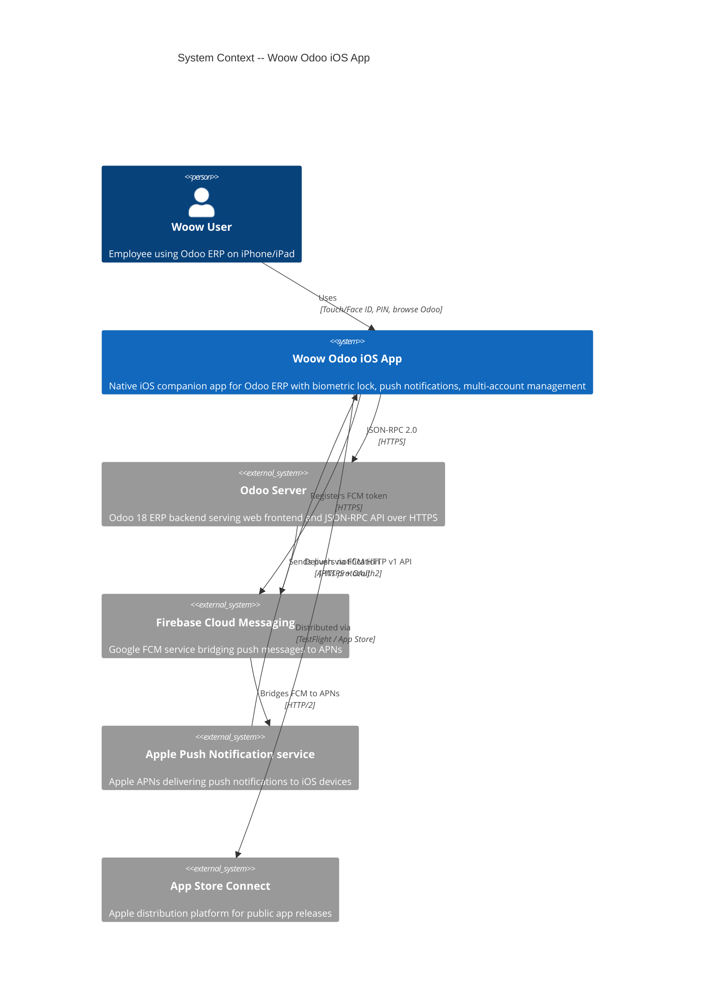
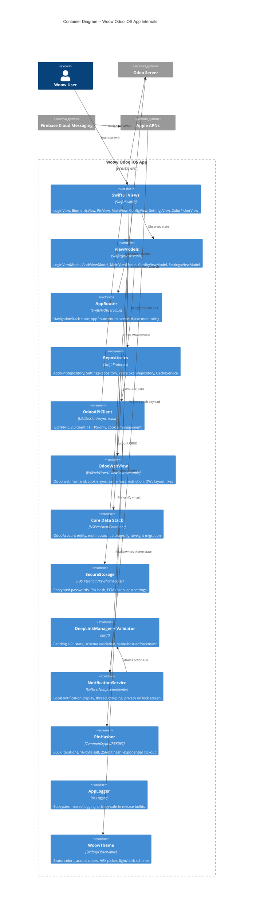
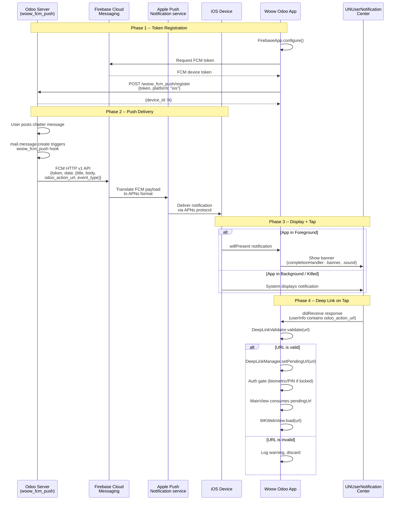
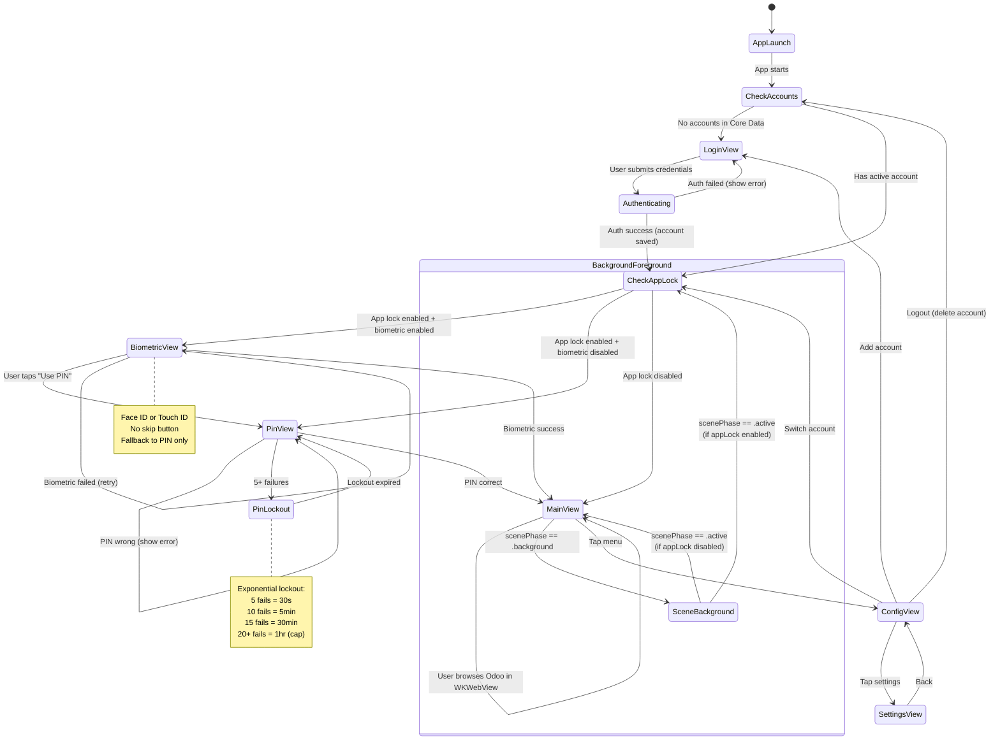
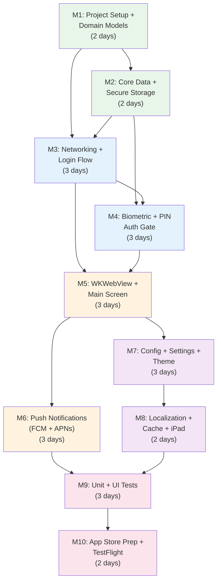

# iOS Implementation Milestones: Woow Odoo App

> **Date:** 2026-03-25
> **Author:** Claude Code (automated from Android codebase analysis + user decisions)
> **Repo:** `Woow_odoo_ios` (separate repository)
> **Bundle ID:** `io.woowtech.odoo`
> **Min iOS:** 16.0 (Core Data, system per-app language, universal iPhone+iPad)
> **Distribution:** App Store (public)
> **Fonts:** System (San Francisco)

---

## User Decisions Summary

| # | Question | Decision |
|---|----------|----------|
| Q1 | Min iOS version | **iOS 16** -- NO SwiftData, use Core Data instead |
| Q2 | Apple Developer account | **Yes**, existing account |
| Q3 | Bundle ID | **`io.woowtech.odoo`** -- same as Android, Firebase handles platform separation |
| Q4 | Language switching | **B** -- System Settings per-app language (iOS 16+) |
| Q5 | Device support | **Universal** -- iPhone + iPad from day 1 |
| Q6 | Distribution | **App Store** (public) -- architecture must pass Apple review |
| Q7 | Brand fonts | **No** -- use system fonts (San Francisco) |
| Q8 | Repository | **Separate repo** -- `Woow_odoo_ios` |

---

## 1. Architecture Block Diagrams

### 1.1 System Context (C4 Level 1)



### 1.2 Container Diagram (C4 Level 2)



### 1.3 FCM Push Notification Flow



### 1.4 Auth Lifecycle



### 1.5 Milestone Dependency Graph



---

## 2. Milestones

### Milestone M1: Project Setup + Domain Models

**Deliverable:** Xcode project builds with Swift 6, SPM dependencies resolve, all domain model files compile, universal (iPhone + iPad) target configured.

**Commits:** IC01, IC02

**Days:** 2

**Depends on:** None (pre-requisites: Apple Developer account active, APNs key created, `GoogleService-Info.plist` downloaded)

**Work items:**
- Create Xcode project `WoowOdoo` with SwiftUI App lifecycle
- Bundle ID: `io.woowtech.odoo`, deployment target iOS 16.0
- Enable Swift 6 strict concurrency checking
- Add SPM: `firebase-ios-sdk` (FirebaseMessaging), `KeychainAccess`
- Add `GoogleService-Info.plist` to the project
- Configure Info.plist: ATS (no exceptions), `NSFaceIDUsageDescription`, `NSCameraUsageDescription`, `NSPhotoLibraryUsageDescription`
- Enable capabilities: Push Notifications, Background Modes (Remote notifications)
- Register `woowodoo://` URL scheme in Info.plist
- Create domain models: `OdooAccount.swift` (plain struct, Core Data backing later), `AuthResult.swift` (enum with associated values), `AppSettings.swift` (struct, Codable), `ThemeMode.swift` (enum), `AppLanguage.swift` (enum)
- Create `AppLogger.swift` -- os.Logger wrapper with subsystem `io.woowtech.odoo` and categories (`auth`, `network`, `push`, `webview`, `settings`)
- Set up folder structure matching Section 1.2 container diagram
- Configure universal device target (iPhone + iPad) with adaptive layout foundation
- Add `PrivacyInfo.xcprivacy` with required privacy manifest entries

**Verification:**
- [ ] `xcodebuild -scheme WoowOdoo -destination 'platform=iOS Simulator,name=iPhone 16' build` succeeds
- [ ] `xcodebuild -scheme WoowOdoo -destination 'platform=iOS Simulator,name=iPad Pro 13-inch (M4)' build` succeeds
- [ ] Unit test: `OdooAccount`, `AuthResult`, `AppSettings`, `ThemeMode`, `AppLanguage` models instantiate correctly
- [ ] SPM dependencies resolve (Firebase, KeychainAccess)
- [ ] App launches on Simulator showing a placeholder view
- [ ] `PrivacyInfo.xcprivacy` is included in the bundle

---

### Milestone M2: Core Data + Secure Storage

**Deliverable:** Core Data stack operational with `OdooAccount` entity; Keychain-backed `SecureStorage` reads/writes encrypted data; `PinHasher` produces PBKDF2 hashes compatible with Android format.

**Commits:** IC02 (continued), IC03 (partial)

**Days:** 2

**Depends on:** M1

**Work items:**
- Create `WoowOdoo.xcdatamodeld` with `OdooAccount` entity:
  - Attributes: `id` (UUID), `serverUrl` (String), `database` (String), `username` (String), `displayName` (String), `sessionId` (String, optional), `isActive` (Boolean), `createdAt` (Date)
  - Match Android's `OdooAccount` Room entity field for field
- Create `PersistenceController.swift` with `NSPersistentContainer` setup
  - Singleton with `shared` instance and `preview` instance for SwiftUI previews
  - Configure lightweight migration options for future schema changes
  - Use `NSPersistentContainer` (NOT SwiftData -- iOS 16 requirement)
- Create `SecureStorage.swift` wrapping KeychainAccess:
  - Service identifier: `io.woowtech.odoo.keychain`
  - `kSecAttrAccessibleWhenUnlockedThisDeviceOnly` for passwords and PIN hash
  - `kSecAttrAccessibleAfterFirstUnlockThisDeviceOnly` for FCM token (background access)
  - `kSecAttrSynchronizable: false` (no iCloud Keychain sync)
  - Methods: `savePassword(accountId:password:)`, `getPassword(accountId:)`, `deletePassword(accountId:)`, `saveSettings(_:)`, `getSettings()`, `saveFcmToken(_:)`, `getFcmToken()`
- Create `PinHasher.swift` using CommonCrypto:
  - PBKDF2WithHmacSHA256, 600,000 iterations, 16-byte salt, 256-bit hash
  - Storage format: `salt_hex:hash_hex` (cross-platform compatible with Android)
  - `hash(pin:) -> String` and `verify(pin:against:) -> Bool`
  - Length validation: 4-6 digits only

**Verification:**
- [ ] Unit test: `PersistenceController` creates in-memory store, inserts `OdooAccount`, fetches it back
- [ ] Unit test: `SecureStorage` saves and retrieves password; delete works; missing key returns nil
- [ ] Unit test: `PinHasher.hash("1234")` produces `salt:hash` format with `:` separator
- [ ] Unit test: `PinHasher.verify("1234", against: hash)` returns true; `PinHasher.verify("9999", against: hash)` returns false
- [ ] Unit test: same PIN produces different hashes (random salt)
- [ ] Unit test: PIN shorter than 4 or longer than 6 digits is rejected

---

### Milestone M3: Networking + Login Flow

**Deliverable:** Complete login flow -- user can enter Odoo server URL, select database, enter credentials, and authenticate via JSON-RPC. Account is saved to Core Data with encrypted password in Keychain.

**Commits:** IC03 (continued), IC04

**Days:** 3

**Depends on:** M1, M2

**Work items:**
- Create `OdooAPIClient.swift` as a Swift actor:
  - JSON-RPC 2.0 request/response Codable models (`JsonRpcRequest`, `JsonRpcResponse`, `JsonRpcError`)
  - `URLSession` with custom configuration: 30s timeout, `HTTPCookieStorage.shared`
  - HTTPS-only enforcement (reject `http://` URLs)
  - Auto-prefix bare domain with `https://`
  - `authenticate(serverUrl:database:username:password:) async -> AuthResult`
  - `fetchDatabases(serverUrl:) async -> [String]` (for database selection step)
  - Session ID extraction from response cookies
  - Cookie clearing per host
- Create `AccountRepository.swift` (protocol + implementation):
  - `authenticate(serverUrl:database:username:password:) async -> AuthResult`
  - `switchAccount(id:) async -> Bool`
  - `logout(accountId:) async`
  - `removeAccount(id:) async`
  - `getActiveAccount() -> OdooAccount?`
  - `getAllAccounts() -> [OdooAccount]`
  - Multi-account support: deactivate all before activating selected
- Create `LoginView.swift` -- SwiftUI form:
  - Three-step flow: Server URL -> Database selection -> Credentials
  - HTTPS auto-prefix display
  - Loading state with ProgressView
  - Error display with localized messages
  - Keyboard handling with `@FocusState`
  - Adaptive layout for iPhone and iPad (wider form on iPad)
- Create `LoginViewModel.swift` -- @Observable class:
  - `uiState` with steps: `serverInfo`, `databaseSelection`, `credentials`
  - Field validation before API calls
  - Error type mapping to user-readable messages
  - Loading state management

**Verification:**
- [ ] Unit test: `OdooAPIClient` rejects `http://` URL with `.httpsRequired` error
- [ ] Unit test: `OdooAPIClient` auto-prefixes bare domain with `https://`
- [ ] Unit test: `LoginViewModel` starts on `.serverInfo` step; blank URL is rejected
- [ ] Unit test: `LoginViewModel` blank username/password rejected before network call
- [ ] Unit test: `AccountRepository` creates account in Core Data, saves encrypted password in Keychain
- [ ] Unit test: `AccountRepository` deactivates all accounts before activating new one
- [ ] Unit test: All `AuthResult.ErrorType` values mapped to user-readable messages
- [ ] Manual test: Login to real Odoo server via Simulator, account appears in Core Data
- [ ] Manual test: Login flow renders correctly on both iPhone and iPad simulators

---

### Milestone M4: Biometric + PIN Auth Gate

**Deliverable:** After login, the app enforces biometric (Face ID / Touch ID) or PIN authentication before showing the main screen. Background-to-foreground transitions re-trigger authentication when app lock is enabled.

**Commits:** IC05, IC06

**Days:** 3

**Depends on:** M2, M3

**Work items:**
- Create `AuthViewModel.swift` -- @Observable class:
  - `isAuthenticated: Bool` (starts false)
  - `setAuthenticated(_ value: Bool)`
  - `onAppBackgrounded()` -- resets `isAuthenticated` if app lock is enabled
  - `verifyPin(_ pin: String) -> Bool` delegating to SettingsRepository
  - `getRemainingAttempts() -> Int`
  - `isLockedOut() -> Bool`
  - Lockout timing via `ProcessInfo.processInfo.systemUptime` (not wall clock)
- Create `BiometricView.swift`:
  - `LAContext.evaluatePolicy(.deviceOwnerAuthenticationWithBiometrics)` integration
  - Automatic biometric prompt on appear
  - "Use PIN" fallback button (NO skip button)
  - Biometric availability check via `canEvaluatePolicy`
  - `NSFaceIDUsageDescription` already in Info.plist from M1
- Create `PinView.swift`:
  - Custom number pad with dot indicators (4-6 digits)
  - Shake animation on wrong PIN
  - Remaining attempts display
  - Lockout countdown timer display
  - Exponential lockout enforcement: 5 fails = 30s, 10 = 5min, 15 = 30min, 20+ = 1hr
- Create `AppRouter.swift` -- @Observable class:
  - `NavigationPath` state management
  - `AppRoute` enum: `.splash`, `.login`, `.auth`, `.pin`, `.main`, `.config`, `.settings`
  - Start destination logic: check accounts -> check app lock -> route
- Create `SettingsRepository.swift` (protocol + implementation -- auth-related subset):
  - `isAppLockEnabled() -> Bool`
  - `isBiometricEnabled() -> Bool`
  - `setPin(_:) -> Bool`, `verifyPin(_:) -> Bool`, `removePin()`
  - `getFailedAttempts() -> Int`, `incrementFailedAttempts()`, `resetFailedAttempts()`
  - `getLockoutEndTime() -> TimeInterval?`
  - Backed by `SecureStorage` (Keychain)
- Integrate `@Environment(\.scenePhase)` in root view:
  - On `.background` -> `authViewModel.onAppBackgrounded()`
  - On `.active` -> check if re-auth needed -> navigate to auth gate

**Verification:**
- [ ] Unit test: `AuthViewModel` starts with `isAuthenticated == false`
- [ ] Unit test: `onAppBackgrounded()` resets `isAuthenticated` when lock ON
- [ ] Unit test: `onAppBackgrounded()` does NOT reset when lock OFF
- [ ] Unit test: PIN verify delegates correctly (correct returns true, wrong returns false)
- [ ] Unit test: After 5 failed attempts, `isLockedOut()` returns true
- [ ] Unit test: Lockout durations: 5 = 30s, 10 = 5min, 15 = 30min, 20 = 1hr, 100 = 1hr (cap)
- [ ] Manual test: Face ID prompt appears on device (not Simulator)
- [ ] Manual test: No "Skip" button visible on BiometricView or PinView
- [ ] Manual test: App goes to background and returns -- re-auth required when lock is ON
- [ ] UI test: BiometricView has no skip-related accessibility elements

---

### Milestone M5: WKWebView + Main Screen

**Deliverable:** After authentication, the main screen displays the Odoo web interface in WKWebView with cookie synchronization, same-host restriction, OWL layout fixes, and deep link URL loading.

**Commits:** IC07, IC08

**Days:** 3

**Depends on:** M3, M4

**Work items:**
- Create `OdooWebView.swift` -- `UIViewRepresentable`:
  - `WKWebViewConfiguration`:
    - JavaScript enabled
    - DOM storage enabled
    - Custom user agent including "WoowOdoo/iOS"
    - Non-persistent data store option for cache control mode
  - Cookie synchronization from `URLSession` to `WKHTTPCookieStore`:
    - Sync session_id cookie before loading URL
    - Wait for `setCookie` completion handler before loading
  - Adaptive layout: fill available space on both iPhone and iPad
- Create `OdooWebViewCoordinator.swift`:
  - `WKNavigationDelegate`:
    - `decidePolicyFor navigationAction` -- same-host only enforcement
    - Block `javascript:` and `data:` schemes
    - External URLs -> `UIApplication.shared.open()`
    - Session expiry detection (`/web/login` redirect)
    - `didFinish` -- inject OWL framework layout fix JavaScript
  - `WKUIDelegate`:
    - File input handling (WKWebView handles natively on iOS)
    - `createWebViewWith configuration` -- block popup windows (return nil)
  - JavaScript injection on page finish:
    - Force body/html height to 100%
    - Force action_manager min-height
    - Dispatch resize events at 0ms, 100ms, 500ms, 1000ms
- Create `MainView.swift`:
  - NavigationStack with toolbar (menu button)
  - Loading overlay with ProgressView while WebView loads
  - Deep link URL consumption on appear
  - Pull-to-refresh for WebView reload
  - Safe area handling for Dynamic Island / notch / iPad
- Create `MainViewModel.swift` -- @Observable class:
  - Active account observation from Core Data
  - Session ID retrieval for cookie sync
  - Deep link URL consumption (`consumePendingDeepLink()`)
  - Credentials loading for WebView initialization
- Create `DeepLinkManager.swift` -- @Observable class:
  - `pendingUrl: String?`
  - `setPendingUrl(_:)`, `consumePendingUrl() -> String?`
  - Thread-safe access
- Create `DeepLinkValidator.swift` -- static validation methods:
  - Reject `javascript:`, `data:`, `ftp:` schemes (case-insensitive)
  - Reject empty/blank URLs
  - Allow relative `/web` paths
  - Verify same-host for absolute URLs
  - Port directly from Android -- pure logic, no platform dependencies

**Verification:**
- [ ] Unit test: `DeepLinkValidator` rejects `javascript:alert()`, `data:text/html`, empty, blank (6 tests)
- [ ] Unit test: `DeepLinkValidator` accepts `/web#id=42`, `/web#action=contacts`, `/web/login`, `/web` (4 tests)
- [ ] Unit test: `DeepLinkValidator` rejects `evil.com`, `attacker.com`, `ftp://` (3 tests)
- [ ] Unit test: `DeepLinkManager` -- consume returns nil when empty; set+consume returns URL then clears; overwrite keeps latest
- [ ] Unit test: `MainViewModel` returns active account session ID
- [ ] Manual test: Login on real Odoo server, WebView loads Odoo dashboard
- [ ] Manual test: Same-host restriction blocks navigation to external URLs
- [ ] Manual test: WebView renders correctly on iPhone (portrait) and iPad (landscape)
- [ ] Manual test: OWL framework layout has no blank areas or scrolling issues

---

### Milestone M6: Push Notifications (FCM + APNs)

**Deliverable:** App receives push notifications from the Odoo server via FCM/APNs. Tapping a notification deep-links to the relevant Odoo record. Token is registered with all Odoo accounts.

**Commits:** IC09, IC10

**Days:** 3

**Depends on:** M5

**Work items:**
- Create/update `AppDelegate.swift`:
  - `FirebaseApp.configure()` in `didFinishLaunchingWithOptions`
  - Conform to `UNUserNotificationCenterDelegate`
  - Conform to `MessagingDelegate` (Firebase)
  - `messaging(_:didReceiveRegistrationToken:)` -- save token + register with Odoo
  - `userNotificationCenter(_:willPresent:)` -- show banner when app is foreground
  - `userNotificationCenter(_:didReceive:)` -- handle notification tap -> deep link
  - Request notification permission at first launch: `UNUserNotificationCenter.requestAuthorization(options: [.alert, .sound, .badge])`
  - Register for remote notifications: `UIApplication.shared.registerForRemoteNotifications()`
- Create `NotificationService.swift`:
  - Build `UNMutableNotificationContent` from FCM data payload
  - Fields: `title`, `body`, `odoo_action_url` (in userInfo), `event_type`
  - `threadIdentifier` set to `event_type` for automatic grouping (maps to Android notification groups)
  - Sound: `.default`
  - Privacy: content hidden on lock screen via notification settings
- Create `PushTokenRepository.swift` (protocol + implementation):
  - `registerToken(_ token: String) async` -- POST to all active Odoo accounts at `/woow_fcm_push/register` with `platform: "ios"`
  - `saveToken(_ token: String)` -- store in Keychain
  - `getToken() -> String?` -- retrieve from Keychain
  - `unregisterToken() async` -- POST to `/woow_fcm_push/unregister` on logout
- Wire deep link flow:
  - Notification tap -> extract `odoo_action_url` from `userInfo`
  - Validate with `DeepLinkValidator`
  - Set in `DeepLinkManager`
  - Auth gate if locked -> MainView consumes pending URL -> WKWebView loads

**Verification:**
- [ ] Unit test: `NotificationService` builds content with correct title, body, threadIdentifier from data payload
- [ ] Unit test: Missing title or body -> no notification created (no crash)
- [ ] Unit test: `PushTokenRepository` saves token to Keychain and registers with N accounts
- [ ] Unit test: `PushTokenRepository` with 0 accounts -> saves token only, no error
- [ ] Unit test: FCM data payload parsing: all 6 fields extracted, missing optional fields return nil
- [ ] Unit test: Case sensitivity -- "title" works, "Title" does not
- [ ] Manual test: Send push from Firebase Console -> notification appears on device
- [ ] Manual test: Tap notification -> app opens to correct Odoo record via deep link
- [ ] Manual test: FCM token registered with Odoo server (verify in Odoo admin: FCM Devices list with `platform = ios`)

---

### Milestone M7: Config + Settings + Theme

**Deliverable:** Config screen shows account list with switch/add/logout. Settings screen has appearance (theme color picker, dark mode), security (app lock, biometric, PIN setup), and data management sections. Brand color system with 5 brand + 10 accent colors + HEX input.

**Commits:** IC11, IC12, IC13

**Days:** 3

**Depends on:** M5

**Work items:**
- Create `ConfigView.swift`:
  - Profile card with avatar initial letter
  - Account list (expandable) with switch action
  - "Add Account" button -> navigate to LoginView
  - "Logout" button with confirmation alert
  - Adaptive layout for iPad (sidebar-style on larger screens)
- Create `ConfigViewModel.swift`:
  - Account list from Core Data
  - `switchAccount(id:) async -> Bool`
  - `logout() async`
  - `removeAccount(id:) async`
- Create `SettingsView.swift`:
  - **Appearance section:** Theme color (opens ColorPickerView), dark mode toggle (System/Light/Dark)
  - **Security section:** App lock toggle, biometric toggle (only if app lock on), PIN setup/change/remove
  - **Data & Storage section:** Cache size display, "Clear Cache" button
  - **About section:** App version, build number
  - SwiftUI `Form` / `List` with `Section` headers
- Create `SettingsViewModel.swift` -- @Observable class:
  - Delegates all operations to `SettingsRepository` and `CacheService`
  - `updateThemeColor(_ hex: String)`
  - `updateThemeMode(_ mode: ThemeMode)`
  - `toggleAppLock(_ enabled: Bool)`, `toggleBiometric(_ enabled: Bool)`
  - `setPin(_ pin: String) -> Bool`, `removePin()`
  - `clearCache() async`
  - `cacheSize: String` (formatted: "0 B", "512 B", "1 KB", "3 MB")
- Complete `SettingsRepository.swift` implementation:
  - Theme color persistence
  - Theme mode persistence
  - App lock + biometric state
  - All backed by `SecureStorage` (Keychain)
- Create `WoowColors.swift`:
  - 5 brand colors: Primary Blue (#6183FC), White, Light Gray, Gray, Deep Gray
  - 10 accent colors: Cyan, Yellow, SkyBlue, Coral, Mint, Lavender, Peach, Sage, Rose, Amber
  - `Color` extension for hex parsing: `Color(hex: 0x6183FC)`
- Create `WoowTheme.swift` -- @Observable class:
  - Current primary color (persisted via SettingsRepository)
  - Light/dark color scheme generation from primary color
  - Injected into views via `@Environment`
- Create `ColorPickerView.swift`:
  - Brand color grid (5 preset)
  - Accent color grid (10 preset)
  - HEX text field input with `#RRGGBB` validation
  - "Apply" button that saves and dismisses

**Verification:**
- [ ] Unit test: `SettingsViewModel` -- `updateThemeColor("#FF0000")` reaches repository with exact string
- [ ] Unit test: `SettingsViewModel` -- all 3 `ThemeMode` values reach repository
- [ ] Unit test: `SettingsViewModel` -- enable/disable app lock reaches repository
- [ ] Unit test: `SettingsViewModel` -- `setPin("1234")` returns true; too-short returns false
- [ ] Unit test: `SettingsViewModel` -- cache size formatting: 0 B, 512 B, 1 KB, 3 MB
- [ ] Unit test: `SettingsViewModel` -- clear cache calls CacheService
- [ ] Unit test: `Color(hex:)` extension parses `0x6183FC` correctly
- [ ] Manual test: Color picker shows brand + accent colors + HEX input
- [ ] Manual test: Apply color -> app theme updates
- [ ] Manual test: Settings screen renders correctly on iPad in landscape
- [ ] UI test: Navigation Config -> Settings -> Back works correctly

---

### Milestone M8: Localization + Cache + iPad Polish

**Deliverable:** App supports English, Traditional Chinese, Simplified Chinese via system per-app language setting. Cache clearing works without destroying login session. iPad layout is polished with adaptive navigation.

**Commits:** IC14, IC15

**Days:** 2

**Depends on:** M7

**Work items:**
- Create `Localizable.xcstrings` (String Catalog):
  - English (en): base language, ~140 strings ported from Android `res/values/strings.xml`
  - Traditional Chinese (zh-Hant): ~138 strings from `res/values-zh-rTW/strings.xml`
  - Simplified Chinese (zh-Hans): ~141 strings from `res/values-zh-rCN/strings.xml`
  - Convert format specifiers: `%s` -> `%@`, `%d` -> `%lld`
  - All displayed text uses `String(localized:)` -- never hardcoded
- Configure per-app language support:
  - Add `CFBundleLocalizations` to Info.plist: `["en", "zh-Hant", "zh-Hans"]`
  - System Settings > Apps > Woow Odoo > Language (iOS 16+ built-in)
  - No custom in-app language switcher needed (per user decision Q4)
- Create `CacheService.swift` (actor for thread safety):
  - `clearWebViewData() async` -- `WKWebsiteDataStore.default().removeData(ofTypes: [.diskCache, .memoryCache, .offlineWebApplicationCache], modifiedSince: .distantPast)`
  - `clearAppCache() async` -- `FileManager.default.removeItem(at: cachesDirectory)`
  - `calculateCacheSize() async -> Int64` -- walk caches directory
  - Preserve cookies and login: only clear cache data types, NOT `WKWebsiteDataType.cookies`
- iPad layout polish:
  - `LoginView`: wider form with max width on iPad
  - `ConfigView`: consider `NavigationSplitView` for master-detail on iPad
  - `MainView`: WKWebView fills available space, toolbar adapts
  - `SettingsView`: `Form` naturally adapts, verify section layout
  - Test all screens in landscape and split-view multitasking

**Verification:**
- [ ] Unit test: `CacheService` clears cache directory, returns 0 size after clear
- [ ] Unit test: `CacheService` calculates correct byte count for known files
- [ ] Manual test: System Settings > Apps > Woow Odoo > Language > select Simplified Chinese -> app shows Chinese strings
- [ ] Manual test: Switch back to English -> labels restore
- [ ] Manual test: zh-Hans terminology is correct: `服务器` (not `伺服器`), `账号` (not `帳號`)
- [ ] Manual test: Clear Cache -> app stable, login preserved, cache size shows "0 B"
- [ ] Manual test: iPad landscape -- all screens render without layout issues
- [ ] Manual test: iPad split-view multitasking -- app resizes correctly

---

### Milestone M9: Unit + UI Tests

**Deliverable:** Full test suite: 120+ unit tests covering all ViewModels, repositories, validators, and hashers. UI tests covering login flow, auth flow, navigation, and settings. All tests pass in CI-compatible `xcodebuild test` run.

**Commits:** IC16, IC17

**Days:** 3

**Depends on:** M6, M8

**Work items:**
- **Unit tests (XCTest + Swift Testing):**
  - `LoginViewModelTests.swift` (~15 tests): initial state, field updates, step navigation, HTTPS handling, error mapping
  - `OdooAPIClientTests.swift` (~15 tests): HTTPS enforcement, cookie management, network errors, data models
  - `AccountRepositoryTests.swift` (~15 tests): auth new/existing, switch, logout, remove, session access
  - `SettingsViewModelTests.swift` (~15 tests): theme color, app lock, biometric, PIN, language, cache formatting
  - `SettingsRepositoryTests.swift` (~10 tests): PIN PBKDF2, lockout, settings persistence
  - `AuthViewModelTests.swift` (8 tests): default state, set authenticated, bg/fg with lock on/off, PIN verify, lockout
  - `DeepLinkValidatorTests.swift` (13 tests): malicious URLs, valid paths, external hosts
  - `DeepLinkManagerTests.swift` (5 tests): no pending, set+consume, set nil, overwrite
  - `PinHasherTests.swift` (~8 tests): format, random salt, length validation, verify correct/wrong
  - `NotificationServiceTests.swift` (~10 tests): payload parsing, missing fields, edge cases
  - `PushTokenRepositoryTests.swift` (~5 tests): multi-account registration, 0 accounts, stored token
  - `CacheServiceTests.swift` (~5 tests): clear, empty size, known files size
- **Mock objects:**
  - `MockAccountRepository.swift`, `MockSettingsRepository.swift`, `MockSecureStorage.swift`, `MockOdooAPIClient.swift`, `MockCacheService.swift`
  - All protocol-based -- no mocking library needed
- **UI tests (XCUITest):**
  - `LoginFlowUITests.swift`: launch -> login screen appears, fill fields, navigate steps
  - `AuthFlowUITests.swift`: verify biometric/PIN screen presence, no skip button
  - `NavigationUITests.swift`: main -> config -> settings -> back, deep link handling
  - `SettingsUITests.swift`: color picker opens, toggles work, cache clear button exists
- Configure Xcode Test Plan for organized test execution

**Verification:**
- [ ] `xcodebuild test -scheme WoowOdoo -destination 'platform=iOS Simulator,name=iPhone 16'` passes with 0 failures
- [ ] 120+ unit tests covering all public APIs and business logic
- [ ] UI tests pass on iPhone Simulator
- [ ] UI tests pass on iPad Simulator
- [ ] No test depends on network connectivity (all mocked)
- [ ] Test coverage report shows >80% on ViewModels and Repositories

---

### Milestone M10: App Store Prep + TestFlight

**Deliverable:** App is code-signed, uploaded to App Store Connect via TestFlight, metadata and screenshots prepared, App Store review notes document native features to avoid 4.2 rejection.

**Commits:** IC18

**Days:** 2

**Depends on:** M9

**Work items:**
- Configure release build settings:
  - Code signing with distribution certificate
  - Provisioning profile for `io.woowtech.odoo`
  - Strip debug symbols, enable bitcode (if required), optimize for size
- Create App Store Connect listing:
  - App name, subtitle, keywords
  - Category: Business
  - Privacy policy URL
  - App icon (1024x1024)
- Prepare screenshots:
  - iPhone 6.9" (iPhone 16 Pro Max): 4-6 screenshots
  - iPhone 6.7" (iPhone 15 Plus): 4-6 screenshots
  - iPad 13": 4-6 screenshots
  - Screenshots should highlight: Login, WebView, Settings, Push Notification, Color Picker
- Write App Review Notes (critical for avoiding 4.2 rejection):
  - List all native features: biometric authentication, PIN lock with PBKDF2, push notifications via FCM, multi-account management, brand theming, cache management, deep linking
  - Explain value beyond WebView: security layer, offline account management, native push integration
  - Provide demo Odoo account credentials for reviewer
- Upload to TestFlight:
  - Archive build from Xcode
  - Upload via Xcode or `xcrun altool`
  - Internal testing group distribution
  - External testing group (if needed)
- Complete privacy manifest:
  - `PrivacyInfo.xcprivacy` with API usage declarations
  - Privacy Nutrition Labels in App Store Connect
  - No App Tracking Transparency needed (no tracking)
- fastlane setup (optional but recommended):
  - `Fastfile` with `scan` (tests), `gym` (build), `pilot` (TestFlight upload)
  - Automated screenshot capture with `snapshot`

**Verification:**
- [ ] Archive build succeeds without warnings
- [ ] TestFlight build uploaded and available for internal testers
- [ ] App installs and runs on physical iPhone and iPad from TestFlight
- [ ] All features verified on TestFlight build: login, biometric, WebView, push, settings
- [ ] Privacy manifest passes `xcrun privacy` validation
- [ ] App Store screenshots captured for all required sizes
- [ ] Review notes document at least 6 native features

---

## 3. Test Plan for iOS

### 3.1 Feature-to-Test Mapping

| Feature | Unit Test (XCTest) | UI Test (XCUITest) | Manual Test |
|---------|-------------------|-------------------|-------------|
| JSON-RPC auth | Mock URLSession, verify request format, error mapping | Login flow end-to-end | Real Odoo server auth |
| HTTPS enforcement | `OdooAPIClientTests` -- reject http://, auto-prefix | N/A | Verify ATS blocks HTTP |
| Multi-account storage | `AccountRepositoryTests` -- CRUD with mock Core Data | Account switcher UI | Switch between 2 real accounts |
| Encrypted password | `SecureStorageTests` -- Keychain read/write/delete | N/A | Verify Keychain via Keychain Access.app |
| PBKDF2 PIN hash | `PinHasherTests` -- format, salt, verify, length | PIN entry flow | Enter PIN on device |
| Exponential lockout | `SettingsRepositoryTests` -- 5/10/15/20 attempts | Lockout timer display | Intentionally fail 5 times |
| Face ID / Touch ID | `AuthViewModelTests` -- state management | Verify no skip button | Real Face ID on device |
| Background re-auth | `AuthViewModelTests` -- bg/fg with lock on/off | N/A | Send to background, return |
| WKWebView rendering | N/A (WKWebView is system component) | Tap inside WebView | Verify OWL layout on real Odoo |
| Cookie sync | N/A (WKHTTPCookieStore is system API) | N/A | Login, verify WebView has session |
| Same-host restriction | `DeepLinkValidatorTests` -- external hosts rejected | N/A | Attempt navigation to external URL |
| FCM push registration | `PushTokenRepositoryTests` -- multi-account reg | N/A | Verify token in Odoo admin panel |
| Push notification display | `NotificationServiceTests` -- content building | N/A | Send from Firebase Console |
| Notification tap + deep link | `DeepLinkManagerTests` -- pending URL state | N/A | Tap notification, verify Odoo record |
| Notification grouping | `NotificationServiceTests` -- threadIdentifier | N/A | Send 3 notifications, verify grouping |
| Notification privacy | `NotificationServiceTests` -- hidden preview | N/A | Check lock screen notification |
| Theme color picker | `SettingsViewModelTests` -- color update | Color picker opens, apply works | Visual check of brand colors |
| Dark mode | `SettingsViewModelTests` -- theme mode values | Toggle in settings | Visual check light/dark |
| Brand color system | `WoowColorsTests` -- hex parsing | N/A | Visual check 15 colors |
| Language (zh-CN) | N/A (system handles localization) | N/A | System Settings > change language |
| Language (zh-TW) | N/A | N/A | System Settings > change language |
| Cache clearing | `CacheServiceTests` -- clear, size calculation | Clear cache button | Verify login preserved after clear |
| Deep link URL scheme | `DeepLinkValidatorTests` -- validation | N/A | Send `woowodoo://` URL via Safari |
| iPad layout | N/A | UI tests on iPad simulator | Visual check all screens on iPad |
| File upload in WebView | N/A | N/A | Attach file in Odoo chatter |
| App Store compliance | N/A | N/A | Checklist review before submission |

### 3.2 XCTest Patterns

#### ViewModel Testing Pattern

```swift
import XCTest
@testable import WoowOdoo

final class LoginViewModelTests: XCTestCase {

    private var sut: LoginViewModel!
    private var mockAccountRepo: MockAccountRepository!

    override func setUp() {
        super.setUp()
        mockAccountRepo = MockAccountRepository()
        sut = LoginViewModel(accountRepository: mockAccountRepo)
    }

    override func tearDown() {
        sut = nil
        mockAccountRepo = nil
        super.tearDown()
    }

    func test_givenInitialState_whenCreated_thenStepIsServerInfo() {
        XCTAssertEqual(sut.currentStep, .serverInfo)
        XCTAssertTrue(sut.serverUrl.isEmpty)
        XCTAssertNil(sut.error)
    }

    func test_givenBlankServerUrl_whenGoToNextStep_thenShowsError() {
        sut.serverUrl = ""
        sut.goToNextStep()
        XCTAssertNotNil(sut.error)
        XCTAssertEqual(sut.currentStep, .serverInfo) // did not advance
    }

    func test_givenBareDomain_whenGoToNextStep_thenAutoPrefix() {
        sut.serverUrl = "odoo.example.com"
        sut.goToNextStep()
        XCTAssertTrue(sut.serverUrl.hasPrefix("https://"))
    }
}
```

#### Repository Testing Pattern

```swift
final class AccountRepositoryTests: XCTestCase {

    private var sut: AccountRepositoryImpl!
    private var mockAPIClient: MockOdooAPIClient!
    private var mockSecureStorage: MockSecureStorage!
    private var persistenceController: PersistenceController!

    override func setUp() {
        super.setUp()
        persistenceController = PersistenceController(inMemory: true)
        mockAPIClient = MockOdooAPIClient()
        mockSecureStorage = MockSecureStorage()
        sut = AccountRepositoryImpl(
            context: persistenceController.container.viewContext,
            apiClient: mockAPIClient,
            secureStorage: mockSecureStorage
        )
    }

    func test_givenAuthSuccess_whenAuthenticate_thenAccountSavedAndPasswordEncrypted() async {
        mockAPIClient.authResult = .success(uid: 1, sessionId: "abc123", displayName: "Test")

        let result = await sut.authenticate(
            serverUrl: "https://odoo.example.com",
            database: "main",
            username: "admin",
            password: "secret"
        )

        XCTAssertTrue(result.isSuccess)
        XCTAssertEqual(mockSecureStorage.savedPasswords.count, 1)

        let accounts = sut.getAllAccounts()
        XCTAssertEqual(accounts.count, 1)
        XCTAssertTrue(accounts.first!.isActive)
    }
}
```

### 3.3 XCUITest Patterns

#### Login Flow UI Test

```swift
import XCUITest

final class LoginFlowUITests: XCTestCase {

    let app = XCUIApplication()

    override func setUp() {
        continueAfterFailure = false
        app.launchArguments = ["--uitesting", "--reset-state"]
        app.launch()
    }

    func test_givenFreshInstall_whenLaunched_thenLoginScreenAppears() {
        XCTAssertTrue(app.textFields["Server URL"].waitForExistence(timeout: 5))
    }

    func test_givenServerUrl_whenNextTapped_thenDatabaseStepAppears() {
        let serverField = app.textFields["Server URL"]
        serverField.tap()
        serverField.typeText("https://odoo.example.com")

        app.buttons["Next"].tap()

        XCTAssertTrue(app.staticTexts["Select Database"].waitForExistence(timeout: 5))
    }

    func test_givenAuthScreen_whenDisplayed_thenNoSkipButtonExists() {
        // Navigate to auth screen (requires logged-in account with lock enabled)
        // ...setup...

        XCTAssertFalse(app.buttons["Skip"].exists)
        XCTAssertFalse(app.buttons["skip"].exists)
        XCTAssertFalse(app.staticTexts["Skip"].exists)
    }
}
```

#### WKWebView UI Test

```swift
func test_givenLoggedIn_whenMainScreenLoads_thenWebViewShowsOdooContent() {
    // XCUITest can interact with WKWebView content via accessibility
    let webView = app.webViews.firstMatch
    XCTAssertTrue(webView.waitForExistence(timeout: 15))

    // Verify Odoo content loaded (look for known Odoo element)
    let odooElement = webView.staticTexts.matching(
        NSPredicate(format: "label CONTAINS 'Odoo'")
    ).firstMatch
    XCTAssertTrue(odooElement.waitForExistence(timeout: 10))
}
```

### 3.4 Push Notification Testing

Push notifications **cannot be fully automated** because APNs requires a physical device and real server communication. Testing strategy:

| Test Aspect | Method | Details |
|-------------|--------|---------|
| FCM token retrieval | Unit test | Mock `Messaging.messaging().fcmToken` |
| Token registration API call | Unit test | Mock URLSession, verify POST body |
| Notification content building | Unit test | `NotificationServiceTests` -- verify UNMutableNotificationContent fields |
| Payload parsing (missing fields) | Unit test | Verify graceful handling of incomplete payloads |
| Deep link extraction from userInfo | Unit test | Verify `odoo_action_url` extraction |
| Real push delivery | **Manual** | Firebase Console > Compose notification > target iOS device |
| Real Odoo chatter push | **Manual** | Post chatter message as user B, user A receives push |
| Notification tap -> deep link | **Manual** | Tap notification, verify Odoo record opens |
| Background delivery | **Manual** | Kill app, send push, verify notification appears |
| Grouped notifications | **Manual** | Send 3 notifications with same event_type, verify grouping |

### 3.5 Test Automation Configuration

**Xcode Test Plan** (`WoowOdoo.xctestplan`):
- Configuration "Unit Tests": run `WoowOdooTests` target only, parallel execution enabled
- Configuration "UI Tests": run `WoowOdooUITests` target, sequential execution, reset app state between tests
- Configuration "All Tests": run both targets

**fastlane scan** (CI integration):
```ruby
lane :test do
  scan(
    scheme: "WoowOdoo",
    devices: ["iPhone 16", "iPad Pro 13-inch (M4)"],
    clean: true,
    code_coverage: true,
    output_types: "html,junit"
  )
end
```

**CI command** (GitHub Actions or local):
```bash
xcodebuild test \
  -scheme WoowOdoo \
  -destination 'platform=iOS Simulator,name=iPhone 16,OS=18.0' \
  -destination 'platform=iOS Simulator,name=iPad Pro 13-inch (M4),OS=18.0' \
  -resultBundlePath TestResults.xcresult \
  | xcpretty
```

---

## 4. App Store Compliance Checklist

### 4.1 Guideline 4.2 -- Minimum Functionality (WebView Apps)

This is the **highest risk rejection point** for the app. Apple regularly rejects apps that are "merely a WebView wrapper." The strategy is to prominently highlight all native features.

**Native features to highlight in App Review Notes:**

| # | Native Feature | Description | Not possible in mobile Safari |
|---|---------------|-------------|-------------------------------|
| 1 | **Biometric authentication** | Face ID / Touch ID gate on every app open, configurable by user | Safari has no app-level biometric lock |
| 2 | **PIN lock with PBKDF2** | 4-6 digit PIN with 600K-iteration hashing, exponential lockout (30s to 1hr) | Safari has no PIN lock |
| 3 | **Push notifications** | Real-time FCM notifications for Odoo chatter, mentions, activities, DMs | Safari on iOS has limited web push support |
| 4 | **Multi-account management** | Store and switch between multiple Odoo accounts/servers with encrypted credentials | Safari cannot store multiple Odoo sessions |
| 5 | **Brand theming** | 15 brand/accent colors, HEX input, light/dark mode, company branding | No native theming in Safari |
| 6 | **Deep linking** | `woowodoo://` URL scheme for notification-to-record navigation | Requires app for custom URL schemes |
| 7 | **Secure credential storage** | Keychain-backed encrypted password storage per account | Browser stores cookies, not encrypted passwords |
| 8 | **Cache management** | Granular cache clearing while preserving login session | Safari clears everything |

**Recommended App Review Notes text:**
```
This app is a native companion for the Odoo ERP platform, providing significant
native functionality beyond the web interface:

1. BIOMETRIC SECURITY: Face ID / Touch ID lock on every app launch, with PIN
   fallback using PBKDF2 hashing (600,000 iterations) and exponential lockout.
2. PUSH NOTIFICATIONS: Real-time notifications via Firebase Cloud Messaging
   for Odoo chatter messages, mentions, and activity assignments.
3. MULTI-ACCOUNT: Securely store and switch between multiple Odoo server
   accounts with Keychain-encrypted credentials.
4. BRAND THEMING: Custom color system with 15 preset colors and HEX input,
   plus light/dark mode support.
5. DEEP LINKING: Custom URL scheme (woowodoo://) for notification-to-record
   navigation with security validation.

Demo account: [provide credentials for review]
Server: [provide HTTPS URL]
```

### 4.2 Privacy Manifest (`PrivacyInfo.xcprivacy`)

Required since Spring 2024 for all App Store submissions.

```xml
<?xml version="1.0" encoding="UTF-8"?>
<!DOCTYPE plist PUBLIC "-//Apple//DTD PLIST 1.0//EN"
  "http://www.apple.com/DTDs/PropertyList-1.0.dtd">
<plist version="1.0">
<dict>
    <key>NSPrivacyTracking</key>
    <false/>
    <key>NSPrivacyTrackingDomains</key>
    <array/>
    <key>NSPrivacyCollectedDataTypes</key>
    <array>
        <dict>
            <key>NSPrivacyCollectedDataType</key>
            <string>NSPrivacyCollectedDataTypeDeviceID</string>
            <key>NSPrivacyCollectedDataTypeLinked</key>
            <true/>
            <key>NSPrivacyCollectedDataTypeTracking</key>
            <false/>
            <key>NSPrivacyCollectedDataTypePurposes</key>
            <array>
                <string>NSPrivacyCollectedDataTypePurposeAppFunctionality</string>
            </array>
        </dict>
    </array>
    <key>NSPrivacyAccessedAPITypes</key>
    <array>
        <dict>
            <key>NSPrivacyAccessedAPIType</key>
            <string>NSPrivacyAccessedAPICategoryUserDefaults</string>
            <key>NSPrivacyAccessedAPITypeReasons</key>
            <array>
                <string>CA92.1</string>
            </array>
        </dict>
    </array>
</dict>
</plist>
```

### 4.3 App Tracking Transparency

**NOT required.** The app:
- Does not use advertising identifiers (IDFA)
- Does not track users across apps or websites
- Does not share data with third-party analytics
- `NSPrivacyTracking` is set to `false`

No ATT prompt is needed.

### 4.4 Required Privacy Descriptions (Info.plist)

| Key | Value | When Triggered |
|-----|-------|----------------|
| `NSFaceIDUsageDescription` | "Use Face ID to unlock the Woow Odoo app" | First biometric prompt |
| `NSCameraUsageDescription` | "Take photos for Odoo attachments" | File upload in WebView selects camera |
| `NSPhotoLibraryUsageDescription` | "Select photos for Odoo attachments" | File upload in WebView selects photos |

**NOT required** (features not used):
- `NSLocationWhenInUseUsageDescription` -- no location features
- `NSMicrophoneUsageDescription` -- no audio features
- `NSContactsUsageDescription` -- no contacts access
- `NSCalendarsUsageDescription` -- no calendar access

### 4.5 Screenshots and Previews

**Required screenshot sizes:**

| Device | Size (pixels) | Count |
|--------|---------------|-------|
| iPhone 6.9" (16 Pro Max) | 1320 x 2868 | 4-6 |
| iPhone 6.7" (15 Plus) | 1290 x 2796 | 4-6 |
| iPad Pro 13" | 2064 x 2752 | 4-6 |

**Recommended screenshot content:**

1. Login screen with server URL field (shows native UI, not just WebView)
2. Biometric authentication prompt (Face ID -- shows native security)
3. Odoo dashboard in WebView (shows core functionality)
4. Push notification on lock screen (shows native integration)
5. Settings screen with color picker (shows native customization)
6. Multi-account switcher in Config screen (shows native account management)

**Automation:** Use fastlane `snapshot` to capture screenshots across all device sizes and languages (en, zh-Hant, zh-Hans).

### 4.6 Additional App Store Requirements

| Requirement | Status |
|-------------|--------|
| App icon 1024x1024 (no alpha, no rounded corners) | Need to provide |
| Privacy Policy URL | Need to provide (required for apps with accounts) |
| Support URL | Need to provide |
| Copyright | "Woow Tech" or company name |
| Age Rating | 4+ (no objectionable content) |
| Category | Business |
| Pricing | Free |
| Availability | All territories (or specific to Taiwan/China) |
| IPv6 compatibility | Handled by URLSession automatically |
| 64-bit requirement | Met (all modern Xcode builds are 64-bit) |

---

## 5. Core Data vs SwiftData Decision Impact

### 5.1 Why Core Data (Not SwiftData)

The user chose **iOS 16** as the minimum deployment target. SwiftData requires iOS 17+. This means:

| Aspect | SwiftData (iOS 17+) | Core Data (iOS 16+) |
|--------|---------------------|---------------------|
| Minimum iOS | 17.0 | 10.0+ (any) |
| Declaration | `@Model class` | `.xcdatamodeld` + `NSManagedObject` subclass |
| Queries in SwiftUI | `@Query` property wrapper | `@FetchRequest` property wrapper or manual `NSFetchRequest` |
| Observation | Automatic via `@Observable` | `NSFetchedResultsController` or `@FetchRequest` |
| DI in views | `@Environment(\.modelContext)` | `@Environment(\.managedObjectContext)` |
| Migration | Automatic lightweight | Automatic lightweight + manual `NSMappingModel` if needed |
| Concurrency | Actor-based `ModelActor` | Background `NSManagedObjectContext` with `perform` |
| Container | `ModelContainer` | `NSPersistentContainer` |

### 5.2 Core Data Stack Setup

```swift
// PersistenceController.swift

import CoreData

final class PersistenceController {

    static let shared = PersistenceController()

    /// In-memory store for SwiftUI previews and unit tests
    static let preview: PersistenceController = {
        let controller = PersistenceController(inMemory: true)
        // Seed preview data if needed
        return controller
    }()

    let container: NSPersistentContainer

    init(inMemory: Bool = false) {
        container = NSPersistentContainer(name: "WoowOdoo")

        if inMemory {
            container.persistentStoreDescriptions.first?.url =
                URL(fileURLWithPath: "/dev/null")
        }

        container.loadPersistentStores { description, error in
            if let error = error {
                // In production: log with AppLogger, do not crash
                AppLogger.data.error("Failed to load Core Data: \(error.localizedDescription)")
            }
        }

        container.viewContext.automaticallyMergesChangesFromParent = true
        container.viewContext.mergePolicy = NSMergeByPropertyObjectTrumpMergePolicy
    }
}
```

### 5.3 OdooAccount Entity (Core Data NSManagedObject)

**Data model file:** `WoowOdoo.xcdatamodeld`

**Entity: `OdooAccountEntity`**

| Attribute | Type | Optional | Default | Notes |
|-----------|------|----------|---------|-------|
| `id` | UUID | No | Auto-generated | Primary identifier |
| `serverUrl` | String | No | -- | HTTPS URL of Odoo server |
| `database` | String | No | -- | Odoo database name |
| `username` | String | No | -- | Login username |
| `displayName` | String | Yes | nil | User's display name from Odoo |
| `sessionId` | String | Yes | nil | Current session cookie value |
| `isActive` | Boolean | No | false | Only one account active at a time |
| `createdAt` | Date | No | Now | Account creation timestamp |

**NSManagedObject subclass:**

```swift
// OdooAccountEntity+CoreDataProperties.swift (auto-generated)

import CoreData

@objc(OdooAccountEntity)
public class OdooAccountEntity: NSManagedObject {
    @NSManaged public var id: UUID
    @NSManaged public var serverUrl: String
    @NSManaged public var database: String
    @NSManaged public var username: String
    @NSManaged public var displayName: String?
    @NSManaged public var sessionId: String?
    @NSManaged public var isActive: Bool
    @NSManaged public var createdAt: Date
}

extension OdooAccountEntity {
    @nonobjc public class func fetchRequest() -> NSFetchRequest<OdooAccountEntity> {
        return NSFetchRequest<OdooAccountEntity>(entityName: "OdooAccountEntity")
    }

    /// Convenience: fetch only the active account
    static func activeAccountRequest() -> NSFetchRequest<OdooAccountEntity> {
        let request = fetchRequest()
        request.predicate = NSPredicate(format: "isActive == YES")
        request.fetchLimit = 1
        return request
    }

    /// Convenience: fetch all accounts sorted by creation date
    static func allAccountsRequest() -> NSFetchRequest<OdooAccountEntity> {
        let request = fetchRequest()
        request.sortDescriptors = [
            NSSortDescriptor(keyPath: \OdooAccountEntity.createdAt, ascending: true)
        ]
        return request
    }
}
```

**Domain model (value type for ViewModels):**

```swift
// OdooAccount.swift -- pure Swift struct, no Core Data dependency

struct OdooAccount: Identifiable, Equatable {
    let id: UUID
    let serverUrl: String
    let database: String
    let username: String
    let displayName: String?
    let sessionId: String?
    let isActive: Bool
    let createdAt: Date
}

extension OdooAccount {
    /// Create from Core Data entity
    init(entity: OdooAccountEntity) {
        self.id = entity.id
        self.serverUrl = entity.serverUrl
        self.database = entity.database
        self.username = entity.username
        self.displayName = entity.displayName
        self.sessionId = entity.sessionId
        self.isActive = entity.isActive
        self.createdAt = entity.createdAt
    }
}
```

### 5.4 SwiftUI Integration with Core Data

Since SwiftData's `@Query` is not available on iOS 16, use Core Data's `@FetchRequest`:

```swift
// In a SwiftUI view:

struct ConfigView: View {
    @FetchRequest(
        sortDescriptors: [SortDescriptor(\.createdAt)],
        animation: .default
    )
    private var accounts: FetchedResults<OdooAccountEntity>

    var body: some View {
        List {
            ForEach(accounts) { account in
                AccountRow(account: OdooAccount(entity: account))
            }
        }
    }
}
```

In ViewModels (which should not import SwiftUI), use `NSFetchedResultsController` or pass a `NSManagedObjectContext`:

```swift
// AccountRepositoryImpl.swift

final class AccountRepositoryImpl: AccountRepository {
    private let context: NSManagedObjectContext
    private let apiClient: OdooAPIClient
    private let secureStorage: SecureStorage

    init(
        context: NSManagedObjectContext,
        apiClient: OdooAPIClient,
        secureStorage: SecureStorage
    ) {
        self.context = context
        self.apiClient = apiClient
        self.secureStorage = secureStorage
    }

    func getActiveAccount() -> OdooAccount? {
        let request = OdooAccountEntity.activeAccountRequest()
        guard let entity = try? context.fetch(request).first else {
            return nil
        }
        return OdooAccount(entity: entity)
    }

    func getAllAccounts() -> [OdooAccount] {
        let request = OdooAccountEntity.allAccountsRequest()
        let entities = (try? context.fetch(request)) ?? []
        return entities.map(OdooAccount.init)
    }
}
```

### 5.5 Migration Strategy

Since this is a **new app** (no existing iOS users), no data migration is needed for v1.0. However, the Core Data stack is configured for future migrations:

- **Lightweight migration** is enabled by default via `NSPersistentContainer`
- Adding new optional attributes to `OdooAccountEntity` will auto-migrate
- Adding new entities will auto-migrate
- Renaming or deleting attributes requires a `mapping model` -- avoid this in early versions
- If the app later raises its minimum to iOS 17+, migration to SwiftData is possible via `NSPersistentContainer` compatibility (SwiftData can read Core Data stores)

### 5.6 Key Differences in Code Patterns

| Pattern | SwiftData (if iOS 17+ were chosen) | Core Data (iOS 16 -- what we use) |
|---------|-------------------------------------|-----------------------------------|
| Model definition | `@Model class OdooAccount { ... }` | `.xcdatamodeld` + `NSManagedObject` subclass |
| Insert | `context.insert(account)` | `let entity = OdooAccountEntity(context: ctx); entity.serverUrl = ...` |
| Query | `@Query var accounts: [OdooAccount]` | `@FetchRequest(sortDescriptors: [...]) var accounts: FetchedResults<OdooAccountEntity>` |
| Predicate | `#Predicate { $0.isActive }` | `NSPredicate(format: "isActive == YES")` |
| Save | Automatic | `try context.save()` (explicit) |
| Delete | `context.delete(account)` | `context.delete(entity)` |
| Background ops | `ModelActor` | `context.perform { ... }` |
| Testing | In-memory `ModelConfiguration` | In-memory `NSPersistentStoreDescription` with `/dev/null` URL |

**Trade-off accepted:** Core Data requires more boilerplate (explicit save, NSManagedObject subclass, `.xcdatamodeld` file) but supports iOS 16 devices, which is the user's priority for wider device coverage.

---

## Appendix A: Timeline Summary

| Milestone | Days | Cumulative | Week |
|-----------|------|------------|------|
| M1: Project Setup + Domain Models | 2 | 2 | Week 1 |
| M2: Core Data + Secure Storage | 2 | 4 | Week 1 |
| M3: Networking + Login Flow | 3 | 7 | Week 2 |
| M4: Biometric + PIN Auth Gate | 3 | 10 | Week 2-3 |
| M5: WKWebView + Main Screen | 3 | 13 | Week 3 |
| M6: Push Notifications (FCM + APNs) | 3 | 16 | Week 3-4 |
| M7: Config + Settings + Theme | 3 | 19 | Week 4 |
| M8: Localization + Cache + iPad | 2 | 21 | Week 4-5 |
| M9: Unit + UI Tests | 3 | 24 | Week 5 |
| M10: App Store Prep + TestFlight | 2 | 26 | Week 5-6 |

**Total: 26 working days (~5.5 weeks)**

| Scenario | Duration |
|----------|----------|
| Optimistic | 4 weeks (no WKWebView issues, fast App Store review) |
| Expected | 5.5 weeks (some WebView debugging, normal review) |
| Pessimistic | 7 weeks (major OWL layout issues, App Store rejection + resubmission) |

---

## Appendix B: Commit-to-Milestone Mapping

| Commit | Description | Milestone |
|--------|-------------|-----------|
| IC01 | Xcode project setup, SPM, Firebase config, PrivacyInfo.xcprivacy | M1 |
| IC02 | Domain models: OdooAccount, AuthResult, AppSettings | M1, M2 |
| IC03 | SecureStorage (Keychain), OdooAPIClient (URLSession), AppLogger | M2, M3 |
| IC04 | Login flow: LoginView, LoginViewModel, AccountRepository | M3 |
| IC05 | Biometric + PIN auth: BiometricView, PinView, PinHasher | M4 |
| IC06 | Auth navigation: AuthViewModel, AppRouter, scene phase | M4 |
| IC07 | WKWebView: OdooWebView, Coordinator, cookie sync, OWL fixes | M5 |
| IC08 | MainView with toolbar, deep link consumption, loading overlay | M5 |
| IC09 | Push: AppDelegate FCM, NotificationService, APNs | M6 |
| IC10 | Deep link: DeepLinkManager, DeepLinkValidator, PushTokenRepository | M6 |
| IC11 | Config screen: ConfigView, account switching, logout | M7 |
| IC12 | Settings screen: SettingsView, theme picker, security toggles | M7 |
| IC13 | Brand color system: WoowColors, WoowTheme, ColorPickerView | M7 |
| IC14 | Localization: en, zh-Hant, zh-Hans string catalogs | M8 |
| IC15 | Cache management: CacheService, WKWebsiteDataStore clearing | M8 |
| IC16 | Unit tests: all ViewModels, repositories, validators, hashers | M9 |
| IC17 | UI tests: login flow, auth flow, navigation, settings | M9 |
| IC18 | TestFlight build configuration, App Store metadata prep | M10 |

---

## Appendix C: Pre-Development Checklist (Updated for Decisions)

Before writing any code, ensure these are ready:

- [ ] Apple Developer Program membership active ($99/year) -- **confirmed: existing account**
- [ ] Bundle ID `io.woowtech.odoo` registered in Apple Developer portal
- [ ] App ID configured with Push Notifications capability
- [ ] APNs Authentication Key (`.p8`) created in Apple Developer portal
- [ ] `.p8` key uploaded to Firebase Console (Project `woow-odoo-de2cb` > Cloud Messaging > iOS)
- [ ] iOS app added in Firebase Console with bundle ID `io.woowtech.odoo`
- [ ] `GoogleService-Info.plist` downloaded for the iOS app
- [ ] Test Odoo server accessible over HTTPS from development Mac
- [ ] Physical iPhone available for WKWebView + push notification testing
- [ ] Physical iPad available for universal layout testing
- [ ] App icon designed (1024x1024, no alpha, no rounded corners)
- [ ] Privacy policy URL prepared
- [ ] Git repo `Woow_odoo_ios` created
- [ ] Xcode 16+ installed on development Mac

---

## Appendix D: Risk Mitigation Specific to User Decisions

| Decision | Risk | Mitigation |
|----------|------|------------|
| iOS 16 (Core Data) | More boilerplate than SwiftData, no `@Query`, explicit saves | Use `@FetchRequest` in views, `NSFetchRequest` in repos; create helper extensions to reduce boilerplate |
| Same bundle ID (`io.woowtech.odoo`) | Firebase might confuse Android and iOS apps | Firebase handles this via separate `google-services.json` (Android) and `GoogleService-Info.plist` (iOS) under the same project -- no conflict |
| System per-app language | Users must go to Settings app to change language (not in-app) | Document in onboarding or settings screen: "To change language, go to Settings > Woow Odoo > Language" |
| Universal (iPhone + iPad) | iPad layout requires additional testing and adaptive design | Use SwiftUI adaptive layouts (`NavigationSplitView` on iPad, `NavigationStack` on iPhone); test in split-view multitasking |
| App Store distribution | Risk of 4.2 rejection (WebView wrapper) | Detailed review notes listing 8 native features; screenshots of native screens; demo account for reviewer |
| System fonts (San Francisco) | No brand differentiation in typography | Use font weight, size, and color variations for brand identity; can add custom fonts later without architectural change |
| Separate repo | Shared docs/scripts between Android and iOS repos need manual sync | Reference Odoo backend module docs; keep API contracts documented in both repos |
