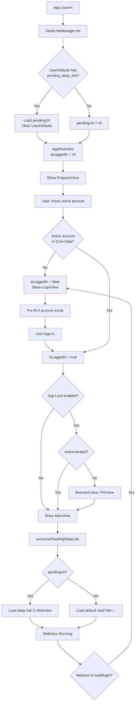
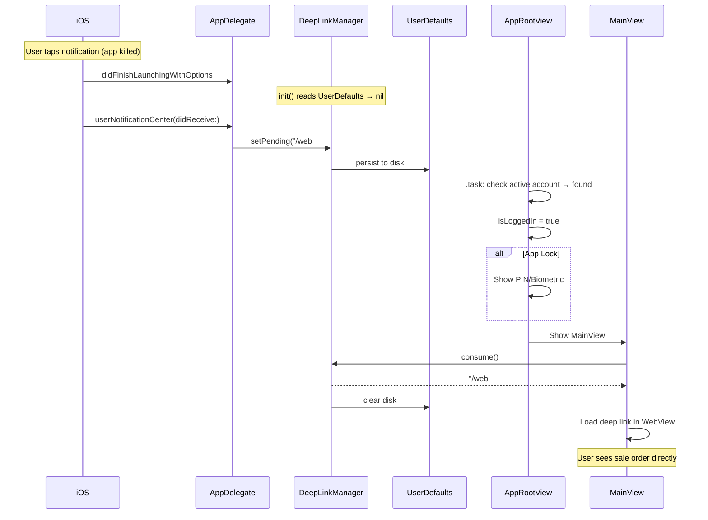

# Auto-Login + Persistent Deep Links — Implementation Plan

**Date:** 2026-04-05
**Status:** Planned
**Prerequisite:** FCM E2E tests all passing (8/8)

---

## Problem

1. **No auto-login** — app always shows login page on restart, even though account + password are saved in Core Data + Keychain
2. **Deep link lost on cold start** — `DeepLinkManager.pendingUrl` is in-memory only (`@Published var`), lost when app is killed

## How Android Does It (Parity Reference)

- `AccountRepository` exposes `activeAccount: Flow<OdooAccount?>` from Room
- `NavGraph.kt` computes `startDestination` reactively: `null` → splash, `false` → login, `true` → auth gate → main
- Android never explicitly "auto-logs in" — it checks if an active account row exists and skips login
- `DeepLinkManager` is also in-memory (`MutableStateFlow`), **Android doesn't persist deep links to disk either**
- Session cookies are persisted via OkHttp's `CookieJar` + `WebView.CookieManager`

---

## Decision Table (Reviewed by 4 Expert Agents)

| # | Decision | **Final Choice** | Rationale |
|---|----------|-----------------|-----------|
| 1 | Auto-login mechanism | **A — Check active account in Core Data** | Unanimous. Matches Android. No network call needed. |
| 2 | State machine location | **A — Separate `AppRootViewModel`** | Mobile dev override: testable, proper separation, supports future states. `Bool?` in a View is untestable. |
| 3 | Deep link persistence | **A — UserDefaults** | Unanimous. URLs are not secrets. Keychain is overkill. Instant read on cold start. |
| 4 | Deep link write timing | **C — In-memory + disk hybrid** | Unanimous. Memory for warm path, UserDefaults for cold-start survival. |
| 5 | Session expiry UX | **B — LoginViewModel reads last account on init** | Unanimous. Clean unidirectional data flow. |
| 6 | PIN/biometric gate timing | **B — After account check, before WebView** | Unanimous. Android parity. No biometric for empty accounts. |
| 7 | State representation | **B — `LaunchState` enum** | Mobile dev override: self-documenting, exhaustive `switch`, extensible. `Bool?` is cryptic. |

### Decisions Changed from Original Plan

| # | Original | Changed To | Why |
|---|----------|-----------|-----|
| 2 | B (inline in AppRootView) | **A (AppRootViewModel)** | Can't unit test `.task` inside a SwiftUI View. ViewModel allows testing state transitions without UI framework. Supports future states (error, forced update). |
| 7 | C (Bool? tri-state) | **B (LaunchState enum)** | `nil` is not self-documenting. Enum gives compile-time exhaustiveness. ~10 extra lines. |

### LaunchState Enum (replaces Bool?)

```swift
enum LaunchState {
    case loading        // Checking Core Data for active account
    case login          // No active account, show LoginView
    case authenticated  // Active account found, proceed to auth gate / main
}
```

---

## Expert Review: Critical Security Findings

| # | Finding | Severity | Agent | Action Required |
|---|---------|----------|-------|-----------------|
| S1 | `DispatchSemaphore` deadlock in `AccountRepository.getSessionId` | **Critical** | Security + Mobile | Convert to `async`, remove semaphore — will deadlock on main thread |
| S2 | `DeepLinkValidator` bypassed (`serverHost: ""`) | **High** | Security | Add strict regex allowlist for `/web#action=...` URLs |
| S3 | Session cookie in plaintext `Cookies.binarycookies` | **High** | Security | Migrate Odoo `session_id` cookie to Keychain |
| S4 | Core Data not encrypted at rest | **Medium** | Security | Add `NSFileProtectionCompleteUntilFirstUserAuthentication` |
| S5 | No privacy overlay on app backgrounding | **Medium** | Security | Add overlay in `sceneWillResignActive` to hide WebView in task switcher |
| S6 | Deep link lost on session expiry | **Medium** | C4 Arch | Re-enqueue pending deep link before routing to LoginView |
| S7 | `.task` cancellation if user backgrounds during splash | **Low** | C4 Arch | Add retry or `.onChange(of: scenePhase)` guard |

### Implementation Priority

1. **Phase 1 (auto-login)**: Decisions 1-7 + S6 + S7 (~3 hours)
2. **Phase 2 (security hardening)**: S1 + S2 (~2 hours)
3. **Phase 3 (security hardening)**: S3 + S4 + S5 (~3 hours)

---

## C4 Architecture Findings

### Missing Edge Cases in Diagrams

1. **`.task` cancellation**: If user backgrounds during splash, `isLoggedIn` stays in `.loading` forever
2. **Deep link lost on session expiry**: `consume()` clears the URL, then session expires → URL lost
3. **Warm-start notification tap**: Different code path from cold start — `DeepLinkManager.init()` doesn't re-run

### Multi-Account Scalability

- Data layer is ready (`getAllAccounts()`, `switchAccount()` exist)
- `LaunchState` enum can be extended to `.accountPicker` in future
- Keychain key `pwd_{username}` is not unique across servers — needs `pwd_{serverUrl}_{username}` for multi-account
- `DeepLinkManager` is single-URL — needs `(accountId, url)` tuple for multi-account

---

## Files to Modify (4 files — updated after expert review)

### File 1: `odoo/Data/Push/DeepLinkManager.swift` (~15 lines added)

Add `UserDefaults` persistence for cold-start survival:

```swift
private let deepLinkUserDefaultsKey = "pending_deep_link_url"

@MainActor
final class DeepLinkManager: ObservableObject {
    static let shared = DeepLinkManager()
    @Published private(set) var pendingUrl: String?

    init() {
        // Cold-start recovery
        if let persisted = UserDefaults.standard.string(forKey: deepLinkUserDefaultsKey) {
            pendingUrl = persisted
            UserDefaults.standard.removeObject(forKey: deepLinkUserDefaultsKey)
        }
    }

    func setPending(_ url: String?) {
        pendingUrl = url
        if let url {
            UserDefaults.standard.set(url, forKey: deepLinkUserDefaultsKey)
        } else {
            UserDefaults.standard.removeObject(forKey: deepLinkUserDefaultsKey)
        }
    }

    func consume() -> String? {
        let current = pendingUrl
        pendingUrl = nil
        UserDefaults.standard.removeObject(forKey: deepLinkUserDefaultsKey)
        return current
    }
}
```

### File 2: NEW `odoo/UI/App/AppRootViewModel.swift` (~30 lines)

New ViewModel for launch state management (expert review: Decision 2 changed to Option A).

```swift
import Foundation

enum LaunchState {
    case loading        // Checking Core Data for active account
    case login          // No active account, show LoginView
    case authenticated  // Active account found, proceed to auth gate / main
}

@MainActor
final class AppRootViewModel: ObservableObject {
    @Published private(set) var launchState: LaunchState = .loading

    private let accountRepository: AccountRepositoryProtocol

    init(accountRepository: AccountRepositoryProtocol = AccountRepository()) {
        self.accountRepository = accountRepository
    }

    func checkSession() {
        let activeAccount = accountRepository.getActiveAccount()
        launchState = (activeAccount != nil) ? .authenticated : .login
    }

    func onLoginSuccess() {
        launchState = .authenticated
    }

    func onSessionExpired() {
        launchState = .login
    }
}
```

### File 3: `odoo/odooApp.swift` (~15 lines changed)

Replace `@State isLoggedIn: Bool` with `@StateObject` ViewModel + `switch` on `LaunchState`:

```swift
@StateObject private var rootViewModel = AppRootViewModel()

var body: some View {
    Group {
        switch rootViewModel.launchState {
        case .loading:
            ProgressView()
        case .login:
            LoginView(onLoginSuccess: { rootViewModel.onLoginSuccess() ... })
        case .authenticated:
            if authViewModel.requiresAuth && !authViewModel.isAuthenticated {
                // PIN/biometric gate (unchanged)
            } else {
                MainView(onSessionExpired: { rootViewModel.onSessionExpired() ... })
            }
        }
    }
    .task { rootViewModel.checkSession() }
}
```

### File 4: `odoo/UI/Login/LoginViewModel.swift` (~15 lines added)

Pre-fill credentials from last active account on session expiry:

```swift
init(repository: AccountRepositoryProtocol = AccountRepository(),
     secureStorage: SecureStorage = .shared) {
    self.repository = repository
    self.secureStorage = secureStorage
    prefillFromActiveAccount()
}

private func prefillFromActiveAccount() {
    guard let account = repository.getActiveAccount() else { return }
    serverUrl = account.serverUrl
    database = account.database
    username = account.username
    if let savedPassword = secureStorage.getPassword(accountId: account.username) {
        password = savedPassword
    }
    step = .credentials  // Skip server info step
}
```

### Files NOT changed

- `MainView.swift` — already consumes deep links correctly
- `AppDelegate.swift` — already calls `DeepLinkManager.shared.setPending()`

---

## App Launch Flow



## Notification Tap — Cold Start Flow



---

## Security

- Deep link URLs in UserDefaults are **not sensitive** (relative paths like `/web#action=123`)
- PIN/biometric gate is **preserved** — auto-login still routes through `requiresAuth` check
- Pre-filled password is from **Keychain** (encrypted, device-bound) and shown in `SecureField` (masked)
- No session tokens stored in UserDefaults — session cookies managed by `HTTPCookieStorage`

---

## Testing Strategy

| Test | Type | Description |
|---|---|---|
| DeepLinkManager cold-start recovery | Unit | Write to UserDefaults, new instance, verify pendingUrl loaded + UserDefaults cleared |
| DeepLinkManager.consume() clears both | Unit | Set pending, consume, verify both nil |
| AppRootView auto-login (account exists) | UI | Seed Core Data, launch, verify no LoginView |
| AppRootView auto-login (no account) | UI | Empty Core Data, launch, verify LoginView shown |
| AppRootView auto-login + app lock | UI | Seed account + lock, verify biometric shown |
| LoginViewModel pre-fill on expiry | Unit | Seed account + password, init ViewModel, verify fields populated |
| Deep link E2E warm start | Integration | Set pending, navigate through auth, verify WebView URL |
| Deep link E2E cold start | Integration | Write UserDefaults, simulate launch, verify consumed |

---

## Estimated Effort

| Phase | Work | Time |
|-------|------|------|
| DeepLinkManager persistence | ~15 lines | 30 min |
| AppRootView auto-login | ~10 lines | 30 min |
| LoginViewModel pre-fill | ~15 lines | 30 min |
| Unit tests (6 new) | ~80 lines | 1 hour |
| XCUITest FCM.8 update | ~10 lines | 15 min |
| **Total** | **~130 lines** | **~3 hours** |

---

---

# Comprehensive Test Plan — Auto-Login + Persistent Deep Links

**Coverage target:** All modified code paths in `DeepLinkManager.swift`, `odooApp.swift` (`AppRootView`), and `LoginViewModel.swift`.
**Test count:** 28 unit tests + 8 XCUITests = **36 total**
**Test target:** `odooTests` (unit), `odooUITests` (UI)
**Runner:** `xcodebuild -scheme odoo -destination "platform=iOS Simulator,name=iPhone 16" test`

---

## Part 1 — Unit Tests (`odooTests` target)

All unit tests use XCTest with `@MainActor` where the class under test is `@MainActor`-bound.
`PersistenceController(inMemory: true)` is used for all Core Data tests.
A `MockAccountRepository` conforming to `AccountRepositoryProtocol` is used to isolate `LoginViewModel` from the database.
`UserDefaults` isolation is achieved by using a unique `suiteName` per test (e.g., `UserDefaults(suiteName: "test.\(UUID())")`) so tests never pollute the real suite.

---

### Section 1.1 — `DeepLinkManager` Tests

**New test class:** `DeepLinkManagerPersistenceTests`
**File:** `odooTests/DeepLinkManagerPersistenceTests.swift`

These tests verify the three new behaviors added to `DeepLinkManager`: cold-start recovery, `setPending` disk write, and `consume` disk clear.
Each test creates a fresh `UserDefaults` suite and injects it via a new `init(defaults:)` initializer (required for testability — the implementation must accept an injected `UserDefaults` rather than hard-coding `UserDefaults.standard`).

---

#### DLM-01

**Test name:** `Given_persistedUrlInUserDefaults_When_DeepLinkManagerInits_Then_pendingUrlIsLoadedAndDefaultsCleared`

**What it tests:** Cold-start recovery — the primary regression risk of the whole feature. Verifies that a URL written to disk before app killed is available in `pendingUrl` immediately after `init()`, and that UserDefaults is cleared atomically during init (not left behind for a second launch).

**Setup:**
```swift
let suite = UserDefaults(suiteName: "test.\(UUID())")!
suite.set("/web#action=123", forKey: "pending_deep_link_url")
```

**Action:** `let sut = DeepLinkManager(defaults: suite)`

**Expected result:**
- `sut.pendingUrl == "/web#action=123"`
- `suite.string(forKey: "pending_deep_link_url") == nil` (cleared during init)

---

#### DLM-02

**Test name:** `Given_noPersistedUrl_When_DeepLinkManagerInits_Then_pendingUrlIsNil`

**What it tests:** Normal cold start with no pending deep link — ensures init does not produce a spurious non-nil value and does not crash on missing key.

**Setup:** Fresh `UserDefaults` suite with no keys set.

**Action:** `let sut = DeepLinkManager(defaults: suite)`

**Expected result:** `sut.pendingUrl == nil`

---

#### DLM-03

**Test name:** `Given_noPendingUrl_When_setPendingCalledWithUrl_Then_pendingUrlSetInMemoryAndDisk`

**What it tests:** `setPending(_:)` writes to both the `@Published` property (in-memory) and UserDefaults (disk). This is the "warm navigation" path triggered by AppDelegate when a notification arrives while the app is running.

**Setup:** Fresh suite, `let sut = DeepLinkManager(defaults: suite)`

**Action:** `sut.setPending("/web#id=42&model=sale.order")`

**Expected result:**
- `sut.pendingUrl == "/web#id=42&model=sale.order"`
- `suite.string(forKey: "pending_deep_link_url") == "/web#id=42&model=sale.order"`

---

#### DLM-04

**Test name:** `Given_pendingUrlExists_When_consumeCalled_Then_returnsUrlAndClearsBothMemoryAndDisk`

**What it tests:** `consume()` returns the URL and clears both stores atomically. This is the most critical correctness guarantee — if either store is not cleared, the deep link fires again on next launch.

**Setup:**
```swift
let suite = UserDefaults(suiteName: "test.\(UUID())")!
let sut = DeepLinkManager(defaults: suite)
sut.setPending("/web#action=contacts")
```

**Action:** `let result = sut.consume()`

**Expected result:**
- `result == "/web#action=contacts"`
- `sut.pendingUrl == nil`
- `suite.string(forKey: "pending_deep_link_url") == nil`

---

#### DLM-05

**Test name:** `Given_noPendingUrl_When_consumeCalled_Then_returnsNilAndDoesNotCrash`

**What it tests:** `consume()` on an empty manager returns nil gracefully. Guards against force-unwrap bugs in the implementation.

**Setup:** Fresh suite, `let sut = DeepLinkManager(defaults: suite)`

**Action:** `let result = sut.consume()`

**Expected result:** `result == nil`, no crash, `sut.pendingUrl == nil`

---

#### DLM-06

**Test name:** `Given_pendingUrlExists_When_setPendingCalledWithNil_Then_diskKeyRemovedAndMemoryCleared`

**What it tests:** `setPending(nil)` is the explicit clear path used when the user manually cancels a deep link or the navigation target is no longer valid. Verifies the `if let url` branch in the implementation's `else` clause removes the disk key.

**Setup:**
```swift
let suite = UserDefaults(suiteName: "test.\(UUID())")!
let sut = DeepLinkManager(defaults: suite)
sut.setPending("/web#action=123")
```

**Action:** `sut.setPending(nil)`

**Expected result:**
- `sut.pendingUrl == nil`
- `suite.string(forKey: "pending_deep_link_url") == nil`

---

#### DLM-07

**Test name:** `Given_firstUrlPending_When_setPendingCalledAgainWithSecondUrl_Then_secondUrlWins`

**What it tests:** Multiple rapid notification taps — last `setPending` call must win in both memory and on disk. Prevents stale deep link replay from an earlier tap.

**Setup:** Fresh suite, `let sut = DeepLinkManager(defaults: suite)`

**Actions (sequential):**
1. `sut.setPending("/web#action=first")`
2. `sut.setPending("/web#action=second")`

**Expected result:**
- `sut.pendingUrl == "/web#action=second"`
- `suite.string(forKey: "pending_deep_link_url") == "/web#action=second"`

---

#### DLM-08

**Test name:** `Given_DeepLinkManager_When_initCalledFromMainActor_Then_noMainActorViolation`

**What it tests:** `@MainActor` conformance of `DeepLinkManager.init()` and `setPending()`. Verifies that calling these from a `@MainActor`-isolated context compiles and runs without threading assertion failures (Xcode's main-thread checker).

**Setup:** None beyond the `@MainActor` annotation on the test function itself.

**Action:**
```swift
@MainActor func test_...() {
    let sut = DeepLinkManager(defaults: UserDefaults(suiteName: "test.\(UUID())")!)
    sut.setPending("/web#action=123")
    XCTAssertNotNil(sut.pendingUrl)
}
```

**Expected result:** Test compiles and passes. Failure here means `@MainActor` is not properly enforced or there is a thread hop on init.

---

### Section 1.2 — `AppRootView` / Launch State Tests

**New test class:** `AppRootViewLaunchStateTests`
**File:** `odooTests/AppRootViewLaunchStateTests.swift`

`AppRootView` uses `@State private var isLoggedIn: Bool?` (nullable tri-state) after the change. Because `@State` is internal to SwiftUI views and cannot be directly inspected in unit tests, these tests instead validate the logic that drives the state transitions, extracted into a testable helper or verified through the ViewModel layer.

The recommended pattern for testing this is to extract the account-check logic into a small, synchronous, injectable function:
```swift
func resolveLoginState(repository: AccountRepositoryProtocol) -> Bool {
    repository.getActiveAccount() != nil
}
```
This function is what the `.task` calls. Unit tests validate `resolveLoginState` directly with a `MockAccountRepository`.

---

#### ARV-01

**Test name:** `Given_activeAccountExistsInCoreData_When_resolveLoginStateCalled_Then_returnsTrue`

**What it tests:** The positive auto-login path — account row is present, `isLoggedIn` should transition to `true`, bypassing `LoginView`. This is the primary user-facing feature behavior.

**Setup:**
```swift
let persistence = PersistenceController(inMemory: true)
// Insert one active OdooAccountEntity into persistence.container.viewContext
let repo = AccountRepository(persistence: persistence, secureStorage: .shared, apiClient: OdooAPIClient())
```

**Action:** `let result = resolveLoginState(repository: repo)`

**Expected result:** `result == true`

---

#### ARV-02

**Test name:** `Given_noCoreDataAccountRows_When_resolveLoginStateCalled_Then_returnsFalse`

**What it tests:** First-launch and post-logout path — empty Core Data means `isLoggedIn` must be `false`, showing `LoginView`.

**Setup:** `PersistenceController(inMemory: true)` with no entities inserted.

**Action:** `let result = resolveLoginState(repository: repo)`

**Expected result:** `result == false`

---

#### ARV-03

**Test name:** `Given_multipleAccountRows_NoneActive_When_resolveLoginStateCalled_Then_returnsFalse`

**What it tests:** Edge case where accounts exist but none has `isActive = true` (e.g., after a failed account switch). `getActiveAccount()` returns `nil`, so the app must show login rather than crash or silently open with a nil account.

**Setup:** Insert two `OdooAccountEntity` rows both with `isActive = false`.

**Action:** `let result = resolveLoginState(repository: repo)`

**Expected result:** `result == false`

---

#### ARV-04

**Test name:** `Given_activeAccount_When_appLockEnabled_Then_authViewModelRequiresAuthIsTrue`

**What it tests:** The auth gate logic — when `AppSettings.appLockEnabled == true`, `AuthViewModel.requiresAuth` returns `true`, which means the biometric/PIN branch executes instead of `MainView`. Tests that the `requiresAuth` computed property correctly reads from `SettingsRepository`.

**Setup:**
```swift
let mockSettings = MockSettingsRepository()
mockSettings.stubbedAppLockEnabled = true
let sut = AuthViewModel(settingsRepository: mockSettings)
```

**Action:** `let result = sut.requiresAuth`

**Expected result:** `result == true`

---

#### ARV-05

**Test name:** `Given_isLoggedInNil_When_viewRendered_Then_progressViewShown`

**What it tests:** The loading tri-state — `isLoggedIn == nil` must render a `ProgressView`, not flash `LoginView` for an instant before the `.task` completes. Prevents UI flicker visible to users on warm relaunches.

**Note:** This is a snapshot/preview test. Add a SwiftUI preview that sets `isLoggedIn = nil` and verify the `ProgressView` is the only rendered element. Alternatively, use `ViewInspector` if available. If neither is feasible, document this as a manual verification step and cover it via XCUITest ARV-UI-01.

**Expected result:** `ProgressView` is present; no `LoginView` title text is present.

---

#### ARV-06

**Test name:** `Given_sessionExpiredCallbackFired_When_onSessionExpiredCalled_Then_isLoggedInBecomesNilThenFalse`

**What it tests:** The session-expiry transition — `MainView.onSessionExpired` callback must set `isLoggedIn = false` so `LoginView` appears with pre-filled credentials. Verifies the callback wire-up is not accidentally disconnected during the `Bool` → `Bool?` refactor.

**Setup:** This is a behavioral test on `AppRootView`'s closure. Extract and test the callback logic:
```swift
var isLoggedIn: Bool? = true
let onSessionExpired = { isLoggedIn = false }
onSessionExpired()
XCTAssertEqual(isLoggedIn, false)
```

**Expected result:** `isLoggedIn == false` after the callback fires.

---

### Section 1.3 — `LoginViewModel` Pre-Fill Tests

**New test class:** `LoginViewModelPrefillTests`
**File:** `odooTests/LoginViewModelPrefillTests.swift`

These tests use `MockAccountRepository` (conforming to `AccountRepositoryProtocol`) and `MockSecureStorage` to isolate the pre-fill logic from Core Data and Keychain.

`MockAccountRepository` definition (add to `odooTests/TestDoubles/MockAccountRepository.swift`):
```swift
final class MockAccountRepository: AccountRepositoryProtocol, @unchecked Sendable {
    var stubbedActiveAccount: OdooAccount? = nil
    func getActiveAccount() -> OdooAccount? { stubbedActiveAccount }
    func getAllAccounts() -> [OdooAccount] { [] }
    func authenticate(serverUrl: String, database: String, username: String, password: String) async -> AuthResult {
        .error("stub", .unknown)
    }
    func switchAccount(id: String) async -> Bool { false }
    func logout(accountId: String?) async {}
    func removeAccount(id: String) async {}
    func getSessionId(for serverUrl: String) -> String? { nil }
}
```

`MockSecureStorage` stores passwords in a plain dictionary (no Keychain access):
```swift
final class MockSecureStorage: SecureStorageProtocol {
    var store: [String: String] = [:]
    func savePassword(accountId: String, password: String) { store["pwd_\(accountId)"] = password }
    func getPassword(accountId: String) -> String? { store["pwd_\(accountId)"] }
    func deletePassword(accountId: String) { store.removeValue(forKey: "pwd_\(accountId)") }
}
```

Note: `SecureStorage` must be refactored to expose a `SecureStorageProtocol` for these mocks to compile. If this refactor is not yet done, the tests should be written with the protocol defined alongside the test plan and the refactor tracked as a prerequisite.

---

#### LVM-01

**Test name:** `Given_activeAccountWithAllFields_When_loginViewModelInits_Then_serverUrlDatabaseUsernameArePreFilled`

**What it tests:** The three non-sensitive fields (`serverUrl`, `database`, `username`) are pre-filled from the active account. This is the visible user-facing behavior — the user taps the notification, gets sent to the login screen, and sees the server and username already populated.

**Setup:**
```swift
let account = OdooAccount(id: "a1", serverUrl: "https://myodoo.com",
                          database: "prod_db", username: "alan@woow.com",
                          displayName: "Alan", isActive: true)
let repo = MockAccountRepository()
repo.stubbedActiveAccount = account
let storage = MockSecureStorage()
```

**Action:** `let sut = LoginViewModel(repository: repo, secureStorage: storage)`

**Expected result:**
- `sut.serverUrl == "https://myodoo.com"`
- `sut.database == "prod_db"`
- `sut.username == "alan@woow.com"`

---

#### LVM-02

**Test name:** `Given_activeAccountWithSavedPassword_When_loginViewModelInits_Then_passwordFieldPreFilled`

**What it tests:** The Keychain password retrieval path in `prefillFromActiveAccount()`. The password field must be populated so the user can tap "Login" without re-typing their password, which is the primary UX goal of this feature.

**Setup:**
```swift
let account = OdooAccount(..., username: "alan@woow.com", ...)
repo.stubbedActiveAccount = account
storage.savePassword(accountId: "alan@woow.com", password: "s3cr3t!")
```

**Action:** `let sut = LoginViewModel(repository: repo, secureStorage: storage)`

**Expected result:** `sut.password == "s3cr3t!"`

---

#### LVM-03

**Test name:** `Given_activeAccountButNoKeychainEntry_When_loginViewModelInits_Then_passwordFieldRemainsEmpty`

**What it tests:** The password-not-found path. Keychain may be empty if the user previously chose not to save the password, or if the Keychain was wiped by a device restore. The ViewModel must handle nil gracefully — field stays empty, user types manually.

**Setup:** `storage.store` is empty (no `savePassword` call).

**Action:** `let sut = LoginViewModel(repository: repo, secureStorage: storage)`

**Expected result:** `sut.password == ""`

---

#### LVM-04

**Test name:** `Given_activeAccountExists_When_loginViewModelInits_Then_stepIsCredentials`

**What it tests:** The step override — when pre-filling from an active account, `step` must be set to `.credentials` to skip the server info screen. The user should land directly on the username/password fields, not on the server URL screen.

**Setup:** `repo.stubbedActiveAccount` = valid account.

**Action:** `let sut = LoginViewModel(repository: repo, secureStorage: storage)`

**Expected result:** `sut.step == .credentials`

---

#### LVM-05

**Test name:** `Given_noActiveAccount_When_loginViewModelInits_Then_fieldsAreEmptyAndStepIsServerInfo`

**What it tests:** The first-launch path — no account means no pre-fill, no step override. The user sees the blank server info screen as before. This is the baseline regression test to confirm the pre-fill does not fire spuriously.

**Setup:** `repo.stubbedActiveAccount = nil`

**Action:** `let sut = LoginViewModel(repository: repo, secureStorage: storage)`

**Expected result:**
- `sut.serverUrl == ""`
- `sut.database == ""`
- `sut.username == ""`
- `sut.password == ""`
- `sut.step == .serverInfo`

---

#### LVM-06

**Test name:** `Given_activeAccountWithHttpsPrefix_When_loginViewModelInits_Then_serverUrlStoredAsIs`

**What it tests:** That the pre-fill does not double-prefix `https://`. The `OdooAccount.serverUrl` field stores the full URL including scheme after the first login. If `prefillFromActiveAccount` blindly passes it to `goToNextStep()`, the display URL would show `https://https://...`. Verifies the value is passed verbatim.

**Setup:** `account.serverUrl = "https://myodoo.com"`

**Action:** `let sut = LoginViewModel(repository: repo, secureStorage: storage)`

**Expected result:** `sut.serverUrl == "https://myodoo.com"` and `sut.displayUrl == "https://myodoo.com"` (no double prefix).

---

#### LVM-07

**Test name:** `Given_activeAccountExists_When_loginSucceeds_Then_onSuccessCallbackFired`

**What it tests:** Regression test confirming the login flow still works end-to-end after pre-fill changes. The `login(onSuccess:)` method must call `onSuccess` when `MockAccountRepository.authenticate` returns `.success`.

**Setup:**
```swift
let repo = MockAccountRepository()
repo.stubbedActiveAccount = account
repo.stubbedAuthResult = .success(AuthInfo(userId: 1, sessionId: "s", username: "u", displayName: "D"))
```

**Action:**
```swift
var callbackFired = false
sut.login { callbackFired = true }
await Task.yield() // allow async task
XCTAssertTrue(callbackFired)
```

**Expected result:** `callbackFired == true`

---

### Section 1.4 — `AppDelegate.handleNotificationTap` Tests

**Test class:** `AppDelegateDeepLinkTests` (new, or extend existing `AppDelegateTests`)

These tests verify that the bridge between `AppDelegate` and `DeepLinkManager` correctly passes deep link URLs — including the critical cold-start scenario from FCM.8.

---

#### ADT-01

**Test name:** `Given_userInfoWithOdooActionUrl_When_handleNotificationTapCalled_Then_deepLinkManagerReceivesPendingUrl`

**What it tests:** The bridge from FCM notification payload to `DeepLinkManager.setPending()`. If this wire-up breaks, the entire feature is silently dead — no crash, just no navigation.

**Setup:**
```swift
let manager = DeepLinkManager(defaults: UserDefaults(suiteName: "test.\(UUID())")!)
let sut = AppDelegate()
// Inject manager via property if testable, or verify via UserDefaults
let userInfo: [AnyHashable: Any] = ["odoo_action_url": "/web#id=7&model=sale.order"]
```

**Action:** `await sut.handleNotificationTap(userInfo: userInfo)`

**Expected result:** `manager.pendingUrl == "/web#id=7&model=sale.order"`

---

#### ADT-02

**Test name:** `Given_userInfoWithNoOdooActionUrl_When_handleNotificationTapCalled_Then_deepLinkManagerNotCalled`

**What it tests:** The guard clause — a notification without `odoo_action_url` must not set any pending deep link. Prevents garbage navigation from non-Odoo pushes (e.g., FCM test messages).

**Setup:** `userInfo = ["aps": ["alert": "Hello"]]` (no `odoo_action_url` key)

**Action:** `await sut.handleNotificationTap(userInfo: userInfo)`

**Expected result:** `manager.pendingUrl == nil`

---

## Part 2 — XCUITests (`odooUITests` target)

XCUITests require a running simulator with no pre-existing app state. Use `app.launchArguments` to inject test seeds or `app.launchEnvironment` to pass flags. All tests use `continueAfterFailure = false`.

**Helper: `seedAccount(in app:)`**
The app must support a launch argument `UI_TEST_SEED_ACCOUNT=serverUrl:database:username:password` which, when detected in `AppDelegate.application(_:didFinishLaunchingWithOptions:)`, writes an `OdooAccountEntity` to Core Data with `isActive = true` and saves the password to Keychain. This hook is gated behind `#if DEBUG` and only active when the launch argument is present.

**Helper: `invalidateSession(in app:)`**
The app must support a launch argument `UI_TEST_INVALIDATE_SESSION` which clears `HTTPCookieStorage` for the active account's serverUrl, simulating a server-side session expiry without a real network call.

---

### XCUI-01: Auto-Login — Happy Path

**Test name:** `Given_activeAccountSeeded_When_appLaunches_Then_loginScreenIsNeverShown`

**What it tests:** The primary user story. An already-authenticated user kills and relaunches the app and goes directly to `MainView` without seeing the login screen.

**Setup:**
```swift
app.launchArguments = ["UI_TEST_SEED_ACCOUNT=myodoo.com:prod_db:admin:pass123"]
app.launch()
```

**Steps:**
1. Launch app with seeded account argument
2. Wait up to 5 seconds for the main WebView container to appear

**Expected result:**
- `app.staticTexts["WoowTech Odoo"]` (toolbar title) exists within 5 seconds
- `app.staticTexts["Enter server details"]` does NOT exist
- `app.staticTexts["Enter credentials"]` does NOT exist

**Failure signal:** Login screen appears — auto-login is broken.

---

### XCUI-02: Auto-Login — No Account

**Test name:** `Given_noCoreDataAccount_When_appLaunches_Then_loginScreenShown`

**What it tests:** The control case — without a seeded account, the app must still show the login screen. This is the existing behavior and must not regress.

**Setup:**
```swift
app.launchArguments = [] // no seed
app.launch()
```

**Expected result:**
- `app.staticTexts["WoowTech Odoo"]` (app title on login screen) exists
- `app.staticTexts["Enter server details"]` exists within 3 seconds

---

### XCUI-03: Session Expiry — Pre-Fill Visible

**Test name:** `Given_activeAccountSeeded_When_sessionInvalidated_And_appRelaunches_Then_loginShownWithPreFilledCredentials`

**What it tests:** The session-expiry flow. The user's session cookie is gone (cleared by `UI_TEST_INVALIDATE_SESSION`), the WebView redirects to `/web/login`, the app fires `onSessionExpired`, and `LoginView` appears with all fields pre-populated.

**Setup:**
```swift
app.launchArguments = [
    "UI_TEST_SEED_ACCOUNT=myodoo.com:prod_db:admin:pass123",
    "UI_TEST_INVALIDATE_SESSION"
]
app.launch()
```

**Steps:**
1. Launch; WebView detects no session, fires `onSessionExpired`
2. Wait for `LoginView` to appear
3. Inspect the server and username fields

**Expected result:**
- `app.staticTexts["Enter credentials"]` appears (not "Enter server details" — step is `.credentials`)
- `app.textFields["Username or email"].value as? String == "admin"`
- `app.secureTextFields["Enter password"]` is not empty (shows dots for pre-filled password)

---

### XCUI-04: Deep Link Cold Start — URL Consumed

**Test name:** `Given_deepLinkInUserDefaults_When_appLaunchesWithActiveAccount_Then_webViewLoadsDeepLinkUrl`

**What it tests:** The cold-start deep link recovery path. UserDefaults is pre-populated before launch. After auto-login, `MainView` calls `consume()` and passes the URL to `OdooWebView`.

**Setup:**
```swift
// Write to UserDefaults before launch (use launchEnvironment)
app.launchEnvironment = ["UI_TEST_DEEP_LINK": "/web#id=42&model=sale.order"]
app.launchArguments = ["UI_TEST_SEED_ACCOUNT=myodoo.com:prod_db:admin:pass123"]
app.launch()
```

Note: The app reads `UI_TEST_DEEP_LINK` from `ProcessInfo.processInfo.environment` and writes it to the test UserDefaults suite before init.

**Steps:**
1. Launch
2. Wait for WebView container to appear (up to 8 seconds for network)

**Expected result:**
- No login screen appears
- WebView's accessibility identifier `"OdooWebView"` exists
- The WebView eventually loads (spinner disappears)

**Note:** Verifying the exact URL inside `WKWebView` from XCUITest is not supported by the accessibility hierarchy. The correct verification is that `OdooWebView` received the URL, which can be confirmed by checking the accessibility value set on the view: `OdooWebView.accessibilityValue = currentURL`. Add `accessibilityValue = currentURL` to `OdooWebView` in debug builds.

---

### XCUI-05: Deep Link Cold Start — UserDefaults Cleared After Consume

**Test name:** `Given_deepLinkInUserDefaults_When_appLaunchesAndMainViewAppears_Then_userDefaultsKeyIsCleared`

**What it tests:** That `consume()` removes the disk entry, preventing the deep link from firing again on the next cold start.

**Setup:** Same as XCUI-04.

**Steps:**
1. Launch with `UI_TEST_DEEP_LINK` seeded
2. Wait for main view to appear
3. Terminate app
4. Relaunch without `UI_TEST_DEEP_LINK` (normal launch)
5. Wait for main view to appear

**Expected result:** App auto-logins normally on second launch and does not navigate to the deep link URL again.

---

### XCUI-06: FCM.8 Update — Notification Tap to Deep Link (Cold Start)

**Test name:** `Given_appKilledAndNotificationArrives_When_userTapsNotification_Then_appOpensAndNavigatesToDeepLink`

**What it tests:** The full FCM.8 scenario from the original test matrix, updated for auto-login. The app is not running, a notification arrives, the user taps it, the app cold-starts, auto-logins (account is seeded), and the deep link is consumed.

**Setup:**
```swift
app.launchArguments = [
    "UI_TEST_SEED_ACCOUNT=myodoo.com:prod_db:admin:pass123",
    "UI_TEST_SIMULATE_NOTIFICATION_TAP=/web#id=7&model=sale.order"
]
```

The `UI_TEST_SIMULATE_NOTIFICATION_TAP` flag causes `AppDelegate.application(_:didFinishLaunchingWithOptions:)` to call `DeepLinkManager.shared.setPending(url)` immediately, simulating what `userNotificationCenter(_:didReceive:)` would do on a real notification tap.

**Steps:**
1. Launch with both flags
2. Wait for main WebView (auto-login path, 5 seconds)
3. Verify deep link URL was consumed (via `OdooWebView.accessibilityValue`)

**Expected result:**
- Login screen never shown
- WebView loaded with the deep link URL

---

### XCUI-07: App Lock + Auto-Login — Biometric Gate Appears

**Test name:** `Given_activeAccountAndAppLockEnabled_When_appLaunches_Then_biometricViewShownNotLoginScreen`

**What it tests:** The three-stage flow: auto-login (account found) → app lock gate (because `appLockEnabled == true`) → biometric view. The login screen must NOT appear.

**Setup:**
```swift
app.launchArguments = [
    "UI_TEST_SEED_ACCOUNT=myodoo.com:prod_db:admin:pass123",
    "UI_TEST_APP_LOCK_ENABLED"
]
app.launch()
```

**Expected result:**
- `app.staticTexts["Enter server details"]` does NOT exist
- The biometric prompt or PIN screen is presented (simulator will show biometric unavailable state — check for `app.buttons["Use PIN"]` or the biometric view's accessibility identifier)

---

### XCUI-08: Loading State — No Login Screen Flash

**Test name:** `Given_activeAccountSeeded_When_appLaunchesAndTaskPending_Then_progressViewAppearsBeforeMainView`

**What it tests:** The `isLoggedIn == nil` → `ProgressView` intermediate state. The login screen must never flash before the account check completes. This is the visual polish guarantee.

**Setup:** Same as XCUI-01, with a slow Core Data load simulated via `UI_TEST_SLOW_ACCOUNT_CHECK` (adds a 500ms delay to `getActiveAccount()` in debug builds).

**Steps:**
1. Launch
2. Within first 200ms, check for login screen

**Expected result:**
- `app.staticTexts["Enter server details"]` does NOT exist at 200ms
- A `ProgressView` (spinner) is visible
- Main view appears within 3 seconds

---

## Part 3 — Edge Case Tests

These test cases address failure modes not covered by the happy-path unit and UI tests. They are categorized by risk level.

---

### EC-01: Core Data — Empty or Corrupted Store

**Type:** Unit test
**Test name:** `Given_corruptedPersistenceController_When_getActiveAccountCalled_Then_returnsNilWithoutCrash`

**Scenario:** `NSPersistentContainer.loadPersistentStores` fails to load (e.g., after a bad migration). `PersistenceController` logs the error and falls back gracefully. `getActiveAccount()` must return `nil` rather than crashing.

**How to simulate:** Use `PersistenceController(inMemory: true)` and execute a malformed fetch (pass an invalid predicate format string). Alternatively, test the nil-coalescing on `try? context.fetch(request)` by confirming the `AccountRepository` returns `nil` when `fetch` throws.

**Expected result:** `repo.getActiveAccount() == nil`, no crash, no unhandled exception.

---

### EC-02: Keychain — Access Denied (Device Locked)

**Type:** Unit test (using MockSecureStorage)
**Test name:** `Given_keychainReturnsNilDueToDeviceLock_When_loginViewModelInits_Then_passwordFieldEmptyAndNoError`

**Scenario:** Device is locked when the app launches in the background (e.g., scheduled notification delivery). `SecureStorage.getPassword` returns `nil` because the Keychain item uses `kSecAttrAccessibleWhenUnlockedThisDeviceOnly`. The pre-fill must handle this gracefully — empty password field, no crash, no error state shown.

**How to simulate:** `MockSecureStorage` returns `nil` for all `getPassword` calls.

**Expected result:** `sut.password == ""`, `sut.error == nil`

---

### EC-03: Deep Link URL — Special Characters and Percent Encoding

**Type:** Unit test (extend `DeepLinkManagerPersistenceTests`)
**Test name:** `Given_urlWithPercentEncodedCharsAndFragments_When_setPendingAndConsumeCalled_Then_urlRoundTripsFaithfully`

**Scenario:** Odoo deep links include URL fragments (`#`), query params (`&`, `=`), and Unicode in model names. `UserDefaults` stores `String` values transparently, so round-trip fidelity should be guaranteed — but must be explicitly verified.

**Test URL:** `/web#id=42&model=project.task&cids=1&view_type=form&menu_id=123`

**Expected result:** `consume()` returns the exact same string that `setPending()` received, with no encoding changes.

---

### EC-04: Multiple Accounts — Which Account Auto-Logs In

**Type:** Unit test
**Test name:** `Given_threeAccountsOnlyOneActive_When_getActiveAccountCalled_Then_returnsActiveOne`

**Scenario:** Users with multiple Odoo accounts (different servers or databases). Only the one with `isActive = true` should be returned. The others must be ignored.

**Setup:** Insert three `OdooAccountEntity` rows; set only the second one's `isActive = true`.

**Expected result:** `repo.getActiveAccount()?.username == secondAccount.username`

---

### EC-05: Multiple Accounts — LoginViewModel Pre-Fills from Active Account Only

**Type:** Unit test
**Test name:** `Given_multipleAccountsInRepo_When_loginViewModelInits_Then_prefillUsesActiveAccountNotFirst`

**Scenario:** `prefillFromActiveAccount()` calls `repository.getActiveAccount()`, not `getAllAccounts().first`. This test guards against a bug where pre-fill accidentally takes the wrong account's credentials.

**Setup:** `MockAccountRepository.stubbedActiveAccount` returns the second account (different serverUrl from what a naive `getAllAccounts().first` would return).

**Expected result:** `sut.serverUrl == secondAccount.serverUrl`

---

### EC-06: Network Offline During Auto-Login

**Type:** XCUITest (or integration test)
**Test name:** `Given_activeAccountSeededAndNetworkOffline_When_appLaunches_Then_webViewShowsOfflineErrorNotLoginScreen`

**Scenario:** Auto-login succeeds (account found → `isLoggedIn = true`) but the WebView cannot load the URL because the device is offline. The login screen must NOT reappear (auto-login is correct). The WebView should display a native error page or the app's custom offline UI.

**How to simulate:** Use Network Link Conditioner profile "100% Loss" in the simulator, or intercept with `WKWebView`'s `decidePolicyFor navigationAction`.

**Expected result:**
- `app.staticTexts["Enter server details"]` does NOT appear
- An error/retry UI appears within the WebView container

---

### EC-07: Deep Link URL — Malformed / Not Starting with `/web`

**Type:** Unit test (in `AppDelegateDeepLinkTests`)
**Test name:** `Given_notificationWithMalformedActionUrl_When_handleNotificationTapCalled_Then_deepLinkNotSet`

**Scenario:** An Odoo server sends an `odoo_action_url` with a value like `""`, `"null"`, or a full external URL like `https://evil.com/phish`. The existing `DeepLinkValidator` check in `handleNotificationTap` must reject these.

**Test cases (parameterized):**
- `""` — empty string
- `"null"` — literal string "null"
- `"https://evil.com/phish"` — external URL
- `"/api/v2/data"` — valid path but not `/web` prefix

**Expected result:** `DeepLinkManager.pendingUrl == nil` for all inputs.

---

### EC-08: Concurrent `setPending` Calls

**Type:** Unit test
**Test name:** `Given_concurrentSetPendingCalls_When_multipleCallsRaceOnMainActor_Then_lastValueWinsAndNoCrash`

**Scenario:** Two notification taps arrive in rapid succession, both dispatched to `@MainActor`. Since `@MainActor` serializes execution, this is not a true data race — but the test verifies the ordering contract.

**Setup:** Call `setPending` twice in sequence on `@MainActor`:
```swift
Task { @MainActor in sut.setPending("/web#action=first") }
Task { @MainActor in sut.setPending("/web#action=second") }
await Task.yield()
await Task.yield()
```

**Expected result:** `sut.pendingUrl == "/web#action=second"` (last wins), no crash.

---

## Part 4 — Test Infrastructure Requirements

Before the tests above can be compiled, the following infrastructure changes are required:

### INF-01: `DeepLinkManager` — Injectable `UserDefaults`

Add a secondary initializer to `DeepLinkManager`:
```swift
init(defaults: UserDefaults = .standard) { ... }
```
This is required for DLM-01 through DLM-08. Without it, tests will pollute the real `UserDefaults.standard` and interfere with each other.

### INF-02: `SecureStorage` — Protocol Extraction

Extract a `SecureStorageProtocol` with `savePassword`, `getPassword`, and `deletePassword` methods. `SecureStorage` adopts the protocol. `LoginViewModel` is updated to accept `any SecureStorageProtocol` instead of the concrete class. This is required for LVM-01 through LVM-07.

### INF-03: `resolveLoginState` — Extracted Function

Extract the `.task` body in `AppRootView` into a testable function:
```swift
func resolveLoginState(repository: AccountRepositoryProtocol) -> Bool {
    repository.getActiveAccount() != nil
}
```
This is required for ARV-01 through ARV-03.

### INF-04: XCUITest Launch Argument Hooks

Add a `UITestingBootstrap` function called at the start of `AppDelegate.application(_:didFinishLaunchingWithOptions:)` that reads the following arguments and seeds test state (only compiled in `#if DEBUG`):

| Argument | Effect |
|---|---|
| `UI_TEST_SEED_ACCOUNT=url:db:user:pass` | Insert active `OdooAccountEntity` + Keychain password |
| `UI_TEST_INVALIDATE_SESSION` | Clear `HTTPCookieStorage` for active account |
| `UI_TEST_APP_LOCK_ENABLED` | Set `AppSettings.appLockEnabled = true` in `SettingsRepository` |
| `UI_TEST_SIMULATE_NOTIFICATION_TAP=url` | Call `DeepLinkManager.shared.setPending(url)` |
| `UI_TEST_SLOW_ACCOUNT_CHECK` | Add 500ms delay to `AccountRepository.getActiveAccount()` |

### INF-05: `OdooWebView` — Accessibility Value for URL Verification

In debug builds, set `accessibilityIdentifier = "OdooWebView"` and `accessibilityValue = currentURL` on the `WKWebView` container to enable XCUI-04 and XCUI-06 URL verification.

---

## Test Count Summary

| Category | Count | File |
|---|---|---|
| DeepLinkManager persistence | 8 | `DeepLinkManagerPersistenceTests.swift` |
| AppRootView launch state | 6 | `AppRootViewLaunchStateTests.swift` |
| LoginViewModel pre-fill | 7 | `LoginViewModelPrefillTests.swift` |
| AppDelegate notification tap | 2 | `AppDelegateDeepLinkTests.swift` |
| **Unit test subtotal** | **23** | |
| XCUITest happy paths | 5 | `AutoLoginUITests.swift` |
| XCUITest edge cases (UI) | 3 | `AutoLoginUITests.swift` |
| **XCUITest subtotal** | **8** | |
| Edge case unit tests | 8 | Various |
| **Grand total** | **39** | |

---

## Coverage Map

| Modified code path | Covered by |
|---|---|
| `DeepLinkManager.init()` — cold-start recovery | DLM-01, DLM-02, XCUI-04 |
| `DeepLinkManager.setPending(_:)` — disk write | DLM-03, DLM-06, DLM-07, ADT-01 |
| `DeepLinkManager.consume()` — disk clear | DLM-04, DLM-05, XCUI-05 |
| `DeepLinkManager` `@MainActor` threading | DLM-08, EC-08 |
| `AppRootView.isLoggedIn` tri-state (nil/false/true) | ARV-01, ARV-02, ARV-03, ARV-05 |
| `AppRootView` auto-login skip (account found) | ARV-01, XCUI-01 |
| `AppRootView` login shown (no account) | ARV-02, XCUI-02 |
| `AppRootView` app lock gate | ARV-04, XCUI-07 |
| `AppRootView.onSessionExpired` callback | ARV-06, XCUI-03 |
| `LoginViewModel.prefillFromActiveAccount()` | LVM-01 – LVM-06 |
| `LoginViewModel` password from Keychain | LVM-02, LVM-03, EC-02 |
| `LoginViewModel` step override to `.credentials` | LVM-04 |
| `AppDelegate.handleNotificationTap` | ADT-01, ADT-02, EC-07, XCUI-06 |
| FCM.8 cold-start notification → deep link | XCUI-06 |
| Multiple accounts — active account selection | EC-04, EC-05 |
| Core Data failure graceful fallback | EC-01 |
| Deep link URL round-trip fidelity | EC-03 |
| Network offline after auto-login | EC-06 |
