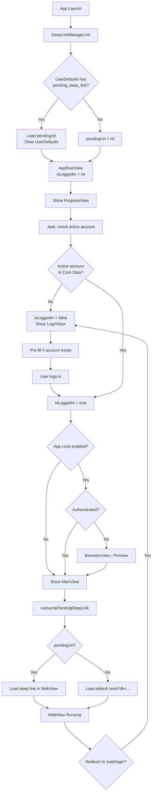
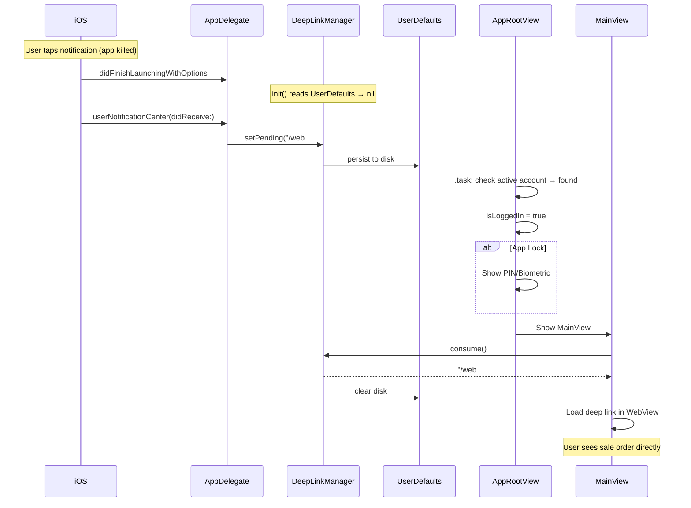

# Auto-Login + Persistent Deep Links — Implementation Plan

**Date:** 2026-04-05
**Status:** Planned
**Prerequisite:** FCM E2E tests all passing (8/8)

---

## Problem

1. **No auto-login** — app always shows login page on restart, even though account + password are saved in Core Data + Keychain
2. **Deep link lost on cold start** — `DeepLinkManager.pendingUrl` is in-memory only (`@Published var`), lost when app is killed

## How Android Does It (Parity Reference)

- `AccountRepository` exposes `activeAccount: Flow<OdooAccount?>` from Room
- `NavGraph.kt` computes `startDestination` reactively: `null` → splash, `false` → login, `true` → auth gate → main
- Android never explicitly "auto-logs in" — it checks if an active account row exists and skips login
- `DeepLinkManager` is also in-memory (`MutableStateFlow`), **Android doesn't persist deep links to disk either**
- Session cookies are persisted via OkHttp's `CookieJar` + `WebView.CookieManager`

---

## Decision Table (Reviewed by 4 Expert Agents)

| # | Decision | **Final Choice** | Rationale |
|---|----------|-----------------|-----------|
| 1 | Auto-login mechanism | **A — Check active account in Core Data** | Unanimous. Matches Android. No network call needed. |
| 2 | State machine location | **A — Separate `AppRootViewModel`** | Mobile dev override: testable, proper separation, supports future states. `Bool?` in a View is untestable. |
| 3 | Deep link persistence | **A — UserDefaults** | Unanimous. URLs are not secrets. Keychain is overkill. Instant read on cold start. |
| 4 | Deep link write timing | **C — In-memory + disk hybrid** | Unanimous. Memory for warm path, UserDefaults for cold-start survival. |
| 5 | Session expiry UX | **B — LoginViewModel reads last account on init** | Unanimous. Clean unidirectional data flow. |
| 6 | PIN/biometric gate timing | **B — After account check, before WebView** | Unanimous. Android parity. No biometric for empty accounts. |
| 7 | State representation | **B — `LaunchState` enum** | Mobile dev override: self-documenting, exhaustive `switch`, extensible. `Bool?` is cryptic. |

### Decisions Changed from Original Plan

| # | Original | Changed To | Why |
|---|----------|-----------|-----|
| 2 | B (inline in AppRootView) | **A (AppRootViewModel)** | Can't unit test `.task` inside a SwiftUI View. ViewModel allows testing state transitions without UI framework. Supports future states (error, forced update). |
| 7 | C (Bool? tri-state) | **B (LaunchState enum)** | `nil` is not self-documenting. Enum gives compile-time exhaustiveness. ~10 extra lines. |

### LaunchState Enum (replaces Bool?)

```swift
enum LaunchState {
    case loading        // Checking Core Data for active account
    case login          // No active account, show LoginView
    case authenticated  // Active account found, proceed to auth gate / main
}
```

---

## Expert Review: Critical Security Findings

| # | Finding | Severity | Agent | Action Required |
|---|---------|----------|-------|-----------------|
| S1 | `DispatchSemaphore` deadlock in `AccountRepository.getSessionId` | **Critical** | Security + Mobile | Convert to `async`, remove semaphore — will deadlock on main thread |
| S2 | `DeepLinkValidator` bypassed (`serverHost: ""`) | **High** | Security | Add strict regex allowlist for `/web#action=...` URLs |
| S3 | Session cookie in plaintext `Cookies.binarycookies` | **High** | Security | Migrate Odoo `session_id` cookie to Keychain |
| S4 | Core Data not encrypted at rest | **Medium** | Security | Add `NSFileProtectionCompleteUntilFirstUserAuthentication` |
| S5 | No privacy overlay on app backgrounding | **Medium** | Security | Add overlay in `sceneWillResignActive` to hide WebView in task switcher |
| S6 | Deep link lost on session expiry | **Medium** | C4 Arch | Re-enqueue pending deep link before routing to LoginView |
| S7 | `.task` cancellation if user backgrounds during splash | **Low** | C4 Arch | Add retry or `.onChange(of: scenePhase)` guard |

### Implementation Priority

1. **Phase 1 (auto-login)**: Decisions 1-7 + S6 + S7 (~3 hours)
2. **Phase 2 (security hardening)**: S1 + S2 (~2 hours)
3. **Phase 3 (security hardening)**: S3 + S4 + S5 (~3 hours)

---

## C4 Architecture Findings

### Missing Edge Cases in Diagrams

1. **`.task` cancellation**: If user backgrounds during splash, `isLoggedIn` stays in `.loading` forever
2. **Deep link lost on session expiry**: `consume()` clears the URL, then session expires → URL lost
3. **Warm-start notification tap**: Different code path from cold start — `DeepLinkManager.init()` doesn't re-run

### Multi-Account Scalability

- Data layer is ready (`getAllAccounts()`, `switchAccount()` exist)
- `LaunchState` enum can be extended to `.accountPicker` in future
- Keychain key `pwd_{username}` is not unique across servers — needs `pwd_{serverUrl}_{username}` for multi-account
- `DeepLinkManager` is single-URL — needs `(accountId, url)` tuple for multi-account

---

## Files to Modify (4 files — updated after expert review)

### File 1: `odoo/Data/Push/DeepLinkManager.swift` (~15 lines added)

Add `UserDefaults` persistence for cold-start survival:

```swift
private let deepLinkUserDefaultsKey = "pending_deep_link_url"

@MainActor
final class DeepLinkManager: ObservableObject {
    static let shared = DeepLinkManager()
    @Published private(set) var pendingUrl: String?

    init() {
        // Cold-start recovery
        if let persisted = UserDefaults.standard.string(forKey: deepLinkUserDefaultsKey) {
            pendingUrl = persisted
            UserDefaults.standard.removeObject(forKey: deepLinkUserDefaultsKey)
        }
    }

    func setPending(_ url: String?) {
        pendingUrl = url
        if let url {
            UserDefaults.standard.set(url, forKey: deepLinkUserDefaultsKey)
        } else {
            UserDefaults.standard.removeObject(forKey: deepLinkUserDefaultsKey)
        }
    }

    func consume() -> String? {
        let current = pendingUrl
        pendingUrl = nil
        UserDefaults.standard.removeObject(forKey: deepLinkUserDefaultsKey)
        return current
    }
}
```

### File 2: NEW `odoo/UI/App/AppRootViewModel.swift` (~30 lines)

New ViewModel for launch state management (expert review: Decision 2 changed to Option A).

```swift
import Foundation

enum LaunchState {
    case loading        // Checking Core Data for active account
    case login          // No active account, show LoginView
    case authenticated  // Active account found, proceed to auth gate / main
}

@MainActor
final class AppRootViewModel: ObservableObject {
    @Published private(set) var launchState: LaunchState = .loading

    private let accountRepository: AccountRepositoryProtocol

    init(accountRepository: AccountRepositoryProtocol = AccountRepository()) {
        self.accountRepository = accountRepository
    }

    func checkSession() {
        let activeAccount = accountRepository.getActiveAccount()
        launchState = (activeAccount != nil) ? .authenticated : .login
    }

    func onLoginSuccess() {
        launchState = .authenticated
    }

    func onSessionExpired() {
        launchState = .login
    }
}
```

### File 3: `odoo/odooApp.swift` (~15 lines changed)

Replace `@State isLoggedIn: Bool` with `@StateObject` ViewModel + `switch` on `LaunchState`:

```swift
@StateObject private var rootViewModel = AppRootViewModel()

var body: some View {
    Group {
        switch rootViewModel.launchState {
        case .loading:
            ProgressView()
        case .login:
            LoginView(onLoginSuccess: { rootViewModel.onLoginSuccess() ... })
        case .authenticated:
            if authViewModel.requiresAuth && !authViewModel.isAuthenticated {
                // PIN/biometric gate (unchanged)
            } else {
                MainView(onSessionExpired: { rootViewModel.onSessionExpired() ... })
            }
        }
    }
    .task { rootViewModel.checkSession() }
}
```

### File 4: `odoo/UI/Login/LoginViewModel.swift` (~15 lines added)

Pre-fill credentials from last active account on session expiry:

```swift
init(repository: AccountRepositoryProtocol = AccountRepository(),
     secureStorage: SecureStorage = .shared) {
    self.repository = repository
    self.secureStorage = secureStorage
    prefillFromActiveAccount()
}

private func prefillFromActiveAccount() {
    guard let account = repository.getActiveAccount() else { return }
    serverUrl = account.serverUrl
    database = account.database
    username = account.username
    if let savedPassword = secureStorage.getPassword(accountId: account.username) {
        password = savedPassword
    }
    step = .credentials  // Skip server info step
}
```

### Files NOT changed

- `MainView.swift` — already consumes deep links correctly
- `AppDelegate.swift` — already calls `DeepLinkManager.shared.setPending()`

---

## App Launch Flow



## Notification Tap — Cold Start Flow



---

## Security

- Deep link URLs in UserDefaults are **not sensitive** (relative paths like `/web#action=123`)
- PIN/biometric gate is **preserved** — auto-login still routes through `requiresAuth` check
- Pre-filled password is from **Keychain** (encrypted, device-bound) and shown in `SecureField` (masked)
- No session tokens stored in UserDefaults — session cookies managed by `HTTPCookieStorage`

---

## Testing Strategy

| Test | Type | Description |
|---|---|---|
| DeepLinkManager cold-start recovery | Unit | Write to UserDefaults, new instance, verify pendingUrl loaded + UserDefaults cleared |
| DeepLinkManager.consume() clears both | Unit | Set pending, consume, verify both nil |
| AppRootView auto-login (account exists) | UI | Seed Core Data, launch, verify no LoginView |
| AppRootView auto-login (no account) | UI | Empty Core Data, launch, verify LoginView shown |
| AppRootView auto-login + app lock | UI | Seed account + lock, verify biometric shown |
| LoginViewModel pre-fill on expiry | Unit | Seed account + password, init ViewModel, verify fields populated |
| Deep link E2E warm start | Integration | Set pending, navigate through auth, verify WebView URL |
| Deep link E2E cold start | Integration | Write UserDefaults, simulate launch, verify consumed |

---

## Estimated Effort

| Phase | Work | Time |
|-------|------|------|
| DeepLinkManager persistence | ~15 lines | 30 min |
| AppRootView auto-login | ~10 lines | 30 min |
| LoginViewModel pre-fill | ~15 lines | 30 min |
| Unit tests (6 new) | ~80 lines | 1 hour |
| XCUITest FCM.8 update | ~10 lines | 15 min |
| **Total** | **~130 lines** | **~3 hours** |

---

## Test Plan

See [2026-04-05-Auto-Login-Deep-Link_Test_Plan.md](2026-04-05-Auto-Login-Deep-Link_Test_Plan.md) — 39 tests (23 unit + 8 XCUITest + 8 edge cases).

