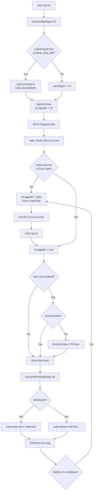
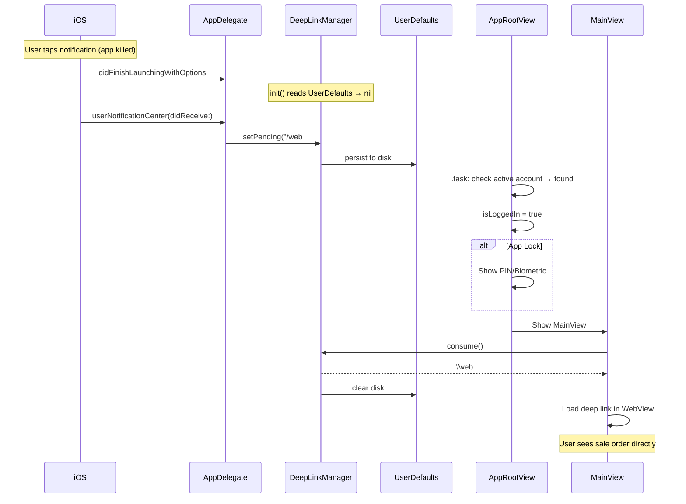

# Auto-Login + Persistent Deep Links — Implementation Plan

**Date:** 2026-04-05
**Status:** Planned
**Prerequisite:** FCM E2E tests all passing (8/8)

---

## Problem

1. **No auto-login** — app always shows login page on restart, even though account + password are saved in Core Data + Keychain
2. **Deep link lost on cold start** — `DeepLinkManager.pendingUrl` is in-memory only (`@Published var`), lost when app is killed

## How Android Does It (Parity Reference)

- `AccountRepository` exposes `activeAccount: Flow<OdooAccount?>` from Room
- `NavGraph.kt` computes `startDestination` reactively: `null` → splash, `false` → login, `true` → auth gate → main
- Android never explicitly "auto-logs in" — it checks if an active account row exists and skips login
- `DeepLinkManager` is also in-memory (`MutableStateFlow`), **Android doesn't persist deep links to disk either**
- Session cookies are persisted via OkHttp's `CookieJar` + `WebView.CookieManager`

---

## Decision Table

| Decision | Option A | Option B | Option C | **Chosen** | Rationale |
|---|---|---|---|---|---|
| Auto-login mechanism | Check active account in Core Data at startup; skip login if found | Re-authenticate with stored password on every launch | Store "wasLoggedIn" flag in UserDefaults | **A** | Matches Android. Account row + cookie persistence is sufficient. |
| State machine location | New `AppLaunchViewModel` class | Check directly in `AppRootView` using `AccountRepository` | Enum-driven coordinator | **B** | Simplest change. `AppRootView` already owns the flow. |
| Deep link persistence | `UserDefaults` | Keychain via `SecureStorage` | Core Data entity | **A** | URLs are not secrets (`/web#action=123`). UserDefaults is instant. |
| Deep link write timing | Write in `DeepLinkManager.setPending()` only | Write in `AppDelegate.handleNotificationTap()` only | In-memory + disk hybrid | **C** | In-memory for warm navigations. Disk as cold-start fallback. |
| Session expiry UX | Pass saved credentials to `LoginView` via binding | `LoginViewModel` reads last active account on init | Show "session expired" interstitial | **B** | `LoginViewModel` already has `AccountRepository` access. |
| PIN/biometric gate timing | Before account check (always gate first) | After account check, before WebView (Android parity) | After WebView loads | **B** | Android shows PIN only after confirming active account exists. |
| State representation | `Bool` (current) | `LaunchState` enum | `Bool?` nullable tri-state (nil=loading) | **C** | Mirrors Android's `Boolean?` pattern. Minimal diff. |

---

## Files to Modify (3 files)

### File 1: `odoo/Data/Push/DeepLinkManager.swift` (~15 lines added)

Add `UserDefaults` persistence for cold-start survival:

```swift
private let deepLinkUserDefaultsKey = "pending_deep_link_url"

@MainActor
final class DeepLinkManager: ObservableObject {
    static let shared = DeepLinkManager()
    @Published private(set) var pendingUrl: String?

    init() {
        // Cold-start recovery
        if let persisted = UserDefaults.standard.string(forKey: deepLinkUserDefaultsKey) {
            pendingUrl = persisted
            UserDefaults.standard.removeObject(forKey: deepLinkUserDefaultsKey)
        }
    }

    func setPending(_ url: String?) {
        pendingUrl = url
        if let url {
            UserDefaults.standard.set(url, forKey: deepLinkUserDefaultsKey)
        } else {
            UserDefaults.standard.removeObject(forKey: deepLinkUserDefaultsKey)
        }
    }

    func consume() -> String? {
        let current = pendingUrl
        pendingUrl = nil
        UserDefaults.standard.removeObject(forKey: deepLinkUserDefaultsKey)
        return current
    }
}
```

### File 2: `odoo/odooApp.swift` (~10 lines changed)

Convert `isLoggedIn` to nullable tri-state + add `.task` for account check:

```swift
@State private var isLoggedIn: Bool? = nil  // nil=loading, false=no account, true=found

var body: some View {
    Group {
        if isLoggedIn == nil {
            ProgressView()  // Splash while checking
        } else if isLoggedIn == false {
            LoginView(onLoginSuccess: { isLoggedIn = true ... })
        } else if authViewModel.requiresAuth && !authViewModel.isAuthenticated {
            // PIN/biometric gate (unchanged)
        } else {
            MainView(onSessionExpired: { isLoggedIn = false ... })
        }
    }
    .task {
        let activeAccount = accountRepository.getActiveAccount()
        isLoggedIn = (activeAccount != nil)
    }
}
```

### File 3: `odoo/UI/Login/LoginViewModel.swift` (~15 lines added)

Pre-fill credentials from last active account on session expiry:

```swift
init(repository: AccountRepositoryProtocol = AccountRepository(),
     secureStorage: SecureStorage = .shared) {
    self.repository = repository
    self.secureStorage = secureStorage
    prefillFromActiveAccount()
}

private func prefillFromActiveAccount() {
    guard let account = repository.getActiveAccount() else { return }
    serverUrl = account.serverUrl
    database = account.database
    username = account.username
    if let savedPassword = secureStorage.getPassword(accountId: account.username) {
        password = savedPassword
    }
    step = .credentials  // Skip server info step
}
```

### Files NOT changed

- `MainView.swift` — already consumes deep links correctly
- `AppDelegate.swift` — already calls `DeepLinkManager.shared.setPending()`

---

## App Launch Flow



## Notification Tap — Cold Start Flow



---

## Security

- Deep link URLs in UserDefaults are **not sensitive** (relative paths like `/web#action=123`)
- PIN/biometric gate is **preserved** — auto-login still routes through `requiresAuth` check
- Pre-filled password is from **Keychain** (encrypted, device-bound) and shown in `SecureField` (masked)
- No session tokens stored in UserDefaults — session cookies managed by `HTTPCookieStorage`

---

## Testing Strategy

| Test | Type | Description |
|---|---|---|
| DeepLinkManager cold-start recovery | Unit | Write to UserDefaults, new instance, verify pendingUrl loaded + UserDefaults cleared |
| DeepLinkManager.consume() clears both | Unit | Set pending, consume, verify both nil |
| AppRootView auto-login (account exists) | UI | Seed Core Data, launch, verify no LoginView |
| AppRootView auto-login (no account) | UI | Empty Core Data, launch, verify LoginView shown |
| AppRootView auto-login + app lock | UI | Seed account + lock, verify biometric shown |
| LoginViewModel pre-fill on expiry | Unit | Seed account + password, init ViewModel, verify fields populated |
| Deep link E2E warm start | Integration | Set pending, navigate through auth, verify WebView URL |
| Deep link E2E cold start | Integration | Write UserDefaults, simulate launch, verify consumed |

---

## Estimated Effort

| Phase | Work | Time |
|-------|------|------|
| DeepLinkManager persistence | ~15 lines | 30 min |
| AppRootView auto-login | ~10 lines | 30 min |
| LoginViewModel pre-fill | ~15 lines | 30 min |
| Unit tests (6 new) | ~80 lines | 1 hour |
| XCUITest FCM.8 update | ~10 lines | 15 min |
| **Total** | **~130 lines** | **~3 hours** |
