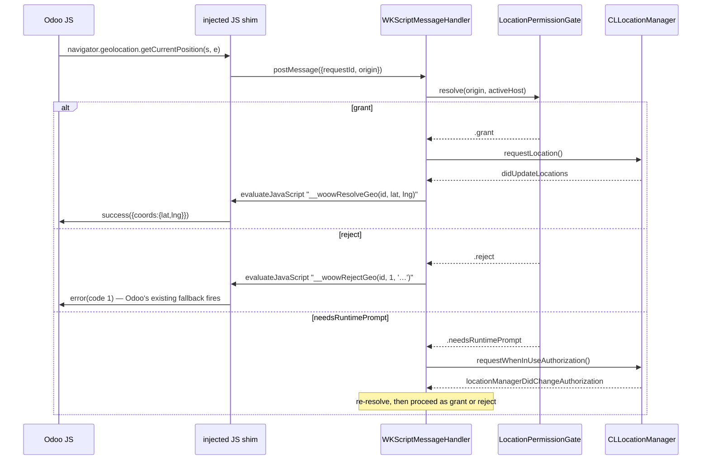

# iOS Location Permission — Plan v2 (Lean / TDD)

**Date:** 2026-04-26
**Supersedes:** `2026-04-26-ios-location-permission-plan.md` (v1, had architect-flagged blockers)
**Min iOS:** 16.0

---

## What changed from v1

Two reviews of v1 found:
- **Apple/App Store:** 3 BLOCKERs — `PrivacyInfo.xcprivacy` missing location declaration, Info.plist purpose string missing, App Store Connect Nutrition Label not updated
- **Code architect:** 1 BLOCKER + 8 issues — `WKUIDelegate.requestGeolocationPermissionFor` is **private SPI** (App Store rejection risk); Capacitor ships it but it's not in public WebKit headers; Coordinator stale-closure same bug as Android; over-complex test approach

v2 takes the architect's option (c) — **JS shim** — which sidesteps the SPI question entirely. Cleaner, safer, version-stable.

**Deleted from v1:** WKUIDelegate geolocation hook (SPI), `pendingDecisionHandler` race, `@available(iOS 15.0, *)` annotations, Approach B Web Inspector, no-op `--SeedLocationGranted`, redundant `LocationManagerProtocol` ceremony.

---

## 1. Architecture (single page)



**Why JS shim over WKUIDelegate SPI:**
- No private API → zero App Store rejection risk on the geolocation surface
- Works on every iOS version with no `@available` branches
- Native fully owns CLLocationManager interaction (cleaner test seam)
- Same architecture pattern as the Android `LocationPermissionGate` for cross-platform readability

---

## 2. Files & Components

| File | Type | Lines (est.) |
|------|------|------|
| `odoo/Data/Location/LocationPermissionGate.swift` | New | ~50 |
| `odoo/Data/Location/LocationCoordinator.swift` | New (CLLocationManagerDelegate + ScriptMessageHandler glue) | ~100 |
| `odoo/Data/Location/geolocation_shim.js` | New (WKUserScript content) | ~40 |
| `odoo/UI/Main/OdooWebView.swift` | Modified (install shim + register message handler) | +20 |
| `odoo/Domain/Models/AppSettings.swift` | Modified (+ `locationEnabled`) | +1 |
| `odoo/Data/Storage/SecureStorage.swift` | Modified (+ key + accessor) | +5 |
| `odoo/Data/Repository/SettingsRepository.swift` | Modified (+ `updateLocationEnabled`) | +5 |
| `odoo/UI/Settings/SettingsView.swift` | Modified (toggle row) | +10 |
| `odoo/UI/Settings/SettingsViewModel.swift` | Modified (`@Published var locationEnabled`) | +5 |
| `odoo/Info.plist` | + `NSLocationWhenInUseUsageDescription` | +1 |
| `odoo/PrivacyInfo.xcprivacy` | + `NSPrivacyCollectedDataTypes` entry for Precise Location | +12 |
| `odoo/en.lproj/Localizable.strings` (+zh-Hans, zh-Hant) | + 3 strings × 3 locales | +9 |
| `odooTests/LocationPermissionGateTests.swift` | New | ~120 |
| `odooTests/LocationCoordinatorTests.swift` | New | ~80 |
| `odooUITests/E2E_LocationTests.swift` | New | ~80 |

---

## 3. TDD plan — 7 red→green cycles

Each cycle: write the failing test FIRST, run, confirm fail, write minimum code to pass, run, confirm green. No code without a test that demands it.

### Cycle 1 — Gate origin/host validation

**Failing tests (`LocationPermissionGateTests`):**
```swift
func test_reject_whenOriginIsHTTP() — gate.resolve(URL("http://x.com")) == .reject("origin-not-https")
func test_reject_whenOriginIsNil()
func test_reject_whenOriginHostMismatchesActiveAccount()
```

**Code to write:** `LocationPermissionGate.swift` with `enum Decision`, `resolve(origin:activeAccountHost:)`. Hardcode "no" answer for now to fail tests; iterate the 3 cases.

### Cycle 2 — Gate user preference

**Failing test:**
```swift
func test_reject_whenLocationDisabled() — given activeHost matches, given locationEnabled=false → .reject("user-opted-out")
```

**Code:** add `settings: AppSettings` param read in resolve.

### Cycle 3 — Gate OS authorization status

**Failing tests:**
```swift
func test_grant_whenAuthorizedWhenInUse()
func test_grant_whenAuthorizedAlways()
func test_needsRuntimePrompt_whenNotDetermined()
func test_reject_whenDenied()
func test_reject_whenRestricted()
```

Use `LocationManagerStub` injected via init. (No `Protocol` ceremony — single-method stub class.)

**Code:** add 4th switch in resolve; ship 8 unit tests total. **End of Cycle 3 = `LocationPermissionGate` is feature-complete.**

### Cycle 4 — Settings persistence

**Failing tests (`SettingsRepositoryTests` — extend existing):**
```swift
func test_locationEnabled_defaultsTrue()
func test_updateLocationEnabled_persistsAndPublishes()
```

**Code:** add `locationEnabled: Bool = true` to `AppSettings`, `SecureStorage` key + accessor, `SettingsRepository.updateLocationEnabled(_:)`.

### Cycle 5 — JS shim contract

**Failing test (`LocationCoordinatorTests`):**
```swift
func test_messageHandler_whenGateGrants_evaluatesResolveJS() {
    // Given a WKWebView and our shim installed
    // Stub gate to return .grant, stub CLLocationManager to deliver lat=25.05, lng=121.61
    // Inject `webkit.messageHandlers.requestLocation.postMessage({requestId:"abc", origin:"https://x.com"})`
    // Wait, then assert evaluateJavaScript was called with "__woowResolveGeo('abc', 25.05, 121.61)"
}
```

**Code:** write `geolocation_shim.js`, write `LocationCoordinator.userContentController(_:didReceive:)` that calls gate, requests location, posts back via `evaluateJavaScript`.

### Cycle 6 — Account switch invalidation (architect-flagged stale-closure equivalent)

**Failing test:**
```swift
func test_resolve_usesLatestActiveAccountHost_notInitialSnapshot() {
    // Given coordinator created with account A, account changes to B,
    // resolve must use B's host. (Bug if it uses A.)
}
```

**Code:** `LocationCoordinator` reads `activeAccountHost` from a closure (`() -> String?`) or from a `@Published` subscription, NOT a captured value. Single change.

### Cycle 7 — End-to-end (XCUITest)

**Failing test (`E2E_LocationTests`):**
```swift
func test_realClockIn_storesNonZeroCoordsOnHrAttendance() async {
    // 1. simctl privacy grant location to app bundle id (in setUp)
    // 2. Launch app with --LocationEnabled
    // 3. Snapshot last hr.attendance.id via JSON-RPC helper
    // 4. Tap into WKWebView's Attendance systray (XCUIElement coordinate tap;
    //    selector source = OWL XML reads we already have)
    // 5. Tap Sign In/Out
    // 6. Wait 5s
    // 7. Re-query hr.attendance — assert new/updated record has non-zero in_/out_latitude
}
```

**Code:** wire the gate + coordinator + shim into `OdooWebViewCoordinator` configuration block.

---

## 4. Architect blockers — addressed

| Issue | Resolution in v2 |
|-------|-----|
| `WKUIDelegate.requestGeolocationPermissionFor` is private SPI | **Replaced with JS shim** — no SPI used |
| `pendingDecisionHandler` race | **Per-request UUID** — `requestId` in message, callback dictionary keyed by it |
| Coordinator stale `activeAccountHost` | **Cycle 6** — use a `() -> String?` closure that reads live, not a captured value |
| `@MainActor` on `LocationPermissionGate` | **Yes** — annotate the gate; `CLLocationManager` calls happen there |
| `@available(iOS 15.0, *)` dead code | Removed — min target 16, no annotation needed |
| `WKSecurityOrigin.port == 0` URL build | N/A — JS shim sends `window.location.origin` (already correct) |
| `SecureStorage` read-modify-write race | Pre-existing; documented as TODO, NOT fixed in this PR |
| `--SeedLocationGranted` no-op | Removed — use `xcrun simctl privacy <udid> grant location <bundleid>` in test setUp |
| Acceptance #8 wrong (iOS doesn't re-prompt) | Updated below — deep-link to Settings on permanent deny |
| `WKWebView.isInspectable` is iOS 16.4+ | Out of scope — we use XCUITest, not Web Inspector |

## 5. Apple/App Store blockers — addressed

| Blocker | Action in v2 |
|---------|------|
| `PrivacyInfo.xcprivacy` missing location entry | **Cycle 0 (pre-coding):** add `NSPrivacyCollectedDataTypes` Precise Location entry. Linked=false, Tracking=false, Purpose=Functionality. |
| Info.plist purpose string missing | **Cycle 0:** add `NSLocationWhenInUseUsageDescription` with reviewable wording (3 locales). |
| App Store Connect Nutrition Label | Operational task before next upload — documented in §8. |
| Reduced-accuracy not handled | **Accept gracefully** — if `accuracyAuthorization == .reducedAccuracy`, still pass coords (1–3 km accuracy) to Odoo. Log warning. No `requestTemporaryFullAccuracyAuthorization` (over-engineering for v1). |
| Apple reviewer needs test account | Operational — provide reviewer credentials in App Review Information. |

---

## 6. Reviewable purpose strings

```
en:    NSLocationWhenInUseUsageDescription = "WoowTech Odoo records your location when you clock in or clock out so your Odoo attendance record includes the GPS coordinates of where you checked in. Location is sent only to your own Odoo server and never to third parties."

zh-Hant: "WoowTech Odoo 會在您打卡上下班時記錄您的位置,以便您的 Odoo 出勤紀錄包含打卡時的 GPS 座標。位置資訊僅傳送至您自己的 Odoo 伺服器,絕不會傳送給第三方。"

zh-Hans: "WoowTech Odoo 会在您打卡上下班时记录您的位置,以便您的 Odoo 考勤记录包含打卡时的 GPS 坐标。位置信息仅发送至您自己的 Odoo 服务器,绝不会发送给第三方。"
```

---

## 7. Privacy Manifest snippet

```xml
<!-- PrivacyInfo.xcprivacy — add to existing NSPrivacyCollectedDataTypes array -->
<dict>
    <key>NSPrivacyCollectedDataType</key>
    <string>NSPrivacyCollectedDataTypePreciseLocation</string>
    <key>NSPrivacyCollectedDataTypeLinked</key>
    <false/>
    <key>NSPrivacyCollectedDataTypeTracking</key>
    <false/>
    <key>NSPrivacyCollectedDataTypePurposes</key>
    <array>
        <string>NSPrivacyCollectedDataTypePurposeAppFunctionality</string>
    </array>
</dict>
```

(Optional second entry for `NSPrivacyCollectedDataTypeCoarseLocation` if reduced-accuracy paths land — same structure.)

---

## 8. Acceptance Criteria

1. All `LocationPermissionGateTests` pass (8 tests)
2. All `LocationCoordinatorTests` pass (≥4 tests covering grant / reject / runtime-prompt / account-switch)
3. `xcodebuild build` clean
4. `Info.plist` has `NSLocationWhenInUseUsageDescription` with reviewable wording in 3 locales
5. `PrivacyInfo.xcprivacy` declares `NSPrivacyCollectedDataTypePreciseLocation` with `Linked=false`, `Tracking=false`, `Purpose=AppFunctionality`
6. NO `NSLocationAlwaysAndWhenInUseUsageDescription` in Info.plist
7. NO `location` in `UIBackgroundModes`
8. App Store Connect Privacy Nutrition Label updated to declare Precise Location → not linked / not tracking / functionality (operational checklist)
9. Apple reviewer credentials supplied in App Review Information (operational)
10. Real-device E2E: cold install → login → tap Sign In → permission prompt → grant → `hr.attendance.in_latitude` ≠ 0
11. Real-device negative: toggle off → next clock-in records 0.0 (Odoo fallback)
12. Real-device permanent deny path → app surfaces Settings deep-link CTA via snackbar (NOT re-prompt — iOS doesn't allow that)

---

## 9. Phases (TDD order)

| # | Cycle | Effort |
|---|-------|--------|
| 0 | Privacy Manifest + Info.plist + 3-locale strings (no test cycle — config files) | 30 min |
| 1 | Cycle 1 (origin/host) | 30 min |
| 2 | Cycle 2 (locationEnabled) | 15 min |
| 3 | Cycle 3 (CL auth status) | 30 min |
| 4 | Cycle 4 (SettingsRepository persistence) | 30 min |
| 5 | Settings UI toggle + 3-locale strings | 30 min |
| 6 | Cycle 5 (JS shim + LocationCoordinator) | 2 hrs |
| 7 | Cycle 6 (account-switch invalidation test) | 30 min |
| 8 | Cycle 7 (XCUITest E2E with `simctl privacy`) | 1.5 hrs |
| 9 | Real-device verification | 1 hr |

**Total: ~7.5 hours / 1 engineer-day** (smaller than v1's 9hr because we removed SPI complexity).

---

## 10. Out of scope (explicit)

- `requestTemporaryFullAccuracyAuthorization` — accept reduced accuracy as graceful degradation
- Background location — never
- `SecureStorage` read-modify-write race fix — pre-existing bug, separate ticket
- Geofencing — would need 3rd-party Odoo module
- Mock-location detection — anti-fraud follow-up
- iOS 15 support — min target is 16, no fallback needed

---

## 11. Risks (final, after both reviews)

| Risk | Mitigation |
|------|-----------|
| Odoo's JS hardens against navigator.geolocation override | Low — Odoo just calls the standard API, doesn't check for shimming |
| User-script timing — shim must run BEFORE Odoo's JS executes `getCurrentPosition` | Inject at `WKUserScriptInjectionTime.atDocumentStart` |
| `WKScriptMessageHandler` retain cycle (handler retains coordinator) | Use `WKScriptMessageHandlerWithReply` or weak indirect via `MessageHandlerProxy` |
| `evaluateJavaScript` callback not invoked on main thread | Already documented main-only — wrap in `await MainActor.run` if needed |
| Reduced-accuracy delivers ~3km centroid, looks like wrong location to user | Accept — document in release notes; pre-promotion to "precise" can be a follow-up |
| Apple reviewer rejects for vague purpose string | Pre-empted by §6 wording (specific: trigger, destination, no third-party) |
| Privacy Nutrition Label not updated → submission rejected at upload | §8 #8 operational checklist |

---

## 12. Definition of Done

A pull request is mergeable when **all** §8 acceptance criteria pass AND there's evidence (screenshot or log) of E2E #10 succeeding on a real iPhone.
