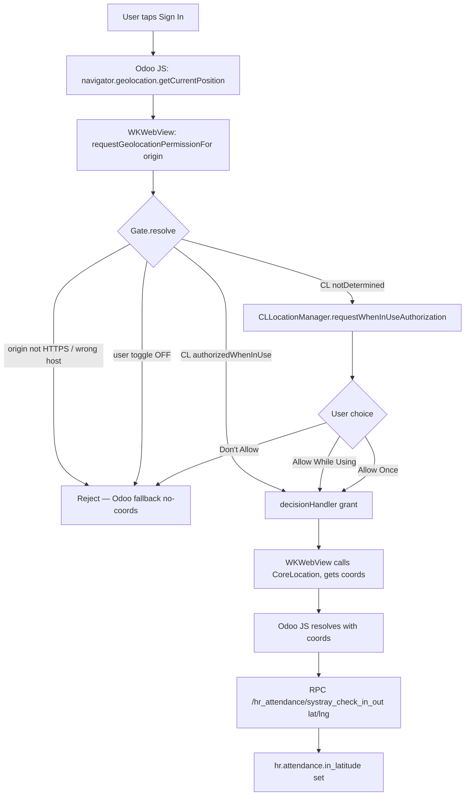

# iOS Location Permission for Odoo Attendances Clock-In

**Date:** 2026-04-26
**Target:** WoowTech Odoo iOS app (`/Users/alanlin/Woow_odoo_ios`)
**Min deployment:** iOS 16.0 (verified via `IPHONEOS_DEPLOYMENT_TARGET`)
**Mirrors:** Android `dev_missing_features_security` branch (already shipped & verified)

---

## 1. Why this is needed

The Android app now records non-zero `hr.attendance.in_latitude`/`in_longitude` after a clock-in. The iOS app should reach feature parity. Without the wire-up, the iOS WKWebView silently denies every `navigator.geolocation.getCurrentPosition()` request and Odoo persists 0.0/0.0.

---

## 2. Critical pre-investigation: `isIosApp()` is NOT a blocker

**Fear:** Odoo 18's `hr_attendance/static/src/components/attendance_menu/attendance_menu.js:58` does:
```js
if (!isIosApp()) { navigator.geolocation.getCurrentPosition(...) }
```
which would skip GPS entirely on iOS and ship with `out_latitude=0`.

**Verified by source inspection** (`addons/web/static/src/core/browser/feature_detection.js:64`):
```js
export function isIosApp() {
    return /OdooMobile \(iOS\)/i.test(browser.navigator.userAgent);
}
```

`isIosApp()` matches the **literal substring `"OdooMobile (iOS)"`** in the user-agent — which only the official Odoo Mobile app sets. Our WKWebView uses Apple's default UA (`Mozilla/5.0 (iPhone; CPU iPhone OS 17_x...) AppleWebKit/...`) — no `OdooMobile (iOS)` substring.

**Conclusion:** `isIosApp()` returns FALSE in our WKWebView. Odoo's JS will call `navigator.geolocation.getCurrentPosition()` normally. **Do NOT spoof UA. Do NOT inject location via JS bridge.** The native WKWebView geolocation path is the right approach — same architecture as Android.

(Cross-platform note: do NOT add `OdooMobile (iOS)` to our UA in any future feature, or we'll lose location on every clock-in.)

---

## 3. iOS-specific differences vs Android

| Concern | Android | iOS |
|---------|---------|-----|
| Permission strings | `AndroidManifest.xml` `<uses-permission ACCESS_FINE_LOCATION>` + COARSE | `Info.plist` `NSLocationWhenInUseUsageDescription` |
| Runtime grant API | `ActivityResultContracts.RequestMultiplePermissions` | `CLLocationManager.requestWhenInUseAuthorization()` |
| WebView geolocation hook | `WebChromeClient.onGeolocationPermissionsShowPrompt` | `WKUIDelegate.webView(_:requestGeolocationPermissionFor:initiatedByFrame:decisionHandler:)` (iOS 15+) |
| Stale-cache defense | `GeolocationPermissions.getInstance().clear(origin)` | iOS doesn't cache per-origin — single decisionHandler call resolves immediately |
| Permission tiers | Precise (FINE) + Approximate (COARSE) + Background | While In Use + Always (we use **only While In Use**) + Reduced Accuracy |
| Reading location | Native: `FusedLocationProviderClient`; WebView: Chromium handles | Native: `CLLocationManager`; WebView: WebKit calls CoreLocation under the hood once granted |

The architecture is the same: a `LocationPermissionGate` checks origin + user preference + OS state, then either grants synchronously or triggers a runtime request.

---

## 4. Design

### LocationPermissionGate (port from Android)

```swift
final class LocationPermissionGate {
    private let settings: SettingsRepository
    private let accountRepository: AccountRepository
    private let locationManager: LocationManagerProtocol  // wraps CLLocationManager for testability

    enum Decision {
        case grant
        case reject(reason: String)
        case needsRuntimePrompt
    }

    /// Resolve a geolocation prompt synchronously. Order:
    ///   1. origin must be HTTPS + host-match active account
    ///   2. settings.locationEnabled must be true
    ///   3. CLAuthorizationStatus must be authorizedWhenInUse or authorizedAlways
    func resolve(origin: URL?, activeAccountHost: String?) -> Decision {
        // 1. Origin check
        guard let origin = origin,
              origin.scheme?.lowercased() == "https",
              let originHost = origin.host?.lowercased(),
              let activeHost = activeAccountHost?.lowercased(),
              originHost == activeHost
        else { return .reject(reason: "origin-mismatch") }

        // 2. App preference
        guard settings.value.locationEnabled else {
            return .reject(reason: "user-opted-out")
        }

        // 3. CLAuthorizationStatus (LIVE check — never cached)
        switch locationManager.authorizationStatus {
        case .authorizedWhenInUse, .authorizedAlways:
            return .grant
        case .notDetermined:
            return .needsRuntimePrompt
        case .denied, .restricted:
            return .reject(reason: "system-denied")
        @unknown default:
            return .reject(reason: "unknown-auth-status")
        }
    }
}

protocol LocationManagerProtocol {
    var authorizationStatus: CLAuthorizationStatus { get }
    func requestWhenInUseAuthorization()
}
```

### WKWebView wire-up — `OdooWebViewCoordinator`

```swift
extension OdooWebViewCoordinator {
    /// iOS 15+ — required for navigator.geolocation in WKWebView.
    @available(iOS 15.0, *)
    func webView(_ webView: WKWebView,
                 requestGeolocationPermissionFor origin: WKSecurityOrigin,
                 initiatedByFrame frame: WKFrameInfo,
                 decisionHandler: @escaping (WKPermissionDecision) -> Void) {
        let originURL = URL(string: "\(origin.protocol)://\(origin.host):\(origin.port)")
        switch gate.resolve(origin: originURL, activeAccountHost: activeHostSnapshot) {
        case .grant:
            decisionHandler(.grant)
        case .reject(let reason):
            AppLogger.debug("Geolocation: rejected (\(reason))")
            decisionHandler(.deny)
        case .needsRuntimePrompt:
            // Stash decisionHandler, kick off CLLocationManager request,
            // resolve handler in CLLocationManagerDelegate callback
            pendingDecisionHandler = decisionHandler
            locationManager.requestWhenInUseAuthorization()
        }
    }

    /// Same lifecycle guard as Android: deny if app not active.
    /// (iOS adds an extra layer — if app is in background, WKWebView prompts
    /// won't surface anyway, but be explicit.)
}
```

### CLLocationManagerDelegate — runtime grant resolution

```swift
extension OdooWebViewCoordinator: CLLocationManagerDelegate {
    func locationManagerDidChangeAuthorization(_ manager: CLLocationManager) {
        guard let handler = pendingDecisionHandler else { return }
        pendingDecisionHandler = nil
        switch manager.authorizationStatus {
        case .authorizedWhenInUse, .authorizedAlways:
            handler(.grant)
        default:
            handler(.deny)
        }
    }
}
```

### Settings UI — toggle (mirrors Android H1)

```swift
// SettingsView.swift — add to Privacy section
Toggle("Use location for clock-in", isOn: $viewModel.locationEnabled)
    .toggleStyle(WoowToggleStyle())
Text("Tags your Odoo clock-in record with your current location. We never track you in the background.")
    .font(.footnote).foregroundColor(.secondary)
```

`SettingsViewModel`:
```swift
@Published var locationEnabled: Bool {
    didSet { settingsRepository.updateLocationEnabled(locationEnabled) }
}
```

`SettingsRepository`:
```swift
func updateLocationEnabled(_ enabled: Bool) {
    secureStorage.set(enabled, forKey: "location_enabled")
    settingsSubject.send(currentSettings.with(locationEnabled: enabled))
}
```

---

## 5. State machine — same shape as Android



---

## 6. Files to change

### New files
| File | Purpose |
|------|---------|
| `odoo/Data/Location/LocationPermissionGate.swift` | Port from Android Kotlin |
| `odoo/Data/Location/LocationManagerProtocol.swift` | Wraps `CLLocationManager` for testability |
| `odoo/Data/Location/CLLocationManagerWrapper.swift` | Production impl |
| `odooTests/LocationPermissionGateTests.swift` | 8 tests (port from Android) |

### Modified files
| File | Change |
|------|--------|
| `odoo/Info.plist` | Add `NSLocationWhenInUseUsageDescription` (~3 language variants) |
| `odoo/Domain/Models/AppSettings.swift` | Add `locationEnabled: Bool = true` |
| `odoo/Data/Storage/SecureStorage.swift` | Add `kLocationEnabledKey` constant + read/write |
| `odoo/Data/Repository/SettingsRepository.swift` | Add `updateLocationEnabled(_:)` |
| `odoo/UI/Main/OdooWebView.swift` | Implement WKUIDelegate `requestGeolocationPermissionFor` (iOS 15+); CLLocationManagerDelegate; pass `activeHostSnapshot` from active account |
| `odoo/UI/Settings/SettingsView.swift` | Add Privacy section toggle |
| `odoo/UI/Settings/SettingsViewModel.swift` | `@Published var locationEnabled` |
| Localizable.strings × 3 | New strings: title, description |
| Existing UI tests | None should break — feature is additive |

---

## 7. UX cue (iOS variant of Android's CircularProgressIndicator)

iOS WKWebView geolocation does NOT block the JS thread visibly — `navigator.geolocation.getCurrentPosition()` is async with a callback. Odoo's JS already handles the wait. We don't need a dedicated spinner like Android; the existing dropdown UI shows a brief "Loading..." state from Odoo itself.

If the user denies, Odoo's error callback runs (`/hr_attendance/systray_check_in_out` without coords) — clock-in still completes. Same graceful degradation as Android.

---

## 8. Tests

### Tier 1 — Unit (`LocationPermissionGateTests` × 8 — port from Android)

```swift
func testReject_whenOriginNotHTTPS()
func testReject_whenOriginNil()
func testReject_whenOriginHostMismatch()
func testReject_whenNoActiveAccount()
func testReject_whenLocationDisabled()
func testGrant_whenAuthorizedWhenInUse()
func testGrant_whenAuthorizedAlways()
func testNeedsRuntimePrompt_whenNotDetermined()
```

### Tier 2 — XCUITest (E2E-15-iOS)

Mirror the Android `e2e_15_clockin_full.py` approach but driven by XCUITest + Safari Web Inspector. iOS Safari Web Inspector doesn't expose CDP by default for app WKWebViews unless `_inspectableWebContentForTesting` is set on the configuration in Debug builds.

**Approach A — XCUITest only (preferred for shipping CI):**
```swift
func testE2E15_clockInRecordsGPSCoords() async throws {
    // 1. Pre-grant location via launch arg (test hook)
    let app = XCUIApplication()
    app.launchArguments += ["--SeedLocationGranted", "--LocationEnabled"]
    app.launch()

    // 2. Snapshot last hr.attendance ID via Odoo JSON-RPC (in test setUp)
    let beforeId = await odooQueryLatestAttendanceID()

    // 3. Tap the WKWebView at the systray attendance icon coords
    //    (after navigating to /odoo/attendances). XCUIElement can tap by coord.
    app.webViews.firstMatch.tap()  // or coordinate-based

    // 4. Wait 8s for geolocation + RPC
    sleep(8)

    // 5. Verify via JSON-RPC
    let after = await odooQueryAttendanceById(beforeId + 1)
    XCTAssertNotEqual(after.in_latitude, 0.0)
}
```

**Approach B — Safari Web Inspector + WebKit remote inspection:**
- Enable `WKWebView.isInspectable = true` in DEBUG builds
- Connect via `safaridriver` or Safari → Develop → Simulator → page
- Use JS injection to click the systray (same OWL XML selectors as Android)

Approach A is portable; Approach B requires a Mac-host CI runner.

### Tier 3 — Manual on real iPhone

Same checklist as Android E2E:
1. Fresh install → login → grant location at first prompt
2. Tap Attendance systray → Sign In → record's `in_latitude` non-zero on Odoo
3. Toggle Settings → Privacy → Use Location OFF → Sign Out → record's `out_latitude` is 0
4. Settings app → Privacy → Location → WoowTech Odoo → Never → return → Sign In → no GPS, fallback path

---

## 9. Test Hook (mirrors Android `TestHooks.kt`)

```swift
#if DEBUG
struct TestHooks {
    static func applyIfPresent(_ launchArgs: [String], settings: SettingsRepository) {
        if launchArgs.contains("--SeedLocationGranted") {
            // No-op on iOS; CL state is OS-managed. Assume the test grants
            // permission via the simulator's Privacy settings before launch.
        }
        if launchArgs.contains("--LocationEnabled") {
            settings.updateLocationEnabled(true)
            AppLogger.warn("Location preference set via test hook (DEBUG only)")
        }
        if launchArgs.contains("--LocationDisabled") {
            settings.updateLocationEnabled(false)
        }
    }
}
#endif
```

Per project memory, iOS already uses the `--SetTestPIN`, `--AppLockEnabled`, `--ResetAppState` launch-arg pattern. Add `--LocationEnabled` / `--LocationDisabled` consistently.

---

## 10. Phases

| # | Step | Effort |
|---|------|--------|
| 1 | Add `NSLocationWhenInUseUsageDescription` to Info.plist (en + zh-Hans + zh-Hant) | 30 min |
| 2 | `LocationPermissionGate.swift` + `LocationManagerProtocol` + production wrapper + 8 unit tests | 2 hr |
| 3 | Wire `WKUIDelegate.requestGeolocationPermissionFor` in `OdooWebViewCoordinator` | 1 hr |
| 4 | `CLLocationManagerDelegate` for runtime grant resolution | 30 min |
| 5 | `AppSettings.locationEnabled` + `SecureStorage` + `SettingsRepository.updateLocationEnabled` | 1 hr |
| 6 | Settings UI toggle + `Localizable.strings` × 3 | 1 hr |
| 7 | TestHooks: `--LocationEnabled` / `--LocationDisabled` launch args | 30 min |
| 8 | XCUITest E2E-15-iOS | 2 hr |
| 9 | Real-device verification on iPhone | 1 hr |

**Total: ~9 hours / 1 engineer-day** (matches Android estimate).

---

## 11. Acceptance Criteria

1. `xcodebuild test` — all `LocationPermissionGateTests` pass (8/8)
2. `xcodebuild build` — clean build for iOS 16+
3. `Info.plist` has `NSLocationWhenInUseUsageDescription` + zh translations
4. NO `NSLocationAlwaysAndWhenInUseUsageDescription` (we don't need Always)
5. NO `UIBackgroundModes` includes `location` (we never track in background)
6. Real-device: cold install → login → tap Sign In → permission prompt → grant → `hr.attendance.in_latitude` non-zero
7. Real-device: toggle off → next clock-in records 0.0 (Odoo fallback path)
8. Real-device: deny → re-prompt on next clock-in (or deep link to Settings if "Don't Allow")
9. UA does NOT contain "OdooMobile (iOS)" (verified — no UA spoofing in our app)
10. iOS code paths mirror Android architecture for cross-platform consistency

---

## 12. Risks

| Risk | Mitigation |
|------|-----------|
| WKUIDelegate `requestGeolocationPermissionFor` is iOS 15+ | We're on iOS 16 min — non-issue |
| Some iPhones in test fleet on iOS 14 | Verify deployment target. iOS 16 min means iOS 14 not supported anyway. |
| User taps "Don't Allow" once, no re-prompt | iOS pattern: deep-link to Settings via `UIApplication.openSettingsURLString` from a snackbar after second denial |
| WKWebView geolocation requires page on HTTPS | Already enforced by our HTTPS-only DeepLinkValidator + URL allowlist |
| Cross-platform settings drift (locationEnabled key differs) | Use same key string `"location_enabled"` as Android `KEY_LOCATION_ENABLED` |
| iOS UA accidentally getting `OdooMobile (iOS)` set in future | Add a CI lint check that scans for that literal in `customUserAgent` assignments |

---

## 13. What this fix does NOT change

- Existing iOS biometric / Face ID / PIN flows
- HTTPS enforcement layers
- DeepLinkValidator allowlist
- Push notifications (FCM v1.1.x integration)
- Account management

---

## 14. Cross-platform parity table (post-implementation)

| Feature | Android | iOS |
|---------|---------|-----|
| Foreground location for clock-in | YES (commit `caea05e`) | YES (this plan) |
| Background location | NO (intentional) | NO (intentional) |
| User opt-out toggle | YES | YES (this plan) |
| Origin/HTTPS/host validation | YES | YES (this plan) |
| Live OS-permission re-check on every prompt | YES | YES (this plan) |
| Test hook for E2E precondition seeding | YES (`--ez location-enabled`) | YES (`--LocationEnabled`) |
| Off-thread crypto (PBKDF2 600K) | YES (commit `23c80bf`) | TODO (separate ticket — verify if iOS PinHasher already async) |
| Verified end-to-end on real device | YES (Xiaomi) | TODO (this plan §11) |
