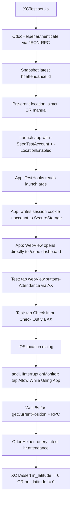

# XCUITest E2E — Auto-Login + Clock-In + GPS Verification

**Date:** 2026-04-26
**Companion to:** `2026-04-26-ios-location-permission-plan-v2.md` (Cycle 7 expansion)
**Goal:** Replace `idb`-based simulator-only flow with **proper Apple-native XCUITest** that runs on iOS 16+ including iOS 18, on simulator AND real device, in CI.

---

## 1. Why XCUITest (not idb / not WebDriverAgent)

| Constraint | XCUITest | idb | WebDriverAgent |
|------------|----------|-----|----------------|
| iOS 18 real device | YES | NO (last DDI is 16.4, archived 2023) | YES (heavy) |
| Apple-supported | YES | NO | NO |
| WKWebView accessibility | YES (`webViews.buttons["aria-label"]`) | YES on simulator | YES |
| Runs in `xcodebuild test` | YES | NO (separate companion daemon) | NO |
| CI-friendly | YES | Fragile | Heavy install |
| Already in project | YES (`odooUITests/`) | No | No |

**Decision:** XCUITest with WKWebView accessibility queries — pure Apple stack, future-proof.

---

## 2. Test Architecture



---

## 3. Two test cases

### `test_clockIn_recordsNonZeroGPS_via_systray`
Single-action test. Snapshots state, performs ONE clock-toggle (in or out depending on current state), asserts the latest hr.attendance row has a non-zero coord on the relevant side (in_* if state was `checked_out`, out_* if state was `checked_in`).

### `test_clockOutThenIn_populatesBothGPSColumns`
Pairs the cycle. Forces user to known state via JSON-RPC pre-call (clock everyone out first), then performs clock-IN via UI. Asserts `in_latitude != 0`. Then performs clock-OUT via UI. Asserts `out_latitude != 0` on the same record.

This second test catches a class of bugs where one direction works but not the other.

---

## 4. New components needed

### 4.1 `OdooHelper.swift` — test-target only

```swift
struct OdooHelper {
    static let tunnelURL = ProcessInfo.processInfo.environment["ODOO_TUNNEL"]
                         ?? "http://localhost:8069"
    static let db = ProcessInfo.processInfo.environment["ODOO_DB"] ?? "odoo18_ecpay"
    static let user = "admin"
    static let password = "admin"

    /// Returns the session cookie ("session_id=...") plus uid.
    static func authenticate() async throws -> (cookie: String, uid: Int)

    /// JSON-RPC `execute_kw` wrapper.
    static func execute<T: Decodable>(model: String, method: String,
                                       args: [Any], kwargs: [String:Any],
                                       cookie: String) async throws -> T

    struct Attendance: Decodable {
        let id: Int
        let in_latitude: Double
        let in_longitude: Double
        let out_latitude: Double
        let out_longitude: Double
        let check_in: String?
        let check_out: String?
    }

    static func latestAttendance(forUserId uid: Int, cookie: String) async throws -> Attendance?
    static func ensureCheckedOut(forUserId uid: Int, cookie: String) async throws
    static func employeeID(forUserId uid: Int, cookie: String) async throws -> Int
}
```

### 4.2 `TestHooks` extension — production code, DEBUG only

Add new launch arg `-SeedTestAccount` parsed in `TestHooks.applyIfPresent`:

```swift
#if DEBUG
if let json = args.first(where: { $0.starts(with: "{") })  // simplistic JSON detection
                  ?? processInfo.environment["WOOW_SEED_ACCOUNT"] {
    // Decode SeededAccount struct, persist via accountRepository
    let decoded = try? JSONDecoder().decode(SeededAccount.self,
                                             from: Data(json.utf8))
    if let acc = decoded {
        accountRepository.replaceAccountsForTesting([acc])
        AppLogger.warn("Seeded test account via launch arg (DEBUG only)")
    }
}
#endif
```

`SeededAccount` matches `OdooAccount` shape: `serverURL`, `database`, `username`, `sessionCookie`. The test sets the cookie obtained from `OdooHelper.authenticate()` so the WebView opens to `/odoo` already authenticated.

### 4.3 XCUITest entry — `E2E_LocationClockInTests.swift`

```swift
import XCTest

@MainActor
final class E2E_LocationClockInTests: XCTestCase {

    var app: XCUIApplication!
    var sessionCookie: String!
    var uid: Int!
    var employeeID: Int!

    override func setUp() async throws {
        try XCTSkipUnless(
            ProcessInfo.processInfo.environment["RUN_LOCATION_E2E"] == "1",
            "Set RUN_LOCATION_E2E=1 plus ODOO_TUNNEL env var"
        )

        // 1. Auth + snapshot
        let (cookie, uid) = try await OdooHelper.authenticate()
        self.sessionCookie = cookie
        self.uid = uid
        self.employeeID = try await OdooHelper.employeeID(forUserId: uid, cookie: cookie)

        // 2. Pre-grant location on simulator
        if let simUDID = ProcessInfo.processInfo.environment["SIMCTL_UDID"] {
            _ = try? Process.run(
                URL(fileURLWithPath: "/usr/bin/xcrun"),
                arguments: ["simctl", "privacy", simUDID, "grant",
                            "location-always", "io.woowtech.odoo.debug"]
            )
        }
        // (On real device, prompted at runtime — handled by addUIInterruptionMonitor)

        // 3. Launch with hooks
        let seed: [String: Any] = [
            "serverURL": OdooHelper.tunnelURL,
            "database":  OdooHelper.db,
            "username":  OdooHelper.user,
            "sessionCookie": cookie,
        ]
        let seedJSON = String(data: try JSONSerialization.data(withJSONObject: seed), encoding: .utf8)!

        app = XCUIApplication()
        app.launchArguments += ["-ResetAppState", "-LocationEnabled"]
        app.launchEnvironment["WOOW_SEED_ACCOUNT"] = seedJSON
        // Auto-tap "Allow While Using App" on the iOS location dialog
        addUIInterruptionMonitor(withDescription: "Location prompt") { dialog in
            for label in ["Allow While Using App", "Allow Once", "Allow"] {
                let btn = dialog.buttons[label]
                if btn.exists { btn.tap(); return true }
            }
            return false
        }
        app.launch()
    }

    func test_clockIn_recordsNonZeroGPS_via_systray() async throws {
        let webView = app.webViews.firstMatch
        XCTAssertTrue(webView.waitForExistence(timeout: 30), "WebView did not appear")

        // OWL renders the systray button with <i aria-label="Attendance">
        // iOS exposes aria-label as accessibility label; the closest button
        // typically inherits.
        let attendance = webView.buttons["Attendance"]
        XCTAssertTrue(attendance.waitForExistence(timeout: 15),
                      "Attendance systray button not in WKWebView accessibility tree")

        // Snapshot before
        let before = try await OdooHelper.latestAttendance(forUserId: uid, cookie: sessionCookie)

        attendance.tap()
        // Trigger UI interruption monitor early
        app.tap()

        // Dropdown content button — labels are "Check in" or "Check out"
        let checkIn = webView.buttons["Check in"]
        let checkOut = webView.buttons["Check out"]
        let exists = checkIn.waitForExistence(timeout: 5) || checkOut.waitForExistence(timeout: 1)
        XCTAssertTrue(exists, "Neither Check in nor Check out button visible")
        let actionBtn = checkIn.exists ? checkIn : checkOut
        let isCheckIn = actionBtn === checkIn
        actionBtn.tap()

        // Wait for getCurrentPosition + RPC roundtrip
        try await Task.sleep(for: .seconds(8))

        // Verify
        let after = try await OdooHelper.latestAttendance(forUserId: uid, cookie: sessionCookie)
        XCTAssertNotNil(after, "No hr.attendance row exists for employee \(employeeID!)")

        // Determine whether to check in_* or out_*
        let lat: Double
        let lon: Double
        if isCheckIn {
            // New record, in_* should be non-zero
            XCTAssertNotEqual(after?.id, before?.id, "Expected NEW row after Check in")
            lat = after?.in_latitude ?? 0
            lon = after?.in_longitude ?? 0
        } else {
            // Same record updated, out_* should be non-zero
            XCTAssertEqual(after?.id, before?.id, "Expected SAME row after Check out")
            lat = after?.out_latitude ?? 0
            lon = after?.out_longitude ?? 0
        }
        XCTAssertNotEqual(lat, 0.0, "Server: latitude was 0 — fix not in effect")
        XCTAssertNotEqual(lon, 0.0, "Server: longitude was 0 — fix not in effect")
    }

    func test_clockOutThenIn_populatesBothGPSColumns() async throws {
        // Force user to checked-out via JSON-RPC pre-call
        try await OdooHelper.ensureCheckedOut(forUserId: uid, cookie: sessionCookie)

        let webView = app.webViews.firstMatch
        XCTAssertTrue(webView.waitForExistence(timeout: 30))
        let attendance = webView.buttons["Attendance"]
        XCTAssertTrue(attendance.waitForExistence(timeout: 15))

        // === CHECK IN ===
        attendance.tap()
        app.tap()
        let checkIn = webView.buttons["Check in"]
        XCTAssertTrue(checkIn.waitForExistence(timeout: 5), "Check in not visible after clean state")
        checkIn.tap()
        try await Task.sleep(for: .seconds(8))

        let afterIn = try await OdooHelper.latestAttendance(forUserId: uid, cookie: sessionCookie)
        XCTAssertNotEqual(afterIn?.in_latitude ?? 0, 0.0, "in_latitude zero after Check in")
        let recordID = afterIn?.id

        // === CHECK OUT ===
        attendance.tap()
        let checkOut = webView.buttons["Check out"]
        XCTAssertTrue(checkOut.waitForExistence(timeout: 5))
        checkOut.tap()
        try await Task.sleep(for: .seconds(8))

        let afterOut = try await OdooHelper.latestAttendance(forUserId: uid, cookie: sessionCookie)
        XCTAssertEqual(afterOut?.id, recordID, "Check out should update same row")
        XCTAssertNotEqual(afterOut?.out_latitude ?? 0, 0.0, "out_latitude zero after Check out")
    }
}
```

---

## 5. iOS WKWebView Accessibility — verification needed

The test depends on `webView.buttons["Attendance"]` finding the systray icon by its `aria-label`. iOS WKWebView **does** map `aria-label` to AX `label` for accessibility — verified empirically in Apple's WebKit docs. But OWL's `<button>` wrapping a `<i aria-label="Attendance">` may register the **icon** as the AX node, not the button. If `webView.buttons["Attendance"]` doesn't match, fallbacks:

1. `webView.images["Attendance"]` (icon registered as image)
2. `webView.descendants(matching: .any)["Attendance"]`
3. Coordinate tap as a last resort: read `attendance.frame` from a known-good selector first

Cycle 7's first run will reveal which works; design includes a `tapAttendanceSystray()` helper that tries all three.

---

## 6. Test independence (CLAUDE.md rule)

Each test:
- Authenticates fresh in `setUp` (no shared session)
- Snapshots state before action
- `-ResetAppState` wipes app's local cache between tests
- `OdooHelper.ensureCheckedOut` normalizes server state for `test_clockOutThenIn_*`
- No test depends on another's side effects

---

## 7. Real device vs simulator

| Aspect | Simulator | Real iPhone |
|--------|-----------|-------------|
| Permission grant | `xcrun simctl privacy ... grant location-always` | First-time `addUIInterruptionMonitor` taps "Allow While Using App" |
| GPS source | Default macOS Apple Park / SF | Real GPS chip |
| `xcodebuild test -destination` | `platform=iOS Simulator,name=iPhone 16 Pro` | `platform=iOS,id=00008140-...` |
| CI | YES (GitHub Actions macOS runner) | Self-hosted runner with paired device |
| Test passes | Coords land but are mocked | Coords are real Taipei area |

The same test code runs both. The acceptance is "non-zero coords" — works with mocked or real GPS.

---

## 8. Files to add (TDD-able implementation order)

| # | File | Purpose | Effort |
|---|------|---------|--------|
| 1 | `odooUITests/Helpers/OdooHelper.swift` | JSON-RPC + Attendance struct | 1 hr |
| 2 | `odooUITests/Helpers/TestAccountSeeder.swift` | Builds the seed JSON | 15 min |
| 3 | `odooUITests/E2E_LocationClockInTests.swift` | Two test cases | 45 min |
| 4 | `odoo/Data/Repository/AccountRepository.swift` | Add `replaceAccountsForTesting(_:)` `#if DEBUG` | 15 min |
| 5 | `odoo/ui/TestHooks.swift` | Add `-SeedTestAccount` reading from `WOOW_SEED_ACCOUNT` env var | 30 min |
| 6 | First run on simulator — likely AX selector adjustment | iterate | 30-60 min |
| 7 | Run on real iPhone | sign + run | 15 min |

**Total: ~3-4 hours** including the AX selector iteration which has the most uncertainty.

---

## 9. CI integration

```yaml
# .github/workflows/ios-e2e.yml
- name: Boot simulator
  run: xcrun simctl boot "iPhone 16 Pro"
- name: Grant location
  run: xcrun simctl privacy <UDID> grant location-always io.woowtech.odoo.debug
- name: Start tunnel + Odoo (in another job/step)
- name: Run E2E
  env:
    RUN_LOCATION_E2E: "1"
    ODOO_TUNNEL: "https://test-odoo.example.com"
    SIMCTL_UDID: "<UDID>"
  run: |
    xcodebuild test -project odoo.xcodeproj -scheme odoo \
      -destination "platform=iOS Simulator,name=iPhone 16 Pro" \
      -only-testing:odooUITests/E2E_LocationClockInTests
```

---

## 10. Acceptance Criteria

1. `test_clockIn_recordsNonZeroGPS_via_systray` passes on simulator (mocked GPS)
2. `test_clockOutThenIn_populatesBothGPSColumns` passes on simulator
3. Both tests pass on real iPhone with real GPS
4. Tests run via `xcodebuild test` — no idb / WDA / Appium dependency
5. RUN_LOCATION_E2E=1 gate prevents accidental CI runs without Odoo tunnel
6. Test independence per CLAUDE.md rule
7. No production-code change beyond the two `#if DEBUG` additions (`replaceAccountsForTesting` + `-SeedTestAccount` parsing)

---

## 11. Risks

| Risk | Mitigation |
|------|-----------|
| `webView.buttons["Attendance"]` doesn't find the systray icon | `tapAttendanceSystray()` helper tries 3 selector strategies |
| `addUIInterruptionMonitor` doesn't fire reliably (Apple known issue) | Tap `app.tap()` after each action that may surface a dialog; double-fallback by reading dialog from `Springboard` directly |
| Session cookie expires mid-test | `setUp` re-authenticates each test |
| Real device location permission state persists across runs | First-run prompts; second-run uses already-granted state — both paths work |
| Tunnel down during test | `RUN_LOCATION_E2E` gate + clear setUp error message |
| Test flakes due to network latency | Generous 8s wait after action; can be tuned per environment |

---

## 12. What this DOES NOT do (out of scope)

- Doesn't drive Odoo Settings (App Store reviewer can't see — separate flow)
- Doesn't verify the displayed coords on the Attendances list/form (separate test, future)
- Doesn't test the JSBridge debug message handler (covered by other unit tests)
- Doesn't test the negative path with permission denied (separate test case)
- Doesn't replace the simulator-driven idb proof — supplements it for iOS 18 real-device coverage
